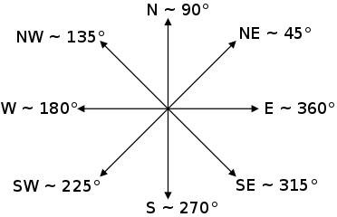
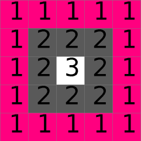
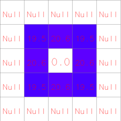
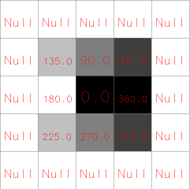
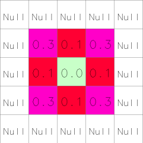
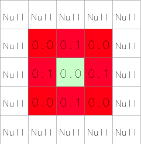
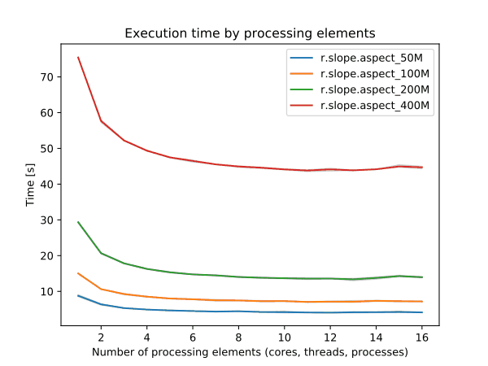
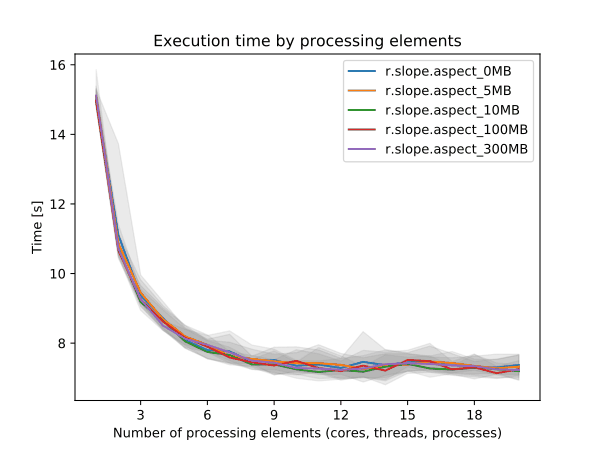
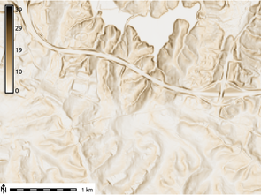
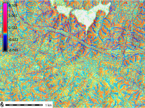

## DESCRIPTION

*r.slope.aspect* generates raster maps of slope, aspect, curvatures and
first and second order partial derivatives from a raster map of true
elevation values. The user must specify the input **elevation** raster
map and at least one output raster maps. The user can also specify the
**format** for slope (degrees, percent; default=degrees), and the
**zscale**: multiplicative factor to convert elevation units to
horizontal units; (default 1.0).

The **elevation** input raster map specified by the user must contain
true elevation values, *not* rescaled or categorized data. If the
elevation values are in other units than in the horizontal units, they
must be converted to horizontal units using the parameter **zscale**.
*In GRASS GIS 7, vertical units are not assumed to be meters any more.
For example, if both your vertical and horizontal units are feet,
parameter **zscale** must not be used*.

The **aspect** output raster map indicates the direction that slopes are
facing counterclockwise from East: 90 degrees is North, 180 is West, 270
is South, 360 is East. Zero aspect indicates flat areas with zero slope.
Category and color table files are also generated for the aspect raster
map.  
Note: These values can be transformed to azimuth values (90 is East, 180
is South, 270 is West, 360 is North) using [r.mapcalc](r.mapcalc.md):

```sh
# convert angles from CCW from East to CW from North
# modulus (%) can not be used with floating point aspect values
r.mapcalc "azimuth_aspect = if(ccw_aspect == 0, 0, \
                            if(ccw_aspect < 90, 90 - ccw_aspect, \
                            450 - ccw_aspect)))"
```

Alternatively, the **-n** flag can be used to produce aspect as degrees
CW from North. Aspect for flat areas is then set to -9999 (default: 0).
Note: The reason for using -9999 is to be compliant with **gdaldem**
which uses -9999 by default as the nodata value.

The aspect for slope equal to zero (flat areas) is set to zero (-9999
with **-n** flag). Thus, most cells with a very small slope end up
having category 0, 45, ..., 360 in **aspect** output. It is possible to
reduce the bias in these directions by filtering out the aspect in areas
where the terrain is almost flat. A option **min_slope** can be used to
specify the minimum slope for which aspect is computed. For all cells
with slope \< **min_slope**, both slope and aspect are set to zero.



The **slope** output raster map contains slope values, stated in degrees
of inclination from the horizontal if **format**=degrees option (the
default) is chosen, and in percent rise if **format**=percent option is
chosen. Category and color table files are generated.

Profile and tangential curvatures are the curvatures in the direction of
steepest slope and in the direction of the contour tangent respectively.
The curvatures are expressed as 1/metres, e.g. a curvature of 0.05
corresponds to a radius of curvature of 20m. Convex form values are
positive and concave form values are negative.

  
*Example DEM*

  
*Slope (degree) from example DEM*

  
*Aspect (degree) from example DEM*

  
*Tangential curvature (1/m) from example DEM*

  
*Profile curvature (1/m) from example DEM*

For some applications, the user will wish to use a reclassified raster
map of slope that groups slope values into ranges of slope. This can be
done using *[r.reclass](r.reclass.md)*. An example of a useful
reclassification is given below:

```sh
          category      range   category labels
                     (in degrees)    (in percent)

             1         0-  1             0-  2%
             2         2-  3             3-  5%
             3         4-  5             6- 10%
             4         6-  8            11- 15%
             5         9- 11            16- 20%
             6        12- 14            21- 25%
             7        15- 90            26% and higher
```

The following color table works well with the above reclassification.

```sh
          category   red   green   blue

             0       179    179     179
             1         0    102       0
             2         0    153       0
             3       128    153       0
             4       204    179       0
             5       128     51      51
             6       255      0       0
             7         0      0       0
```

## NOTES

To ensure that the raster elevation map is not inappropriately
resampled, the settings for the current region are modified slightly
(for the execution of the program only): the resolution is set to match
the resolution of the elevation raster map and the edges of the region
(i.e. the north, south, east and west) are shifted, if necessary, to
line up along edges of the nearest cells in the elevation map. If the
user really wants the raster elevation map resampled to the current
region resolution, the **-a** flag should be specified.

The current mask is ignored.

The algorithm used to determine slope and aspect uses a 3x3 neighborhood
around each cell in the raster elevation map. Thus, slope and aspect are
not determineed for cells adjacent to the edges and NULL cells in the
elevation map layer. These cells are by default set to nodata in output
raster maps. With the **-e** flag, output values are estimated for these
cells, avoiding cropping along the edges.

Horn's formula is used to find the first order derivatives in x and y
directions.

Only when using integer elevation models, the aspect is biased in 0, 45,
90, 180, 225, 270, 315, and 360 directions; i.e., the distribution of
aspect categories is very uneven, with peaks at 0, 45,..., 360
categories. When working with floating point elevation models, no such
aspect bias occurs.

### PERFORMANCE

To enable parallel processing, the user can specify the number of
threads to be used with the **nprocs** parameter (default 1). The
**memory** parameter (default 300) can also be provided to determine the
size of the buffer for computation.


  
*Figure: Benchmark on the left shows execution time for different number
of cells, benchmark on the right shows execution time for different
memory size for 5000x5000 raster. See benchmark scripts in source code.
(Intel Core i9-10940X CPU @ 3.30GHz x 28)*

To reduce the memory requirements to minimum, set option **memory** to
zero. To take advantage of the parallelization, GRASS GIS needs to
compiled with OpenMP enabled.

## EXAMPLES

### Calculation of slope, aspect, profile and tangential curvature

In this example a slope, aspect, profile and tangential curvature map
are computed from an elevation raster map (North Carolina sample
dataset):

```sh
g.region raster=elevation
r.slope.aspect elevation=elevation slope=slope aspect=aspect pcurvature=pcurv tcurvature=tcurv

# set nice color tables for output raster maps
r.colors -n map=slope color=sepia
r.colors map=aspect color=aspectcolr
r.colors map=pcurv color=curvature
r.colors map=tcurv color=curvature
```






Figure: Slope, aspect, profile and tangential curvature raster map
(North Carolina dataset)

### Classification of major aspect directions in compass orientation

In the following example (based on the North Carolina sample dataset) we
first generate the standard aspect map (oriented CCW from East), then
convert it to compass orientation, and finally classify four major
aspect directions (N, E, S, W):

```sh
g.region raster=elevation -p

# generate integer aspect map with degrees CCW from East
r.slope.aspect elevation=elevation aspect=myaspect precision=CELL

# generate compass orientation and classify four major directions (N, E, S, W)
r.mapcalc "aspect_4_directions = eval( \\
   compass=(450 - myaspect ) % 360, \\
     if(compass >=0. && compass < 45., 1)  \\
   + if(compass >=45. && compass < 135., 2) \\
   + if(compass >=135. && compass < 225., 3) \\
   + if(compass >=225. && compass < 315., 4) \\
   + if(compass >=315., 1) \\
)"

# assign text labels
r.category aspect_4_directions separator=comma rules=- << EOF
1,north
2,east
3,south
4,west
EOF

# assign color table
r.colors aspect_4_directions rules=- << EOF
1 253,184,99
2 178,171,210
3 230,97,1
4 94,60,153
EOF
```

  
Aspect map classified to four major compass directions (zoomed subset
shown)

## REFERENCES

- Horn, B. K. P. (1981). *Hill Shading and the Reflectance Map*,
  Proceedings of the IEEE, 69(1):14-47.
- Mitasova, H. (1985). *Cartographic aspects of computer surface
  modeling. PhD thesis.* Slovak Technical University , Bratislava
- Hofierka, J., Mitasova, H., Neteler, M., 2009. *Geomorphometry in
  GRASS GIS.* In: Hengl, T. and Reuter, H.I. (Eds), *Geomorphometry:
  Concepts, Software, Applications.* Developments in Soil Science, vol.
  33, Elsevier, 387-410 pp,
  [doi:10.1016/S0166-2481(08)00017-2](https://doi.org/10.1016/S0166-2481(08)00017-2),
  <https://www.geomorphometry.org>

## SEE ALSO

*[r.mapcalc](r.mapcalc.md), [r.neighbors](r.neighbors.md),
[r.reclass](r.reclass.md), [r.rescale](r.rescale.md)*

## AUTHORS

Michael Shapiro, U.S.Army Construction Engineering Research Laboratory  
Olga Waupotitsch, U.S.Army Construction Engineering Research Laboratory
