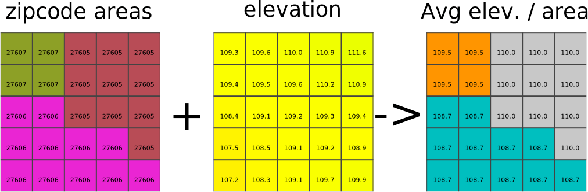

## DESCRIPTION

*r.stats.zonal* is a tool to analyse exploratory statistics of a
floating-point "cover layer" according to how it intersects with objects
in a "base layer". A variety of standard statistical measures are
possible. This type of analysis is often called *zonal statistics*. The
zones are specified as the **base** raster map and the statistics are
computed from cells in the **cover** raster map. Notably, the output of
this module is spatial: The resulting values are recorded as cell values
in the **output** raster map.

## NOTES

*r.stats.zonal* is intended to be a partial replacement for
*[r.statistics](r.statistics.md)*, with support for floating-point cover
maps at the expense of not supporting quantiles. For this, see
*[r.stats.quantile](r.stats.quantile.md)*.

## EXAMPLE

In this example, the raster polygon map `zipcodes` in the North Carolina
sample dataset is used to calculate zonal raster statistics using the
`elevation` raster map:

```sh
g.region raster=zipcodes -p

# pixel count in zipcode areas
r.stats.zonal base=zipcodes cover=elevation method=count output=zipcodes_elev_count
r.colors zipcodes_elev_count color=gyr -g

# average elevation in zipcode areas
r.stats.zonal base=zipcodes cover=elevation method=average output=zipcodes_elev_avg
r.colors zipcodes_elev_avg color=elevation -g
```

  
  
*Figure: ZIP code map on the left shows ZIP code areas, elevation map
the respective values per pixel, zonal statistics map on the right shows
the average elevation per zone (all maps: spatial subset).*

## SEE ALSO

- *[r.stats.quantile](r.stats.quantile.md)* for computing quantiles in
  zones (objects in base raster map),
- *[r.quantile](r.quantile.md)* for computing quantiles of a whole
  raster map,
- *[r.statistics](r.statistics.md)* for categorical (integer) zonal
  statistics,
- *[r.univar](r.univar.md)* for zonal statistics with textual
  (non-spatial) output,
- *[v.vect.stats](v.vect.stats.md)* for statistics of vector points in
  vector areas.

## AUTHOR

Glynn Clements
