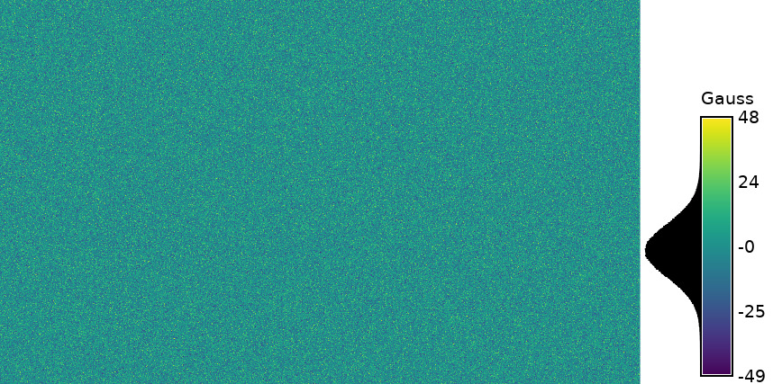

## DESCRIPTION

*r.surf.gauss* produces a raster map of Gaussian deviates whose mean and
standard deviation can be expressed by the user. It uses a Gaussian
random number generator. It is essentially the same as
*[r.surf.random](r.surf.random.md)*, but uses a Gaussian random number
generator instead.

## EXAMPLE

```sh
g.region -p n=228500 s=215000 w=630000 e=645000 res=10
r.surf.gauss out=gauss mean=0 sigma=10

# check result
r.univar gauss
```

  
*Figure: Random Gaussian surface example (mean: 0; sigma: 10)*

With the histogram tool the cell values versus count can be shown.

  
*Figure: Histogram of random Gaussian surface example (mean: 0; sigma:
10)*

## SEE ALSO

*[r.surf.contour](r.surf.contour.md),
[r.surf.fractal](r.surf.fractal.md), [r.surf.idw](r.surf.idw.md),
[r.surf.random](r.surf.random.md), [v.surf.rst](v.surf.rst.md)*

## AUTHOR

Jo Wood, [ASSIST's
home](https://web.archive.org/web/20070707015520/http://www.le.ac.uk/assist/index.html)
