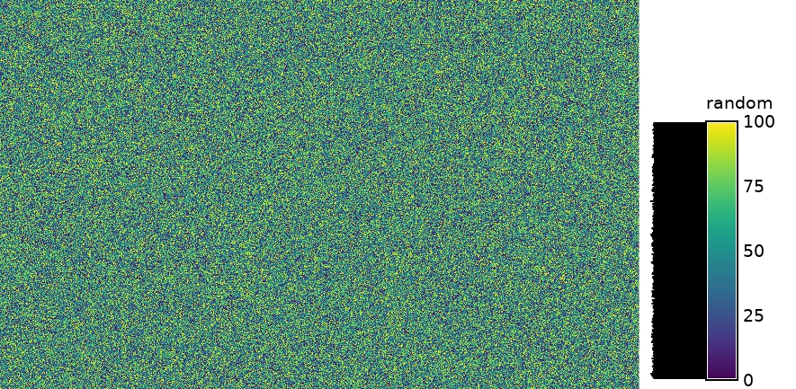

## DESCRIPTION

**r.surf.random** produces a raster map layer of uniform random deviates
whose range can be expressed by the user. It is essentially the same as
*r.surf.gauss*, but uses a linear random number generator instead. It
uses the random number generator drand48() or rand(), depending on the
user's platform.

## EXAMPLE

```sh
g.region -p n=228500 s=215000 w=630000 e=645000 res=10
r.surf.random out=random min=0 max=100

# check result
r.univar random
```

  
*Figure: Random surface example (min: 10; max: 100)*

With the histogram tool the cell values versus count can be shown.

  
*Figure: Histogram of random surface example (min: 10; max: 100)*

## SEE ALSO

*[r.random.surface](r.random.surface.md),
[r.surf.contour](r.surf.contour.md),
[r.surf.fractal](r.surf.fractal.md), [r.surf.gauss](r.surf.gauss.md),
[r.surf.idw](r.surf.idw.md), [v.surf.rst](v.surf.rst.md)*

## AUTHOR

Jo Wood  
Midlands Regional Research Laboratory (ASSIST)  
University of Leicester  
*October 1991*
