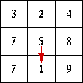
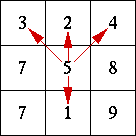
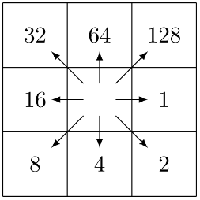

## DESCRIPTION

*r.terraflow* takes as input a raster digital elevation model (DEM) and
computes the flow direction raster and the flow accumulation raster, as
well as the flooded elevation raster, sink-watershed raster (partition
into watersheds around sinks) and TCI (topographic convergence index)
raster maps.

*r.terraflow* computes these rasters using well-known approaches, with
the difference that its emphasis is on the computational complexity of
the algorithms, rather than on modeling realistic flow. *r.terraflow*
emerged from the necessity of having scalable software able to process
efficiently very large terrains. It is based on theoretically optimal
algorithms developed in the framework of I/O-efficient algorithms.
*r.terraflow* was designed and optimized especially for massive grids
and is able to process terrains which were impractical with similar
functions existing in other GIS systems.

Flow directions are computed using either the MFD (Multiple Flow
Direction) model or the SFD (Single Flow Direction, or D8) model,
illustrated below. Both methods compute downslope flow directions by
inspecting the 3-by-3 window around the current cell. The SFD method
assigns a unique flow direction towards the steepest downslope neighbor.
The MFD method assigns multiple flow directions towards all downslope
neighbors.

  
*Flow direction to the steepest downslope neighbor (SFD).*

  
*Flow direction to all downslope neighbors (MFD).*

The SFD and the MFD method cannot compute flow directions for cells
which have the same height as all their neighbors (flat areas) or cells
which do not have downslope neighbors (one-cell pits).

- On plateaus (flat areas that spill out) *r.terraflow* routes flow so
  that globally the flow goes towards the spill cells of the plateaus.
- On sinks (flat areas that do not spill out, including one-cell pits)
  *r.terraflow* assigns flow by flooding the terrain until all the sinks
  are filled and assigning flow directions on the filled terrain.

In order to flood the terrain, *r.terraflow* identifies all sinks and
partitions the terrain into sink-watersheds (a sink-watershed contains
all the cells that flow into that sink), builds a graph representing the
adjacency information of the sink-watersheds, and uses this
sink-watershed graph to merge watersheds into each other along their
lowest common boundary until all watersheds have a flow path outside the
terrain. Flooding produces a sink-less terrain in which every cell has a
downslope flow path leading outside the terrain and therefore every cell
in the terrain can be assigned SFD/MFD flow directions as above. Flow
directions are encoded using powers of two clockwise starting from
2^0 for east to 2^7 for north-east.

  
Flow direction encoding clockwise starting from 2^0 for east
to 2^7 for north-east; 0 for undetermined (sinks) and 1 for
undefined (null cells)
([source](https://idea.isnew.info/how-to-import-arcgis-flow-direction-into-grass-gis.html))

Once flow directions are computed for every cell in the terrain,
*r.terraflow* computes flow accumulation by routing water using the flow
directions and keeping track of how much water flows through each cell.

If flow accumulation of a cell is larger than the value given by the
**d8cut** option, then the flow of this cell is routed to its neighbors
using the SFD (D8) model. This option affects only the flow accumulation
raster and is meaningful only for MFD flow (i.e. if the **-s** flag is
not used); If this option is used for SFD flow it is ignored. The
default value of **d8cut** is *infinity*.

*r.terraflow* also computes the **tci** raster (topographic convergence
index, defined as the logarithm of the ratio of flow accumulation and
local slope).

For more details on the algorithms see \[1,2,3\] below.

## NOTES

One of the techniques used by *r.terraflow* is the space-time trade-off.
In particular, in order to avoid searches, which are I/O-expensive,
*r.terraflow* computes and works with an augmented elevation raster in
which each cell stores relevant information about its 8 neighbors, in
total up to 80B per cell. As a result *r.terraflow* works with
intermediate temporary files that may be up to 80N bytes, where N is the
number of cells (rows x columns) in the elevation raster (more
precisely, 80K bytes, where K is the number of valid (not no-data) cells
in the input elevation raster).

All these intermediate temporary files are stored in the path specified
by the **directory** option. Note: **directory** must contain enough
free disk space in order to store up to 2 x 80N bytes.

The **memory** option can be used to set the maximum amount of main
memory (RAM) the module will use during processing. In practice its
*value* should be an underestimate of the amount of available (free)
main memory on the machine. *r.terraflow* will use at all times at most
this much memory, and the virtual memory system (swap space) will never
be used. The default value is 300 MB.

The **stats** option defines the name of the file that contains the
statistics (stats) of the run.

*r.terraflow* has a limit on the number of rows and columns (max 32,767
each).

The internal type used by *r.terraflow* to store elevations can be
defined at compile-time. By default, *r.terraflow* is compiled to store
elevations internally as floats. Other versions can be created by the
user if needed.

Hints concerning compilation with storage of elevations internally as
shorts: such a version uses less space (up to 60B per cell, up to 60N
intermediate file) and therefore is more space and time efficient.
*r.terraflow* is intended for use with floating point raster data
(FCELL), and *r.terraflow (short)* with integer raster data (CELL) in
which the maximum elevation does not exceed the value of a short
SHRT_MAX=32767 (this is not a constraint for any terrain data of the
Earth, if elevation is stored in meters). Both *r.terraflow* and
*r.terraflow (short)* work with input elevation rasters which can be
either integer, floating point or double (CELL, FCELL, DCELL). If the
input raster contains a value that exceeds the allowed internal range
(short for *r.terraflow (short)*, float for *r.terraflow*), the program
exits with a warning message. Otherwise, if all values in the input
elevation raster are in range, they will be converted (truncated) to the
internal elevation type (short for *r.terraflow (short)*, float for
*r.terraflow*). In this case precision may be lost and artificial flat
areas may be created. For instance, if *r.terraflow (short)* is used
with floating point raster data (FCELL or DCELL), the values of the
elevation will be truncated as shorts. This may create artificial flat
areas, and the output of *r.terraflow (short)* may be less realistic
than those of *r.terraflow* on floating point raster data. The outputs
of *r.terraflow (short)* and *r.terraflow* are identical for integer
raster data (CELL maps).

## EXAMPLES

Example for small area in North Carolina sample dataset to calculate
flow accumulation:

```sh
g.region raster=elev_lid792_1m
r.terraflow elevation=elev_lid792_1m accumulation=elev_lid792_1m_accumulation
```

  
*Flow accumulation*

Spearfish sample data set:

```sh
g.region raster=elevation.10m -p
r.terraflow elev=elevation.10m filled=elevation10m.filled \
    dir=elevation10m.mfdir swatershed=elevation10m.watershed \
    accumulation=elevation10m.accu tci=elevation10m.tci
```

```sh
g.region raster=elevation.10m -p
r.terraflow elev=elevation.10m filled=elevation10m.filled \
    dir=elevation10m.mfdir swatershed=elevation10m.watershed \
    accumulation=elevation10m.accu tci=elevation10m.tci d8cut=500 memory=800 \
    stats=elevation10mstats.txt
```

## REFERENCES

1. [I/O-efficient algorithms for problems on grid-based terrains](https://dl.acm.org/doi/10.1145/945394.945395).
   Lars Arge, Laura Toma, and Jeffrey S. Vitter. In
    *Proc. Workshop on Algorithm Engineering and Experimentation*, 2000.
    To appear in *Journal of Experimental Algorithms*.
2. [Flow computation on massive grids](https://dl.acm.org/doi/10.1145/512161.512180).
    Lars Arge, Jeffrey S. Chase, Patrick N. Halpin, Laura Toma, Jeffrey S.
    Vitter, Dean Urban and Rajiv Wickremesinghe. In *Proc. ACM Symposium
    on Advances in Geographic Information Systems*, 2001.
3. [Flow computation on massive grid terrain datasets](https://link.springer.com/article/10.1023/A:1025526421410).
    Lars Arge, Jeffrey S. Chase, Patrick N. Halpin, Laura
    Toma, Jeffrey S. Vitter, Dean Urban and Rajiv Wickremesinghe. In
    *GeoInformatica, International Journal on Advances of Computer
    Science for Geographic Information Systems*, 7(4):283-313, December
    2003.

## SEE ALSO

*[r.flow](r.flow.md), [r.basins.fill](r.basins.fill.md),
[r.drain](r.drain.md), [r.topidx](r.topidx.md),
[r.topmodel](r.topmodel.md), [r.water.outlet](r.water.outlet.md),
[r.watershed](r.watershed.md)*

## AUTHORS

Original version of program: The
[TerraFlow](http://www.cs.duke.edu/geo*/terraflow/) project, 1999, Duke
University.

[Lars Arge](http://www.daimi.au.dk/~large/), [Jeff
Chase](http://www.cs.duke.edu/~chase/), [Pat
Halpin](http://www.env.duke.edu/faculty/bios/halpin.html), [Laura
Toma](http://www.bowdoin.edu/~ltoma/), [Dean
Urban](http://www.env.duke.edu/faculty/bios/urban.html), [Jeff
Vitter](http://www.science.purdue.edu/jsv/), Rajiv Wickremesinghe.

Porting to GRASS GIS, 2002:

[Lars Arge](http://www.daimi.au.dk/~large/), [Helena
Mitasova,](http://fatra.cnr.ncsu.edu/~hmitaso/index.html) [Laura
Toma](http://www.bowdoin.edu/~ltoma/).

Contact: [Laura Toma](mailto:ltoma@bowdoin.edu-)
