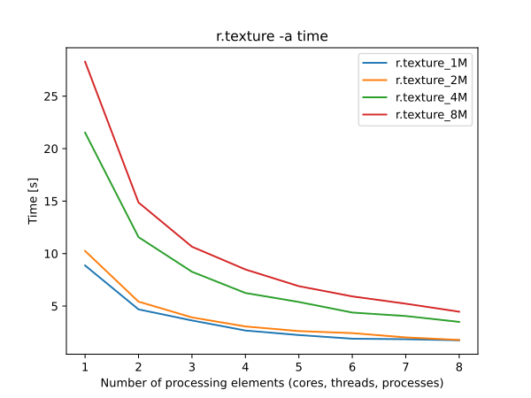
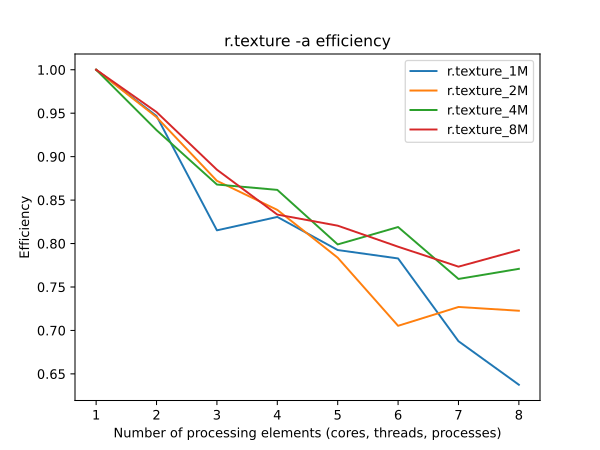
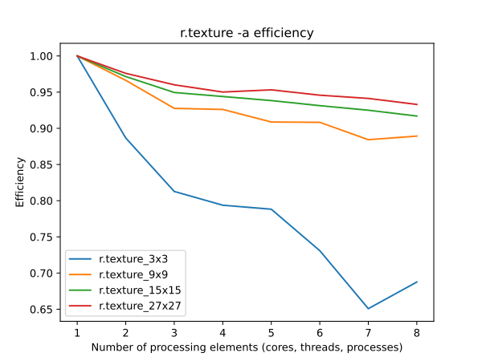
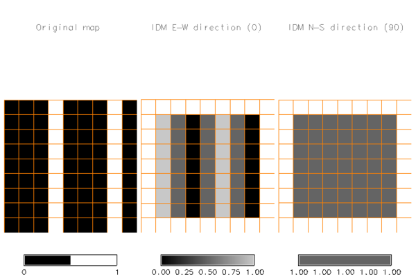

## DESCRIPTION

*r.texture* creates raster maps with textural features from a
user-specified raster map layer. The module calculates textural features
based on spatial dependence matrices at 0, 45, 90, and 135 degrees.

In order to take into account the scale of the texture to be measured,
*r.texture* allows the user to define the *size* of the moving window
and the *distance* at which to compare pixel grey values. By default the
module averages the results over the 4 orientations, but the user can
also request output of the texture variables in 4 different orientations
(flag *-s*). Please note that angles are defined in degrees of east and
they increase counterclockwise, so 0 is East - West, 45 is North-East -
South-West, 90 is North - South, 135 is North-West - South-East.

The user can either chose one or several texture measures (see below for
their description) using the *method* parameter, or can request the
creating of maps for all available methods with the *-a*.

*r.texture* assumes grey levels ranging from 0 to 255 as input. The
input is automatically rescaled to 0 to 255 if the input map range is
outside of this range. In order to reduce noise in the input data (thus
generally reinforcing the textural features), and to speed up
processing, it is recommended that the user recode the data using
equal-probability quantization. Quantization rules for *r.recode* can be
generated with *r.quantile -r* using e.g 16 or 32 quantiles (see example
below).

## NOTES

Texture is a feature of specific land cover classes in satellite
imagery. It is particularly useful in situations where spectral
differences between classes are small, but classes are distinguishable
by their organisation on the ground, often opposing natural to
human-made spaces: cultivated fields vs meadows or golf courses, palm
tree plantations vs natural rain forest, but texture can also be a
natural phenomen: dune fields, different canopies due to different tree
species. The usefulness and use of texture is highly dependent on the
resolution of satellite imagery and on the scale of the human
intervention or the phenomenon that created the texture (also see the
discussion of scale dependency below). The user should observe the
phenomenon visually in order to determine an adequate setting of the
*size* parameter.

The output of *r.texture* can constitute very useful additional
variables as input for image classification or image segmentation
(object recognition). It can be used in supervised classification
algorithms such as [i.maxlik](i.maxlik.md) or [i.smap](i.smap.md), or
for the identification of objects in [i.segment](i.segment.md), and/or
for the characterization of these objects and thus, for example, as one
of the raster inputs of the
[i.segment.stats](https://grass.osgeo.org/grass-stable/manuals/addons/i.segment.stats.html)
addon.

In general, several variables constitute texture: differences in grey
level values, coarseness as scale of grey level differences, presence or
lack of directionality and regular patterns. A texture can be
characterized by tone (grey level intensity properties) and structure
(spatial relationships). Since textures are highly scale dependent,
hierarchical textures may occur.

*r.texture* uses the common texture model based on the so-called grey
level co-occurrence matrix as described by Haralick et al (1973). This
matrix is a two-dimensional histogram of grey levels for a pair of
pixels which are separated by a fixed spatial relationship. The matrix
approximates the joint probability distribution of a pair of pixels.
Several texture measures are directly computed from the Grey Level
Co-occurrence Matrix (GLCM). The provided measures can be categorized
under first-order and second-order statistics, with each playing a
unique role in texture analysis. First-order statistics consider the
distribution of individual pixel values without regard to spatial
relationships, while second-order statistics, particularly those derived
from the Grey Level Co-occurrence Matrix (GLCM), consider the spatial
relationship of pixels.

The following part offers brief explanations of the Haralick et al
texture measures (after Jensen 1996).

### First-order statistics in the spatial domain

- Sum Average (SA): Sum Average measures the average gray level
  intensity of the sum of pixel pairs within the moving window. It
  reflects the average intensity of pixel pairs at specific distances
  and orientations, highlighting the overall brightness level within the
  area.
- Entropy (ENT): This measure analyses the randomness. It is high when
  the values of the moving window have similar values. It is low when
  the values are close to either 0 or 1 (i.e. when the pixels in the
  local window are uniform).
- Difference Entropy (DE): This metric quantifies the randomness or
  unpredictability in the distribution of differences between the grey
  levels of pixel pairs. It is a measure of the entropy of the
  pixel-pair difference histogram, capturing texture granularity.
- Sum Entropy (SE): Similar to Difference Entropy, Sum Entropy measures
  the randomness or unpredictability, but in the context of the sum of
  the grey levels of pixel pairs. It evaluates the entropy of the
  pixel-pair sum distribution, providing insight into the complexity of
  texture in terms of intensity variation.
- Variance (VAR): A measure of gray tone variance within the moving
  window (second-order moment about the mean)
- Difference Variance (DV): This is a measure of the variance or spread
  of the differences in grey levels between pairs of pixels within the
  moving window. It quantifies the contrast variability between pixels,
  indicating texture smoothness or roughness.
- Sum Variance (SV): In contrast to Difference Variance, Sum Variance
  measures the variance of the sum of grey levels of pixel pairs. It
  assesses the variability in the intensity levels of pairs of pixels,
  contributing to an understanding of texture brightness or intensity
  variation.

Note that measures "mean", "kurtosis", "range", "skewness", and
"standard deviation" are available in *r.neighbors*.

### Second-order statistics in the spatial domain

The second-order statistics texture model is based on the so-called grey
level co-occurrence matrices (GLCM; after Haralick 1979).

- Angular Second Moment (ASM, also called Uniformity): This is a measure
  of local homogeneity and the opposite of Entropy. High values of ASM
  occur when the pixels in the moving window are very similar.  
  Note: The square root of the ASM is sometimes used as a texture
  measure, and is called Energy.
- Inverse Difference Moment (IDM, also called Homogeneity): This measure
  relates inversely to the contrast measure. It is a direct measure of
  the local homogeneity of a digital image. Low values are associated
  with low homogeneity and vice versa.
- Contrast (CON): This measure analyses the image contrast (locally
  gray-level variations) as the linear dependency of grey levels of
  neighboring pixels (similarity). Typically high, when the scale of
  local texture is larger than the *distance*.
- Correlation (COR): This measure analyses the linear dependency of grey
  levels of neighboring pixels. Typically high, when the scale of local
  texture is larger than the *distance*.
- Information Measures of Correlation (MOC): These measures evaluate the
  complexity of the texture in terms of the mutual dependence between
  the grey levels of pixel pairs. They quantify how one pixel value
  informs or correlates with another, offering insight into pattern
  predictability and structure regularity.
- Maximal Correlation Coefficient (MCC): This statistic measures the
  highest correlation between any two features of the texture, providing
  a single value that summarizes the degree of linear dependency between
  grey levels in the texture. It's often used to assess the overall
  correlation in the image, indicating how predictable the texture
  patterns are from one pixel to the next.

The computational region should be set to the input map with **g.region
raster=\<input map\>**, or aligned to the input map with **g.region
align=\<input map\>** if only a subregion should be analyzed.

Note that the output of *r.texture* will always be smaller than the
current region as only cells for which there are no null cells and for
which all cells of the moving window are within the current region will
contain a value. The output will thus appear cropped at the margins.

Importantly, the input raster map cannot have more than 255 categories.

### Performance

To enable parallel processing, the user can specify the number of
threads to be used with the **nprocs** parameter (default 1). Figures
below show benchmark results running on Intel® Core™ i9-10940X CPU @
3.30GHz. See benchmark scripts in the source code for more details.

  
*Figure 1: Benchmark shows execution time for different number of cells
(1M, 2M, 4M, and 8M) and the fixed size of window (3×3).*

  
*Figure 2: Benchmark shows efficiency for different numbers of cells
(1M, 2M, 4M, and 8M) and the fixed size of window (3×3).*

  
*Figure 3: Benchmark shows execution time for different sizes of windows
(3×3, 9×9, 15×15, and 27×27) and the fixed number of cells (1M).*

  
*Figure 4: Benchmark shows efficiency for different sizes of windows
(3×3, 9×9, 15×15, and 27×27) and the fixed number of cells (1M).*

## EXAMPLE

Calculation of Angular Second Moment of B/W orthophoto (North Carolina
data set):

```sh
g.region raster=ortho_2001_t792_1m -p
# set grey level color table 0% black 100% white
r.colors ortho_2001_t792_1m color=grey
# extract grey levels
r.mapcalc "ortho_2001_t792_1m.greylevel = ortho_2001_t792_1m"
# texture analysis
r.texture ortho_2001_t792_1m.greylevel output=ortho_texture method=asm -s
# display
g.region n=221461 s=221094 w=638279 e=638694
d.shade color=ortho_texture_ASM_0 shade=ortho_2001_t792_1m
```

This calculates four maps (requested texture at four orientations):
ortho_texture_ASM_0, ortho_texture_ASM_45, ortho_texture_ASM_90,
ortho_texture_ASM_135. Reducing the number of gray levels
(equal-probability quantizing):

```sh
g.region -p raster=ortho_2001_t792_1m

# enter as one line or with \
r.quantile input=ortho_2001_t792_1m quantiles=16 -r | r.recode \
           input=ortho_2001_t792_1m output=ortho_2001_t792_1m_q16 rules=-
```

The recoded raster map can then be used as input for *r.texture* as
before.

Second example: analysis of IDM (homogeneity) on a simple raster with
North-South line pattern.

```sh
# import raster
r.in.ascii in=- output=lines << EOF
north: 9
south: 0
east: 9
west: 0
rows: 9
cols: 9
0 0 0 1 0 0 0 1 0
0 0 0 1 0 0 0 1 0
0 0 0 1 0 0 0 1 0
0 0 0 1 0 0 0 1 0
0 0 0 1 0 0 0 1 0
0 0 0 1 0 0 0 1 0
0 0 0 1 0 0 0 1 0
0 0 0 1 0 0 0 1 0
0 0 0 1 0 0 0 1 0
EOF

# adjust region to raster
g.region raster=lines

# calculate IDM (homogeneity) in all directions
r.texture -s lines method=idm output=text_lines
```

The following image shows the original map, the result in East-West
direction and the result in North-South direction, showing how texture
can depend on direction, with texture perfectly homogeneous (value=1) in
the North-South direction, but quite heterogeneous in East-West
direction, except for those areas where there are three columns of equal
values (as size=3). The overlaid grid highlights that the texture
measures output maps are cropped at the margins.

  
*IDM textures according to direction*

## REFERENCES

The algorithm was implemented after Haralick et al., 1973 and 1979.

The original code was taken by permission from *pgmtexture*, part of
PBMPLUS (Copyright 1991, Jef Poskanser and Texas Agricultural Experiment
Station, employer for hire of James Darrell McCauley). Manual page of
[pgmtexture](https://netpbm.sourceforge.net/doc/pgmtexture.html). Over
the years, the source code of *r.texture* was further improved.

- Haralick, R.M., K. Shanmugam, and I. Dinstein (1973). Textural
  features for image classification. *IEEE Transactions on Systems, Man,
  and Cybernetics*, SMC-3(6):610-621.
- Bouman, C. A., Shapiro, M. (1994). A Multiscale Random Field Model for
  Bayesian Image Segmentation, IEEE Trans. on Image Processing, vol. 3,
  no. 2.
- Jensen, J.R. (1996). Introductory digital image processing. Prentice
  Hall. ISBN 0-13-205840-5
- Haralick, R. (May 1979). *Statistical and structural approaches to
  texture*, Proceedings of the IEEE, vol. 67, No.5, pp. 786-804
- Hall-Beyer, M. (2007). [The GLCM Tutorial Home
  Page](http://www.fp.ucalgary.ca/mhallbey/tutorial.htm) (Grey-Level
  Co-occurrence Matrix texture measurements). University of Calgary,
  Canada

## SEE ALSO

*[i.maxlik](i.maxlik.md), [i.gensig](i.gensig.md), [i.smap](i.smap.md),
[i.gensigset](i.gensigset.md),
[i.segment.stats](https://grass.osgeo.org/grass8/manuals/addons/i.segment.stats.html),
[i.pca](i.pca.md), [r.neighbors](r.neighbors.md),
[r.rescale](r.rescale.md)*

## AUTHORS

[G. Antoniol](mailto:antoniol@ieee.org) - RCOST (Research Centre on
Software Technology - Viale Traiano - 82100 Benevento)  
C. Basco - RCOST (Research Centre on Software Technology - Viale
Traiano - 82100 Benevento)  
M. Ceccarelli - Facolta di Scienze, Universita del Sannio, Benevento  
Markus Metz (correction and optimization of the initial version)  
Moritz Lennert (documentation)
