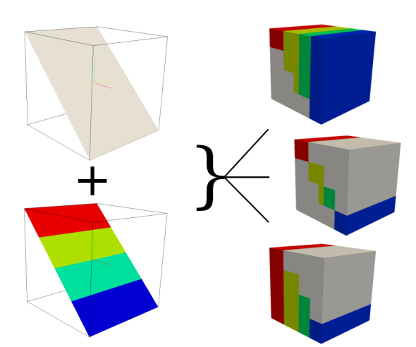

## DESCRIPTION

*r.to.rast3elev* creates a 3D volume map based on 2D elevation and value
raster maps. If the 2d and 3d region settings are different, the 2d
resolution will be adjust to the 3d resolution.

  
*How r.to.rast3elev works*

## NOTES

The height of the 2D elevation maps will be used to verify the position
within the 3D region. If the cell value of the elevation raster maps is
located within the 3D region, the cell value of the appropriate 2D input
raster maps will be written to the associated 3D cell. There are flags
and options to fill the upper and lower 3D cells with a specific value,
or the input raster maps values.

## EXAMPLES

Simple Spearfish sample data set example

```sh
g.region raster=elevation.10m -p
g.region res=200 res3=200 t=2000 b=0 tbres=20 -p

# Write the values of raster map soils based on the elevation of elevation.10m
# to the 3D map volev

r.to.rast3elev in=soils elev=elevation.10m out=volev

# Write the values of map soils based on the elevation of elevation.10m
# to the 3D map volev_l and fill the lower cells with the soils map values

r.to.rast3elev in=soils elev=elevation.10m out=volev_l -l

# Write the values of map soils based on the elevation of elevation.10m
# to the 3D map volev_u and fill the upper cells with the soils map values

r.to.rast3elev in=soils elev=elevation.10m out=volev_u -u

# Example with multiple elevation maps.
## first we need three support maps

r.mapcalc expression="one = 1"
r.mapcalc expression="two = 2"
r.mapcalc expression="three = 3"

## Now we generate the new evelation maps

r.mapcalc expression="elev_mid = elevation.10m - 500"
r.mapcalc expression="elev_bottom = elevation.10m - 1000"

## Now fill the lower cells below the elevation maps with the values one, two and three

r.to.rast3elev -l input=one,two,three elevation=elevation.10m,elev_mid,elev_bottom output=threelayer

## Export the map for visualization with paraview (https://www.paraview.org)
## By default the null value is -9999.99, we adjust it to 0.0 for
## better visualization
r3.out.vtk null=0.0 input=threelayer output=/tmp/threelayer.vtk

# Start paraview

paraview --data=/tmp/threelayer.vtk

# Note: First you need to choose the surface representation style and
# then color by "threelayer" in paraview.
```

## SEE ALSO

*[r.to.rast3](r.to.rast3.md), [r3.cross.rast](r3.cross.rast.md),
[g.region](g.region.md)*

## AUTHOR

Soeren Gebbert
