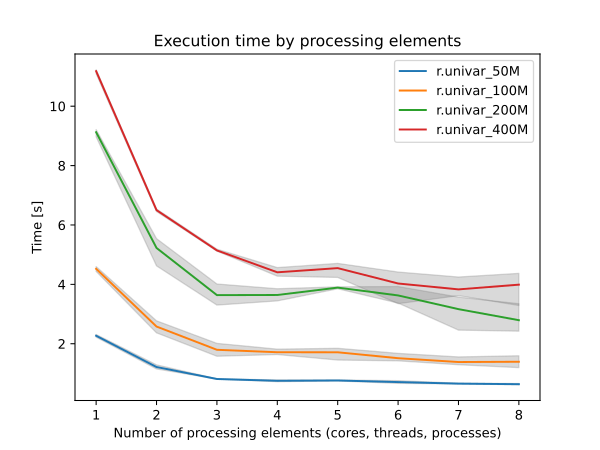
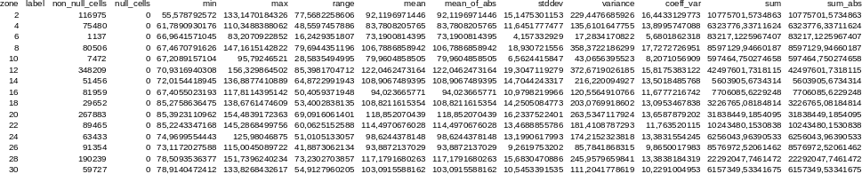

## DESCRIPTION

*r.univar* calculates the univariate statistics of one or several raster
map(s). This includes the number of cells counted, minimum and maximum
cell values, range, arithmetic mean, population variance, standard
deviation, coefficient of variation, and sum. Statistics are calculated
separately for every category/zone found in the **zones** input map if
given. If the **-e** extended statistics flag is given the 1st quartile,
median, 3rd quartile, and given **percentile** are calculated. If the
**-g** flag is given the results are presented in a format suitable for
use in a shell script. If the **-t** flag is given the results are
presented in tabular format with the given field separator. The table
can immediately be converted to a vector attribute table which can then
be linked to a vector, e.g. the vector that was rasterized to create the
**zones** input raster.

When multiple input maps are given to *r.univar*, the overall statistics
are calculated. This is useful for a time series of the same variable,
as well as for the case of a segmented/tiled dataset. Allowing multiple
raster maps to be specified saves the user from using a temporary raster
map for the result of *r.series* or *r.patch*.

## NOTES

As with most GRASS raster modules, *r.univar* operates on the raster
array defined by the current region settings, not the original extent
and resolution of the input map. See *[g.region](g.region.md)*, but also
[the wiki page on the computational
region](https://grasswiki.osgeo.org/wiki/Computational_region#Understanding_the_impact_of_region_settings)
to understand the impact of the region settings on the calculations.

This module can use large amounts of system memory when the **-e**
extended statistics flag is used with a very large region setting. If
the region is too large the module should exit gracefully with a memory
allocation error. Basic statistics can be calculated using any size
input region. Extended statistics can be calculated using
*[r.stats.quantile](r.stats.quantile.md)*.

Without a **zones** input raster, the *r.quantile* module will be
significantly more efficient for calculating percentiles with large
maps.

For calculating univariate statistics from a raster map based on vector
polygon map and uploads statistics to new attribute columns, see
*[v.rast.stats](v.rast.stats.md)*.

### PERFORMANCE

*r.univar* supports parallel processing using OpenMP. The user can
specify the number of threads to be used with the **nprocs** parameter.
However, parallelization is disabled when the raster mask is set.

Due to the differences in summation order, users may encounter small
floating points discrepancies when *r.univar* is run on very large
raster files when different **nprocs** parameters are used. However,
since the work allocation among threads is static, users should expect
to have the same results when run with the same number of threads.

  
*Figure: Benchmark shows execution time for different number of cells
and cores. See benchmark scripts in source code.*

## EXAMPLES

### Univariate statistics

In this example, the raster map `elevation` in the North Carolina sample
dataset is used to calculate univariate statistics:

```sh
g.region raster=elevation -p

# standard output, along with extended statistics
r.univar -e elevation percentile=98
total null and non-null cells: 2025000
total null cells: 0

Of the non-null cells:
----------------------
n: 2025000
minimum: 55.5788
maximum: 156.33
range: 100.751
mean: 110.375
mean of absolute values: 110.375
standard deviation: 20.3153
variance: 412.712
variation coefficient: 18.4057 %
sum: 223510266.558102
1st quartile: 94.79
median (even number of cells): 108.88
3rd quartile: 126.792
98th percentile: 147.727


# script style output, along with extended statistics
r.univar -ge elevation percentile=98
n=2025000
null_cells=0
cells=2025000
min=55.5787925720215
max=156.329864501953
range=100.751071929932
mean=110.375440275606
mean_of_abs=110.375440275606
stddev=20.3153233205981
variance=412.712361620436
coeff_var=18.4056555243368
sum=223510266.558102
first_quartile=94.79
median=108.88
third_quartile=126.792
percentile_98=147.727
```

### Zonal statistics

In this example, the raster polygon map `basins` in the North Carolina
sample dataset is used to calculate raster statistics for zones for
`elevation` raster map:

```sh
g.region raster=basins -p
```

This will set and print computational region in the format:

```sh
projection: 99 (Lambert Conformal Conic)
zone:       0
datum:      nad83
ellipsoid:  a=6378137 es=0.006694380022900787
north:      228500
south:      215000
west:       630000
east:       645000
nsres:      10
ewres:      10
rows:       1350
cols:       1500
cells:      2025000
```

Check basin's IDs using:

```sh
r.category basins
```

This will print them in the format:

```sh
2
4
6
8
10
12
14
16
18
20
22
24
26
28
30
```

Visualization of them underlying elevation map can be created as:

```sh
d.mon wx0
d.rast map=elevation
r.colors map=elevation color=grey
d.rast map=basins
r.colors map=basins color=bgyr
d.legend raster=basins use=2,4,6,8,10,12,14,16,18,20,22,24,26,28,30
d.barscale
```

  
*Figure: Zones (basins, opacity: 60%) with
underlying elevation map for North Carolina sample dataset.*

Then statistics for elevation can be calculated separately for every
zone, i.e. basin found in the **zones** parameter:

```sh
r.univar -t map=elevation zones=basins separator=comma \
         output=basin_elev_zonal.csv
```

This will print information in the format:

```sh
zone,label,non_null_cells,null_cells,min,max,range,mean,mean_of_abs,
stddev,variance,coeff_var,sum,sum_abs2,,116975,0,55.5787925720215,
133.147018432617,77.5682258605957,92.1196971445722,92.1196971445722,
15.1475301152556,229.447668592576,16.4433129773355,10775701.5734863,
10775701.57348634,,75480,0,61.7890930175781,110.348838806152,
48.5597457885742,83.7808205765268,83.7808205765268,11.6451777476995,
135.610164775515,13.8995747088232,6323776.33711624,6323776.33711624
6,,1137,0,66.9641571044922,83.2070922851562,16.2429351806641,
73.1900814395257,73.1900814395257,4.15733292896409,17.2834170822492,
5.68018623179036,83217.1225967407,83217.12259674078,,80506,
0,67.4670791625977,147.161514282227, ...
```

Comma Separated Values (CSV) file is best viewed through a spreadsheet
program such as Microsoft Excel, Libre/Open Office Calc or Google Docs:

  
*Figure: Raster statistics for zones
(basins, North Carolina sample dataset) viewed through Libre/Open Office
Calc.*

### JSON Output

```sh
r.univar -e elevation percentile=98 format=json
```

will output the results in JSON format:

```json
[
    {
        "n": 2025000,
        "null_cells": 0,
        "cells": 2025000,
        "min": 55.578792572021484,
        "max": 156.32986450195312,
        "range": 100.75107192993164,
        "mean": 110.37544027560575,
        "mean_of_abs": 110.37544027560575,
        "stddev": 20.315323320598083,
        "variance": 412.7123616204363,
        "coeff_var": 18.40565552433679,
        "sum": 223510266.55810165,
        "first_quartile": 94.789985656738281,
        "median": 108.87990570068359,
        "third_quartile": 126.79196929931641,
         "percentiles": [
            {
                "percentile": 98,
                "value": 147.7265625
            },
            {
                "percentile": 9,
                "value": 83.494270324707031
            }
        ]
    }
]
```

## TODO

To be implemented *mode, skewness, kurtosis*.

## SEE ALSO

*[g.region](g.region.md), [r3.univar](r3.univar.md),
[r.mode](r.mode.md), [r.quantile](r.quantile.md),
[r.series](r.series.md), [r.stats](r.stats.md),
[r.stats.quantile](r.stats.quantile.md),
[r.stats.zonal](r.stats.zonal.md), [r.statistics](r.statistics.md),
[v.rast.stats](v.rast.stats.md), [v.univar](v.univar.md)*

## AUTHORS

Hamish Bowman, Otago University, New Zealand  
Extended statistics by Martin Landa  
Multiple input map support by Ivan Shmakov  
Zonal loop by Markus Metz
