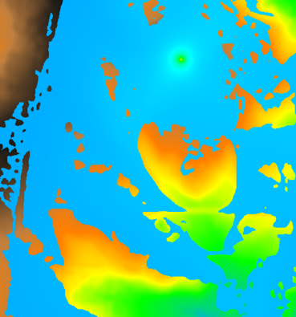

## DESCRIPTION

*r.viewshed* is a module that computes the viewshed of a point on a
raster terrain. That is, given an elevation raster, and the location of
an observer, it generates a raster output map showing which cells are
visible from the given location. The algorithm underlying *r.viewshed*
minimizes both the CPU operations and the transfer of data between main
memory and disk; as a result *r.viewshed* runs fast on very large
rasters.

## NOTES

To run *r.viewshed*, the user must specify an input elevation map name,
an output raster map name, and the location of the viewpoint.

For the time being the viewpoint (**coordinates** parameter) is assumed
to be located inside the terrain. The viewpoint location is given in map
coordinates.

The output raster map may have one of three possible formats, based on
which flags are set.

By default, if no flag is set, the output is in angle-mode, and each
point in the output map is marked as NULL if the point is not visible or
the respective point in the elevation map is NULL. Otherwise, a value in
\[0, 180\] representing the vertical angle with regard to the viewpoint,
in degrees, if the point is visible. A value of 0 is directly below the
specified viewing position, 90 is due horizontal. The angle to the cell
containing the viewing position is undefined and set to 180.

If the **-b** flag is set, the output is in boolean-mode, and each point
in the output map is marked as:

- 0 if the point is no-data/null or not visible
- 1 if the point is visible.

If the **-e** flag is set, the output is in elevation-mode, and each
point in the output map is marked as:

- no-data (null), if the respective point in the elevation map is
  no-data (null)
- -1, if the point is not visible
- the difference in elevation between the point and the viewpoint, if
  the point is visible.

If you wish to identify the area of the map which is within the search
radius but not visible, a combination of *[r.buffer](r.buffer.md)* and
*[r.mapcalc](r.mapcalc.md)* can be used to create a negative of the
viewshed map.

By default the elevations are not adjusted for the curvature of the
earth. The user can turn this on with flag **-c**.

By default the observer is assumed to have height 1.75 map units above
the terrain. The user can change this using option
**observer_elevation**. The value entered is in the same units as the
elevation.

By default the target is assumed to have height of 0 map units above the
terrain. The user can change this using option **target_elevation** to
determine if objects of a given height would be visible. The value
entered is in the same units as the elevation.

By default there is no restriction on the maximum distance to which the
observer can see. The user can set a maximum distance of visibility
using option **max_distance**. The value entered is in the same units as
the cell size of the raster.

The user can limit view horizontally by specifying a minimum and maximum
directions using option **direction_range**. The angles are in degrees,
CCW, East is 0. The angles should be between 0 and 360, e.g.
direction_range=0,180 (north view), or direction_range=270,90 (east
view).

Main memory usage: By default *r.viewshed* assumes it has 500MB of main
memory, and sets up its internal data structures so that it does not
require more than this amount of RAM. The user can set the amount of
memory used by the program by setting the **memory** to the number of MB
of memory they would like to be used.

### Memory mode

The algorithm can run in two modes: in internal memory, which means that
it keeps all necessary data structures in memory during the computation.
And in external memory, which means that the data structures are
external, i.e. on disk. *r.viewshed* decides which mode to run in using
the amount of main memory specified by the user. The internal mode is
(much) faster than the external mode.

Ideally, the user should specify on the command line the amount of
physical memory that is free for the program to use. Underestimating the
memory may result in *r.viewshed* running in external mode instead of
internal, which is slower. Overestimating the amount of free memory may
result in *r.viewshed* running in internal mode and using virtual
memory, which is slower than the external mode.

### The algorithm

*r.viewshed* uses the following model for determining visibility: The
height of a cell is assumed to be variable, and the actual height of a
point falling into a cell, but not identical the cell center, is
interpolated. Thus the terrain is viewed as a smooth surface. Two points
are visible to each other if their line-of-sight does not intersect the
terrain. The height for an arbitrary point x in the terrain is
interpolated from the 4 surrounding neighbours. This means that this
model does a bilinear interpolation of heights. This model is suitable
for both low and high resolution rasters as well as terrain with flat
and steep slopes.

The core of the algorithm is determining, for each cell, the
line-of-sight and its intersections with the cells in the terrain. For a
(square) grid of *n* cells, there can be *O(n^1/2)* cells
that intersect the LOS. If we test every single such cell for every
point in the grid, this adds up to *O(n^3/2)* tests. We can do
all these tests faster if we re-use information from one point to the
next (two grid points that are close to each other will be intersected
by a lot of the same points) and organize the computation differently.

More precisely, the algorithm uses a technique called *line sweeping*:
It considers a half-line centered at the viewpoint, and rotates it
radially around the viewpoint, 360 degrees. During the sweep it keeps
track of all the cells that intersect the sweep line at that time; These
are called the *active* cells. A cell has 3 associated events: when it
is first met by the sweep line and inserted into the active structure;
when it is last met by the sweep line and deleted from the active
structure; and when the sweep line passes over its centerpoint, at which
time its visibility is determined. To determine the visibility of a cell
all cells that intersect the line-of-sight must be active, so they are
in the active structure. The algorithm looks at all the active cells
that are between the point and the viewpoint, and finds the maximum
gradient among these. If the cell's gradient is higher, it is marked as
visible, whereas if it is lower, it is marked as invisible.

For a (square) raster of *n* point in total, the standard viewshed
algorithm uses *O(n sqrt(n))= O(n^3/2)* time, while the
sweep-line algorithm uses *O(n lg n)* time. This algorithm is efficient
in terms of CPU operations and can be also made efficient in terms of
I/O-operations. For all details see the REFERENCES below.

| ![[SDF]](sweep1.png) | ![[SDF]](sweep2.png) |
|------------------------------------------------------------------|------------------------------------------------------------------|
| The sweep-line.  | The active cells.|

## EXAMPLES

Using the North Carolina dataset: Compute viewshed from a observation
point (coordinates: 638728.087167, 220609.261501) which is 5 meters
above ground:

```sh
g.region raster=elev_lid792_1m -p
r.viewshed input=elev_lid792_1m output=elev_lid792_1m_viewshed coordinates=638728,220609 observer_elevation=5.0
```

  
*Viewshed shown on shaded terrain (observer position
in the north-east quadrant with white dot; 5m above ground)*

Using the Spearfish dataset: calculating the viewpoint from top of a
mountain:

```sh
g.region raster=elevation.10m
r.viewshed input=elevation.10m output=viewshed coordinates=598869,4916642 memory=800
```

## REFERENCES

- [Computing Visibility on Terrains in External
  Memory](https://pure.tue.nl/ws/portalfiles/portal/2158947/Metis201668.pdf).
  Herman Haverkort, Laura Toma and Yi Zhuang. In *ACM Journal on
  Experimental Algorithmics (JEA)* 13 (2009).
- [Computing Visibility on Terrains in External
  Memory](https://web.archive.org/web/20230417154048/https://citeseerx.ist.psu.edu/viewdoc/download?doi=10.1.1.76.4282&rep=rep1&type=pdf).
  Herman Haverkort, Laura Toma and Yi Zhuang. In the *Proceedings of the
  9th Workshop on Algorithm Engineering and Experiments / Workshop on
  Analytic Algorithms and Combinatorics (ALENEX/ANALCO 2007)*.

## SEE ALSO

*[r.mapcalc](r.mapcalc.md)*

## AUTHORS

Laura Toma (Bowdoin College): `ltoma@bowdoin.edu`

Yi Zhuang (Carnegie-Mellon University): `yzhuang@andrew.cmu.edu`

William Richard (Bowdoin College): `willster3021@gmail.com`

Markus Metz
