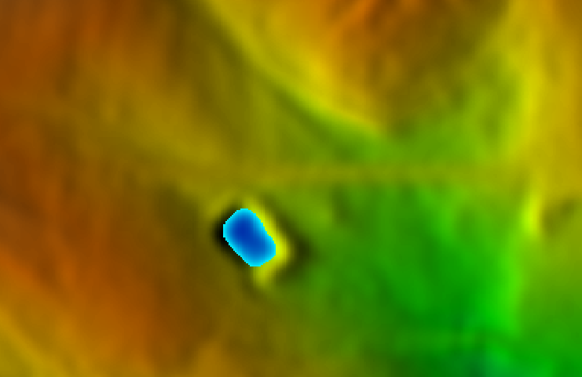

## DESCRIPTION

*r.volume* is a tool for summing cell values within clumps and
calculating volumes and centroids of patches or clumps.

*r.volume* generates a table containing the sum of all cells from a
**input** raster map sorted by category on a **clump** raster map, and
optionally generates a vector points map of the centroids for each
clump. If a clump map is not specified, the current raster mask is used.
The raster mask can be defined by *[r.mask](r.mask.md)*. The sum is
multiplied by the area of a cell to give the volume occupied by that
cell. See below for an example of the output table.

## NOTES

If a clump map is not given and a raster mask is not set, the program
exits with an error message.

*r.volume* works in the current region and respects the current raster
mask.

### CENTROIDS

The centroid coordinates are the same as those stored in the vector map
(if one was requested by **centroids** parameter). They are guaranteed
to fall on a cell of the appropriate category, thus they are not always
the true, mathematical centroid. They will always fall at a cell center.

Attribute table linked to the vector map with centroids contains several
columns:

- `cat` - category value (integer)
- `volume` - volume value (double precision)
- `average` - average value in the clump (double precision)
- `sum` - sum of cell values in the clump (double precision)
- `count` - number of cells with the category (integer)

Vector points can be converted directly to a raster map with each point
a separate category using *[v.to.rast](v.to.rast.md)*.

### APPLICATIONS

By preprocessing the elevation raster map with
*[r.mapcalc](r.mapcalc.md)* and using suitable masking or clump maps,
very interesting applications can be done with *r.volume*. Such as,
calculating the volume of rock in a potential quarry; calculating
cut/fill volumes for roads; finding water volumes in potential
reservoirs.

## EXAMPLE

### Computation of a water basin volume

The example is based on the North Carolina sample dataset:

```sh
# set computational region to small basin within extent of LiDAR elevation model
g.region n=220361 s=220123 w=638527 e=638894 align=elev_lid792_1m -p
# generate shared relief map for better terrain visualization
r.relief input=elev_lid792_1m output=elev_lid792_1m_shaded
d.shade shade=elev_lid792_1m_shaded color=elev_lid792_1m

# query terrain height at a position within the basin
r.what map=elev_lid792_1m coordinates=638684.0,220210.0
# 638684.0|220210.0||112.2362

# fill the basin with water, approx 1.5m above terrain
r.lake elevation=elev_lid792_1m water_level=113.7 lake=mylake coordinates=638684.0,220210.0
#  Lake depth from 0.000000 to 1.622047 (specified water level is taken as zero)
#  Lake area 764.000000 square meters
#  Lake volume 648.875328 cubic meters

# compute water volume
r.volume input=elev_lid792_1m clump=mylake
#
# Category   Average   Data   # Cells        Centroid             Total
# Number     in clump  Total  in clump   Easting     Northing     Volume
# -----------------------------------------------------------------------------
#        1    112.66     54188     481   638683.50   220210.50         54188.35
#        2    112.14      6504      58   638679.50   220215.50          6504.14
# -----------------------------------------------------------------------------
#                                                 Total Volume =       60692.49
```

  
*Figure: Water filled based shown on shaded elevation map*

### Report of geological data

The following report was generated by the command (North Carolina sample
dataset):

```sh
# set computational region
g.region raster=elevation -p

# compute volume
r.volume input=elevation clump=geology_30m
#
# Volume report on data from <elevation> using clumps on <geology_30m> raster map
#
# Category   Average   Data   # Cells        Centroid             Total
# Number     in clump  Total  in clump   Easting     Northing     Volume
# -----------------------------------------------------------------------------
#      217    118.93  86288828  725562   635325.00   221535.00    8628882798.63
#      262    108.97  21650560  198684   638935.00   222495.00    2165056037.02
#      270     92.23  63578874  689373   642405.00   221485.00    6357887443.53
#      405    132.96  33732662  253710   631835.00   224095.00    3373266208.59
#      583    139.35   3011288   21609   630205.00   224665.00     301128821.55
#      720    124.30    599618    4824   634075.00   227995.00      59961816.06
#      766    132.43    936791    7074   631425.00   227845.00      93679120.08
#      862    118.31   7302317   61722   630505.00   218885.00     730231746.74
#      910     94.20   4235816   44964   639215.00   216365.00     423581613.11
#      921    135.22   1693985   12528   630755.00   215445.00     169398523.05
#      945    127.24      1145       9   630015.00   215015.00        114512.03
#      946     89.91    365748    4068   639085.00   215255.00      36574833.85
#      948    129.02    112632     873   630185.00   215115.00      11263181.57
# -----------------------------------------------------------------------------
#                                                 Total Volume = 22351026655.81
```

The `Data Total` column is the sum of the elevations for each in each of
the fields. The `Total Volume` is the sum multiplied by the east-west
resolution times the north-south resolution. Note that the units on the
volume may be difficult if the units of cell values on the **input**
raster map and the resolution units differ.

## SEE ALSO

*[r.clump](r.clump.md), [r.mask](r.mask.md), [r.mapcalc](r.mapcalc.md)*

## AUTHORS

Dr. James Hinthorne, Central Washington University GIS Laboratory,
December 1988.  
Updated to GRASS 7 by Martin Landa, Czech Technical University in
Prague, Czech Republic
