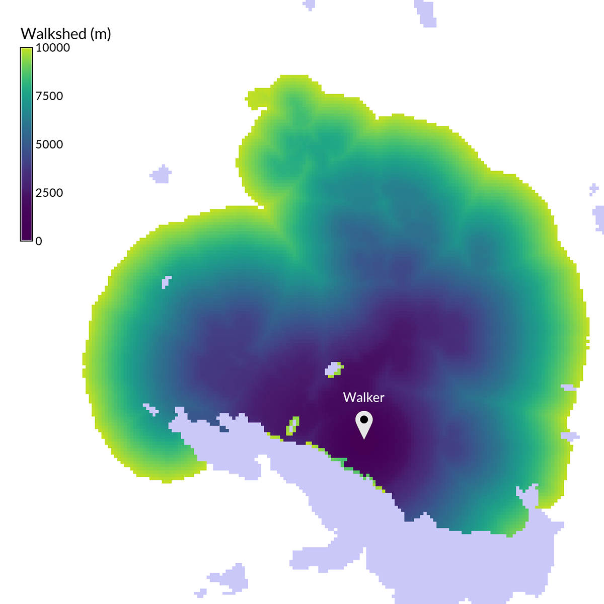

## DESCRIPTION

*r.walk* computes anisotropic cumulative cost of moving between
different geographic locations on an input elevation raster map whose
cell category values represent elevation combined with an input raster
map layer whose cell values represent friction cost.

*r.walk* outputs 1) a raster map showing the lowest cumulative cost
(time) of moving between each cell and the user-specified starting
points and 2) a second raster map showing the movement direction to the
next cell on the path back to the start point (see [Movement
Direction](#movement-direction)). It uses an input elevation raster map whose cell
category values represent elevation, combined with a second input raster
map whose cell values represent friction costs.

This function is similar to *[r.cost](r.cost.md)*, but in addition to a
friction map, it considers an anisotropic travel time due to the
different walking speed associated with downhill and uphill movements.

## NOTES

The formula from Aitken 1977/Langmuir 1984 (based on Naismith's rule for
walking times) has been used to estimate the cost parameters of specific
slope intervals:

```sh
T = a*delta_S + b*delta_H_uphill + c*delta_H_moderate_downhill + d*delta_H_steep_downhill
```

where:

- `T` is time of movement in seconds,
- `delta S` is the horizontal distance covered in meters,
- `delta H` is the altitude difference in meters.

The a, b, c, d **walk_coeff** parameters take in account movement speed
in the different conditions and are linked to:

- a: time in seconds it takes to walk for 1 meter a flat surface
  (1/walking speed)
- b: additional walking time in seconds, per meter of elevation gain on
  uphill slopes
- c: additional walking time in seconds, per meter of elevation loss on
  moderate downhill slopes (use positive value for decreasing cost)
- d: additional walking time in seconds, per meter of elevation loss on
  steep downhill slopes (use negative value for increasing cost)

It has been proved that moving downhill is favourable up to a specific
slope value threshold, after that it becomes unfavourable. The default
slope value threshold (**slope_factor**) is -0.2125, corresponding to
tan(-12), calibrated on human behaviour (\>5 and \<12 degrees: moderate
downhill; \>12 degrees: steep downhill). The default values for a, b, c,
d **walk_coeff** parameters are those proposed by Langmuir (0.72, 6.0,
1.9998, -1.9998), based on man walking effort in standard conditions.

The **friction** cost parameter represents a time penalty in seconds of
additional walking time to cross 1 meter distance. Friction cost can be
any floating point value ≥ 0. A friction map is a required parameter; if
no friction costs are desired, a friction map should be a raster in
which all cells have a value of 0.

The **lambda** parameter is a dimensionless scaling factor of the
friction cost:

```sh
total cost = movement time cost + lambda * friction costs * delta_S
```

For a more accurate result, the "knight's move" option can be used
(although it is more time consuming). In the diagram below, the center
location (O) represents a grid cell from which cumulative distances are
calculated. Those neighbours marked with an x are always considered for
cumulative cost updates. With the "knight's move" option, the neighbours
marked with a K are also considered.

```sh
  K   K
K x x x K
  x O x
K x x x K
  K   K
```

The minimum cumulative costs are computed using Dijkstra's algorithm,
that find an optimum solution (for more details see *r.cost*, that uses
the same algorithm).

### Movement Direction

The movement direction surface is created to record the sequence of
movements that created the cost accumulation surface. This movement
direction surface can be used by *[r.path](r.path.md)* to recover a path
from an end point back to the start point. The direction of each cell
points towards the next cell. The directions are recorded as degrees CCW
from East:

```sh
       112.5      67.5         i.e. a cell with the value 135
157.5  135   90   45   22.5    means the next cell is to the north-west
       180   x   360
202.5  225  270  315  337.5
       247.5     292.5
```

Once *r.walk* computes the cumulative cost map as a linear combination
of friction cost (from friction map) and the altitude and distance
covered (from the digital elevation model), the associated movement
direction map can be used by *[r.path](r.path.md)* to find the minimum
cost path.

*r.walk*, like most all GRASS raster programs, is also made to be run on
maps larger that can fit in available computer memory. As the algorithm
works through the dynamic list of cells it can move almost randomly
around the entire area. *r.walk* divides the entire area into a number
of pieces and swaps these pieces in and out of memory (to and from disk)
as needed. This provides a virtual memory approach optimally designed
for 2-D raster maps. The amount of memory to be used by *r.walk* can be
controlled with the **memory** option, default is 300 MB. For systems
with less memory this value will have to be set to a lower value.

## EXAMPLES

We compute a map showing how far a lost person could get from the point
where he or she was last seen while taking into account the topography
and landcover.

```sh
g.region swwake_30m -p

# create friction map based on land cover
r.recode landclass96 out=friction rules=- << EOF
1:3:0.1:0.1
4:5:10.:10.
6:6:1000.0:1000.0
7:7:0.3:0.3
EOF

r.walk -k elevation=elev_ned_30m friction=friction output=walkcost \
    start_coordinates=635576,216485 lambda=0.5 max=10000

# compute contours on the cost surface to better understand
# how far the person can get in certain time (1000 is in seconds)
r.contour walkcost output=walkcost step=1000
```

  
*Figure: Walkshed over a cost surface derived from topography and
landcover*

## REFERENCES

- Aitken, R. 1977. Wilderness areas in Scotland. Unpublished Ph.D.
  thesis. University of Aberdeen.
- Steno Fontanari, University of Trento, Italy, Ingegneria per
  l'Ambiente e il Territorio, 2000-2001.
- Langmuir, E. 1984. Mountaincraft and leadership. The Scottish Sports
  Council/MLTB. Cordee, Leicester.

## SEE ALSO

*[r.cost](r.cost.md), [r.path](r.path.md), [r.in.ascii](r.in.ascii.md),
[r.mapcalc](r.mapcalc.md), [r.recode](r.recode.md),
[r.out.ascii](r.out.ascii.md)*

## AUTHORS

**Based on r.cost written by :**  
Antony Awaida, Intelligent Engineering, Systems Laboratory, M.I.T.  
James Westervelt, U.S.Army Construction Engineering Research
Laboratory  
Updated for Grass 5 by Pierre de Mouveaux (<pmx@audiovu.com>)

**Initial version of r.walk:**  
Steno Fontanari, 2002

**Current version of r.walk:**  
Franceschetti Simone, Sorrentino Diego, Mussi Fabiano and Pasolli
Mattia  
Correction by: Fontanari Steno, Napolitano Maurizio and Flor Roberto  
In collaboration with: Franchi Matteo, Vaglia Beatrice, Bartucca Luisa,
Fava Valentina and Tolotti Mathias, 2004

**Updated for GRASS 6.1:**  
Roberto Flor and Markus Neteler

**Updated for GRASS GIS 7:**  
Markus Metz  
Multiple path directions sponsored by
[mundialis](https://www.mundialis.de)
