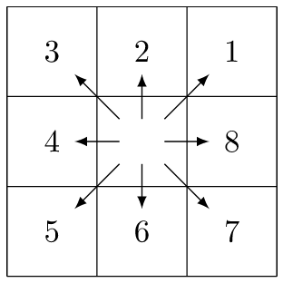

## DESCRIPTION

*r.watershed* generates a set of maps indicating: 1) flow accumulation,
drainage direction, the location of streams and watershed basins, and 2)
the LS and S factors of the Revised Universal Soil Loss Equation
(RUSLE).

## NOTES

Without flag **-m** set, the entire analysis is run in memory maintained
by the operating system. This can be limiting, but is very fast. Setting
this flag causes the program to manage memory on disk which allows very
large maps to be processed but is slower.

Flag **-s** force the module to use single flow direction (SFD, D8)
instead of multiple flow direction (MFD). MFD is enabled by default.

By **-4** flag the user allow only horizontal and vertical flow of
water. Stream and slope lengths are approximately the same as outputs
from default surface flow (allows horizontal, vertical, and diagonal
flow of water). This flag will also make the drainage basins look more
homogeneous.

When **-a** flag is specified the module will use positive flow
accumulation even for likely underestimates. When this flag is not set,
cells with a flow accumulation value that is likely to be an
underestimate are converted to the negative. See below for a detailed
description of flow accumulation output.

Option **convergence** specifies convergence factor for MFD. Lower
values result in higher divergence, flow is more widely distributed.
Higher values result in higher convergence, flow is less widely
distributed, becoming more similar to SFD.

Option **elevation** specifies the elevation data on which entire
analysis is based. NULL (nodata) cells are ignored, zero and negative
values are valid elevation data. Gaps in the elevation map that are
located within the area of interest must be filled beforehand, e.g. with
*[r.fillnulls](r.fillnulls.md)*, to avoid distortions. The elevation map
need not be sink-filled because the module uses a least-cost algorithm.

Option **depression** specifies the optional map of actual depressions
or sinkholes in the landscape that are large enough to slow and store
surface runoff from a storm event. All cells that are not NULL and not
zero indicate depressions. Water will flow into but not out of
depressions.

Raster **flow** map specifies amount of overland flow per cell. This map
indicates the amount of overland flow units that each cell will
contribute to the watershed basin model. Overland flow units represent
the amount of overland flow each cell contributes to surface flow. If
omitted, a value of one (1) is assumed.

Raster **retention** map specifies correction factors per cell for flow
distribution. This map indicates the percentage of overland flow units
leaving each cell. Values should be between zero and 100. If omitted, a
value of 100 is assumed.

Input Raster map or value containing the percent of disturbed land
(i.e., croplands, and construction sites) where the raster or input
value of 17 equals 17%. If no map or value is given, *r.watershed*
assumes no disturbed land. This input is used for the RUSLE
calculations.

Option **blocking** specifies terrain that will block overland surface
flow. Blocking cells and streams stop the slope length for the RUSLE.
All cells that are not NULL and not zero indicate blocking terrain.

Option **threshold** specifies the minimum size of an exterior watershed
basin in cells, if no flow map is input, or overland flow units when a
flow map is given. Warning: low threshold values will dramactically
increase run time and generate difficult to read basin and half_basin
results. This parameter also controls the level of detail in the
**stream** segments map.

Value given by **max_slope_length** option indicates the maximum length
of overland surface flow in meters. If overland flow travels greater
than the maximum length, the program assumes the maximum length (it
assumes that landscape characteristics not discernible in the digital
elevation model exist that maximize the slope length). This input is
used for the RUSLE calculations and is a sensitive parameter.

Output **accumulation** map contains the absolute value of the amount of
overland flow that traverses each cell. This value will be the number of
upland cells plus one if no overland flow map is given. If the overland
flow map is given, the value will be in overland flow units. Negative
numbers indicate that those cells possibly have surface runoff from
outside of the current geographic region. Thus, any cells with negative
values cannot have their surface runoff and sedimentation yields
calculated accurately.

Output **tci** raster map contains topographic index TCI, computed as
`ln(α / tan(β))` where α is the cumulative upslope area draining through
a point per unit contour length and `tan(β)` is the local slope angle.
The TCI reflects the tendency of water to accumulate at any point in the
catchment and the tendency for gravitational forces to move that water
downslope (Quinn et al. 1991). This value will be negative if
`α / tan(β) < 1`.

Output **spi** raster map contains stream power index SPI, computed as
`α * tan(β)` where α is the cumulative upslope area draining through a
point per unit contour length and `tan(β)` is the local slope angle. The
SPI reflects the power of water flow at any point in the catchment and
the tendency for gravitational forces to move that water downslope
(Moore et al. 1991). This value will be negative if `α < 0`, i.e. for
cells with possible surface runoff from outside of the current
geographic region.

Output **drainage** raster map contains drainage direction. Provides the
"aspect" for each cell measured CCW from East.

  
*Figure: Drainage is 8 directions numbered counter-clockwise starting
from 1 in north-east direction
([source](https://idea.isnew.info/how-to-import-arcgis-flow-direction-into-grass-gis.html))*

Multiplying positive values by 45 will give the direction in degrees
that the surface runoff will travel from that cell. The value 0 (zero)
indicates that the cell is a depression area (defined by the depression
input map). Negative values indicate that surface runoff is leaving the
boundaries of the current geographic region. The absolute value of these
negative cells indicates the direction of flow. For MFD, drainage
indicates the direction of maximum flow.

The output **basin** map contains unique label for each watershed basin.
Each basin will be given a unique positive even integer. Areas along
edges may not be large enough to create an exterior watershed basin.
NULL values indicate that the cell is not part of a complete watershed
basin in the current geographic region.

The output **stream** contains stream segments. Values correspond to the
watershed basin values. Can be vectorized after thinning
(*[r.thin](r.thin.md)*) with *[r.to.vect](r.to.vect.md)*.

The output **half_basin** raster map stores each half-basin is given a
unique value. Watershed basins are divided into left and right sides.
The right-hand side cell of the watershed basin (looking upstream) are
given even values corresponding to the values in basin. The left-hand
side cells of the watershed basin are given odd values which are one
less than the value of the watershed basin.

The output **length_slope** raster map stores slope length and steepness
(LS) factor for the Revised Universal Soil Loss Equation (RUSLE).
Equations taken from *Revised Universal Soil Loss Equation for Western
Rangelands* (Weltz et al. 1987). Since the LS factor is a small number
(usually less than one), the GRASS output map is of type DCELL.

The output **slope_steepness** raster map stores slope steepness (S)
factor for the Universal Soil Loss Equation (RUSLE). Equations taken
from article entitled *Revised Slope Steepness Factor for the Universal
Soil Loss Equation* (McCool et al. 1987). Since the S factor is a small
number (usually less than one), the GRASS output map is of type DCELL.

### A^T least-cost search algorithm

*r.watershed* uses an A^T least-cost search algorithm (see
REFERENCES section) designed to minimize the impact of DEM data errors.
Compared to *[r.terraflow](r.terraflow.md)*, this algorithm provides
more accurate results in areas of low slope as well as DEMs constructed
with techniques that mistake canopy tops as the ground elevation. Kinner
et al. (2005), for example, used SRTM and IFSAR DEMs to compare
*r.watershed* against *[r.terraflow](r.terraflow.md)* results in Panama.
*[r.terraflow](r.terraflow.md)* was unable to replicate stream locations
in the larger valleys while *r.watershed* performed much better. Thus,
if forest canopy exists in valleys, SRTM, IFSAR, and similar data
products will cause major errors in *r.terraflow* stream output. Under
similar conditions, *r.watershed* will generate better **stream** and
**half_basin** results. If watershed divides contain flat to low slope,
*r.watershed* will generate better basin results than
*[r.terraflow](r.terraflow.md)*. (*[r.terraflow](r.terraflow.md)* uses
the same type of algorithm as ESRI's ArcGIS watershed software which
fails under these conditions.) Also, if watershed divides contain forest
canopy mixed with uncanopied areas using SRTM, IFSAR, and similar data
products, *r.watershed* will generate better basin results than
*[r.terraflow](r.terraflow.md)*. The algorithm produces results similar
to those obtained when running *[r.cost](r.cost.md)* and
*[r.drain](r.drain.md)* on every cell on the raster map.

### Multiple flow direction (MFD)

*r.watershed* offers two methods to calculate surface flow: single flow
direction (SFD, D8) and multiple flow direction (MFD). With MFD, water
flow is distributed to all neighbouring cells with lower elevation,
using slope towards neighbouring cells as a weighing factor for
proportional distribution. The A^T least-cost path is always
included. As a result, depressions and obstacles are traversed with a
graceful flow convergence before the overflow. The convergence factor
causes flow accumulation to converge more strongly with higher values.
The supported range is 1 to 10, recommended is a convergence factor of 5
(Holmgren, 1994). If many small sliver basins are created with MFD,
setting the convergence factor to a higher value can reduce the amount
of small sliver basins.

### In-memory mode and disk swap mode

There are two versions of this program: *ram* and *seg*. *ram* is used
by default, *seg* can be used by setting the **-m** flag.

The *ram* version requires a maximum of 31 MB of RAM for 1 million
cells. Together with the amount of system memory (RAM) available, this
value can be used to estimate whether the current region can be
processed with the *ram* version.

The *ram* version uses virtual memory managed by the operating system to
store all the data structures and is faster than the *seg* version;
*seg* uses the GRASS segmentation library which manages data in disk
files. *seg* uses only as much system memory (RAM) as specified with the
**memory** option, allowing other processes to operate on the same
system, even when the current geographic region is huge.

Due to memory requirements of both programs, it is quite easy to run out
of memory when working with huge map regions. If the *ram* version runs
out of memory and the resolution size of the current geographic region
cannot be increased, either more memory needs to be added to the
computer, or the swap space size needs to be increased. If *seg* runs
out of memory, additional disk space needs to be freed up for the
program to run. The *[r.terraflow](r.terraflow.md)* module was
specifically designed with huge regions in mind and may be useful here
as an alternative, although disk space requirements of
*[r.terraflow](r.terraflow.md)* are several times higher than of *seg*.

### Large regions with many cells

The upper limit of the *ram* version is 2 billion (2^31 - 1)
cells, whereas the upper limit for the *seg* version is 9
billion-billion (2^63 - 1 =
[9.223372e+18](https://en.wikipedia.org/wiki/9223372036854775807))
cells.  
In some situations, the region size (number of cells) may be too large
for the amount of time or memory available. Running *r.watershed* may
then require use of a coarser resolution. To make the results more
closely resemble the finer terrain data, create a map layer containing
the lowest elevation values at the coarser resolution. This is done
by: 1) Setting the current geographic region equal to the elevation map
layer with *[g.region](g.region.md)*, and 2) Use the
*[r.neighbors](r.neighbors.md)* or *[r.resamp.stats](r.resamp.stats.md)*
command to find the lowest value for an area equal in size to the
desired resolution. For example, if the resolution of the elevation data
is 30 meters and the resolution of the geographic region for
*r.watershed* will be 90 meters: use the minimum function for a 3 by 3
neighborhood. After changing to the resolution at which *r.watershed*
will be run, *r.watershed* should be run using the values from the
**neighborhood** output map layer that represents the minimum elevation
within the region of the coarser cell.

### Basin threshold

The minimum size of drainage basins, defined by the **threshold**
parameter, is only relevant for those watersheds with a single stream
having at least the **threshold** of cells flowing into it. (These
watersheds are called exterior basins.) Interior drainage basins contain
stream segments below multiple tributaries. Interior drainage basins can
be of any size because the length of an interior stream segment is
determined by the distance between the tributaries flowing into it.

### Masking and no data

The *r.watershed* program does not require the user to have the current
geographic region filled with elevation values. Areas without elevation
data (masked or NULL cells, i.e., no data) are ignored and treated as if
they were outside the region. Masking out unimportant areas can
significantly reduce processing time and memory requirements if the
watersheds of interest occupy a small percentage of the overall area.

Gaps (NULL cells) in the elevation map that are located within the area
of interest will heavily influence the analysis: water will flow into
but not out of these gaps. These gaps must be filled beforehand, e.g.
with *[r.fillnulls](r.fillnulls.md)*.

Zero (0) and negative values will be treated as elevation data (not
no_data).

### Further processing of output layers

Problem areas, i.e. those parts of a basin with a likely underestimate
of flow accumulation, can be easily identified with e.g.

```sh
  r.mapcalc "problems = if(flow_acc < 0, basin, null())"
```

If the region of interest contains such problem areas, and this is not
desired, the computational region must be expanded until the catchment
area for the region of interest is completely included.

To isolate an individual river network using the output of this module,
a number of approaches may be considered.

1. Use a resample of the basins catchment raster map as a raster
    mask.  
    The equivalent vector map method is similar using
    *[v.select](v.select.md)* or *[v.overlay](v.overlay.md)*.
2. Use the *[r.cost](r.cost.md)* module with a point in the river as a
    starting point.
3. Use the *[v.net.iso](v.net.iso.md)* module with a node in the river
    as a starting point.

All individual river networks in the stream segments output can be
identified through their ultimate outlet points. These points are all
cells in the stream segments output with negative drainage direction.
These points can be used as start points for
*[r.water.outlet](r.water.outlet.md)* or *[v.net.iso](v.net.iso.md)*.

To create *river mile* segmentation from a vectorized streams map, try
the *[v.net.iso](v.net.iso.md)* or *[v.lrs.segment](v.lrs.segment.md)*
modules.

The stream segments output can be easily vectorized after thinning with
*[r.thin](r.thin.md)*. Each stream segment in the vector map will have
the value of the associated basin. To isolate subbasins and streams for
a larger basin, a mask for the larger basin can be created with
*[r.water.outlet](r.water.outlet.md)*. The stream segments output serves
as a guide where to place the outlet point used as input to
*[r.water.outlet](r.water.outlet.md)*. The basin threshold must have
been sufficiently small to isolate a stream network and subbasins within
the larger basin.

Given that the **drainage** is 8 directions numbered counter-clockwise
starting from 1 in north-east direction, multiplying the output by 45
(by `45.` to get a double precision floating point raster map in
*[r.mapcalc](r.mapcalc.md)*) gives the directions in degrees. For most
applications, zeros which indicate depressions specified by
**depression** and negative values which indicate runoff leaving the
region should be replaced by NULL (`null()` in
*[r.mapcalc](r.mapcalc.md)*). The following command performs these
replacements:

```sh
r.mapcalc "drainage_degrees = if(drainage > 0, 45. * drainage, null())"
```

Alternatively, the user can use the **-a** flag or later the `abs()`
function in *[r.mapcalc](r.mapcalc.md)* if the runoff is leaving the
region.

## EXAMPLES

These examples use the Spearfish sample dataset.

### Convert *r.watershed* streams map output to a vector map

If you want a detailed stream network, set the threshold option small to
create lots of catchment basins, as only one stream is presented per
catchment. The `r.to.vect -v` flag preserves the catchment ID as the
vector category number.

```sh
  r.watershed elev=elevation.dem stream=rwater.stream
  r.to.vect -v in=rwater.stream out=rwater_stream
```

Set a different color table for the accumulation map:

```sh
  MAP=rwater.accum
  r.watershed elev=elevation.dem accum=$MAP

  eval `r.univar -g "$MAP"`
  stddev_x_2=`echo $stddev | awk '{print $1 * 2}'`
  stddev_div_2=`echo $stddev | awk '{print $1 / 2}'`

  r.colors $MAP col=rules << EOF
    0% red
    -$stddev_x_2 red
    -$stddev yellow
    -$stddev_div_2 cyan
    -$mean_of_abs blue
    0 white
    $mean_of_abs blue
    $stddev_div_2 cyan
    $stddev yellow
    $stddev_x_2 red
    100% red
  EOF
```

Create a more detailed stream map using the accumulation map and convert
it to a vector output map. The accumulation cut-off, and therefore
fractal dimension, is arbitrary; in this example we use the map's mean
number of upstream catchment cells (calculated in the above example by
*[r.univar](r.univar.md)*) as the cut-off value. This only works with
SFD, not with MFD.

```sh
  r.watershed elev=elevation.dem accum=rwater.accum

  r.mask raster=elevation.dem
  r.mapcalc "rwater.course = \
   if( abs(rwater.accum) > $mean_of_abs, \
       abs(rwater.accum), \
       null() )"
  r.colors -g rwater.course col=bcyr
  r.mask -r

  # Thinning is required before converting raster lines to vector
  r.thin in=rwater.course out=rwater.course.Thin
  r.colors -gn rwater.course.Thin color=grey
  r.to.vect in=rwater.course.Thin out=rwater_course type=line
  v.db.dropcolumn map=rwater_course column=label
```

### Create watershed basins map and convert to a vector polygon map

```sh
  r.watershed elev=elevation.dem basin=rwater.basin thresh=15000
  r.to.vect -s in=rwater.basin out=rwater_basins type=area
  v.db.dropcolumn map=rwater_basins column=label
  v.db.renamecolumn map=rwater_basins column=value,catchment
```

Display output in a nice way

```sh
  r.relief map=elevation.dem
  d.shade shade=elevation.dem.shade color=rwater.basin bright=40
  d.vect rwater_course color=orange
```

## REFERENCES

- Ehlschlaeger C. (1989). *Using the A^T Search Algorithm to
  Develop Hydrologic Models from Digital Elevation Data*, **Proceedings
  of International Geographic Information Systems (IGIS) Symposium
  '89**, pp 275-281 (Baltimore, MD, 18-19 March 1989).  
  URL: <http://chuck.ehlschlaeger.info/older/IGIS/paper.html>
- Holmgren P. (1994). *Multiple flow direction algorithms for runoff
  modelling in grid based elevation models: An empirical evaluation.*
  **Hydrological Processes** Vol 8(4), 327-334.  
  DOI: [10.1002/hyp.3360080405](https://doi.org/10.1002/hyp.3360080405)
- Kinner D., Mitasova H., Harmon R., Toma L., Stallard R. (2005).
  *GIS-based Stream Network Analysis for The Chagres River Basin,
  Republic of Panama*. **The Rio Chagres: A Multidisciplinary Profile of
  a Tropical Watershed**, R. Harmon (Ed.), Springer/Kluwer, p.83-95.  
  URL: <http://fatra.cnr.ncsu.edu/~hmitaso/measwork/panama/panama.html>
- McCool et al. (1987). *Revised Slope Steepness Factor for the
  Universal Soil Loss Equation*, **Transactions of the ASAE** Vol 30(5).
- Metz M., Mitasova H., Harmon R. (2011). *Efficient extraction of
  drainage networks from massive, radar-based elevation models with
  least cost path search*, **Hydrol. Earth Syst. Sci.** Vol 15,
  667-678.  
  DOI:
  [10.5194/hess-15-667-2011](https://doi.org/10.5194/hess-15-667-2011)
- Moore I.D., Grayson R.B., Ladson A.R. (1991). *Digital terrain
  modelling: a review of hydrogical, geomorphological, and biological
  applications*, **Hydrological Processes**, Vol 5(1), 3-30  
  DOI: [10.1002/hyp.3360050103](https://doi.org/10.1002/hyp.3360050103)
- Quinn P., K. Beven K., Chevallier P., Planchon O. (1991). *The
  prediction of hillslope flow paths for distributed hydrological
  modelling using Digital Elevation Models*, **Hydrological Processes**
  Vol 5(1), p.59-79.  
  DOI: [10.1002/hyp.3360050106](https://doi.org/10.1002/hyp.3360050106)
- Weltz M. A., Renard K.G., Simanton J. R. (1987). *Revised Universal
  Soil Loss Equation for Western Rangelands*, **U.S.A./Mexico Symposium
  of Strategies for Classification and Management of Native Vegetation
  for Food Production In Arid Zones** (Tucson, AZ, 12-16 Oct. 1987).

## SEE ALSO

*[g.region](g.region.md), [r.cost](r.cost.md), [r.drain](r.drain.md),
[r.fillnulls](r.fillnulls.md), [r.flow](r.flow.md), [r.mask](r.mask.md),
[r.neighbors](r.neighbors.md), [r.param.scale](r.param.scale.md),
[r.resamp.interp](r.resamp.interp.md), [r.terraflow](r.terraflow.md),
[r.topidx](r.topidx.md), [r.water.outlet](r.water.outlet.md),
[r.stream.extract](r.stream.extract.md)*

## AUTHORS

Original version: Charles Ehlschlaeger, U.S. Army Construction
Engineering Research Laboratory  
Faster sorting algorithm and MFD support: Markus Metz
\<markus.metz.giswork at gmail.com\>  
Retention for flow distribution by Andreas Gericke (IGB Berlin)
