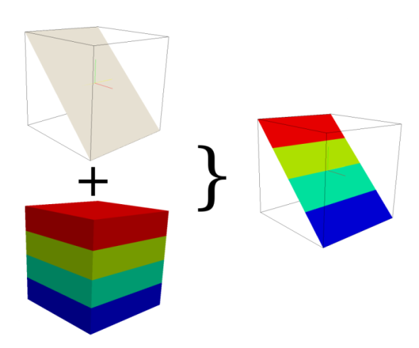

## DESCRIPTION

*r3.cross.rast* creates a cross section 2D map from one 3D raster volume
map based on a 2D elevation map. It checks if the value of the elevation
map is located in the z-coordinate space of the 3D map. If so, the 3D
voxel value for this position is transferred to the related cross
section output map cell, otherwise the NULL value is set.

  
*How r3.cross.rast works*

If the 2D and 3D region settings are different, the 2D resolution will
be adjust to the 3D resolution.

## NOTES

To create a cut plane elevation map use *r.mapcalc*. Some examples:

- To create a cut plane elevation map in x direction type  
  *r.mapcalc "cutplane = col()\*x"*,  
  x be the value for the elevation. If the range of col() is 1 ... 10,
  the elevation map has the range 1 ... 10 if x == 1 and if x == 10 the
  range 10 ... 100
- To create a cut plane elevation map in y direction type  
  *r.mapcalc "cutplane = row()\*x"*,  
  x be the value for the elevation. If the range of col() is 1 ... 10,
  the elevation map has the range 1 ... 10 if x == 1 and if x == 10 the
  range 10 ... 100
- The user can also make a cut in y and x direction with *r.mapcalc* by
  using  
  *r.mapcalc "cutplane = (row()+col())\*x"*

## EXAMPLES

### Simple Spearfish example

```sh
g.region -d
g.region res=150 res3=150 t=1000 b=0 tbres=100

# synthetic data, could be geological structures:
r3.mapcalc "map3d = sin(row())+sin(col())+sin(depth()*depth())"

#create a cutplane map
r.mapcalc "cutplane = col()*10"

#create the cross section map
r3.cross.rast input=map3d elevation=cutplane output=crosssection
```

## SEE ALSO

*[g.region](g.region.md), [r.mapcalc](r.mapcalc.md),
[r3.mapcalc](r3.mapcalc.md), [r3.to.rast](r3.to.rast.md)*

## AUTHOR

Sören Gebbert
