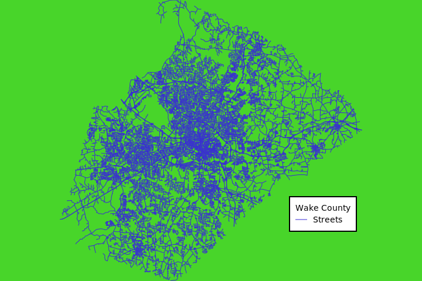

## DESCRIPTION

*d.background* will fill the image (or generally display monitor) with a
single color specified by the **color** option.

## NOTES

*d.background* is a frontend to *d.erase* and shares its limitations.
Namely, it does not work with the wx monitors such as `d.mon wx0`.

## EXAMPLES

In this example, the *streets_wake* map from the North Carolina sample
dataset is displayed with custom background color (specified using HTML
hex color code) using *cairo* display monitor (creates file called
*map.png*):

```sh
g.region vector=streets_wake
d.mon cairo
d.background color=#ADEFD1
d.vect map=streets_wake color=#00203F legend_label="Streets"
d.legend.vect -b at=70,30 title="Wake County"
```



Figure: Wake County street network with custom background color (North
Carolina sample dataset)

## SEE ALSO

*[d.erase](d.erase.md)*

## AUTHOR

Vaclav Petras, [NCSU GeoForAll
Lab](https://geospatial.ncsu.edu/geoforall/)
