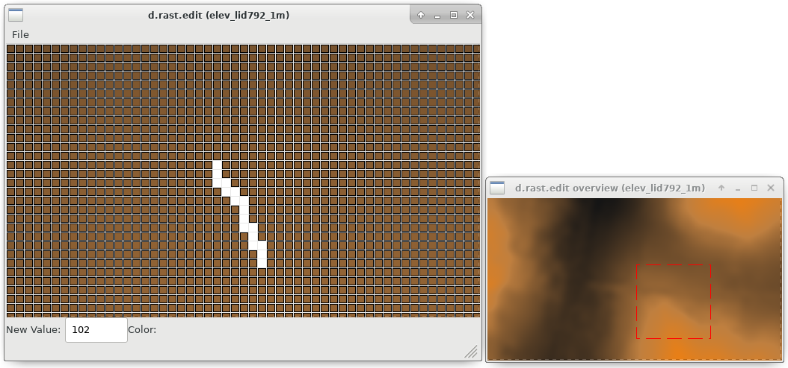

## DESCRIPTION

The *d.rast.edit* program allows users to interactively edit cell
category values in a raster map layer displayed to the graphics monitor
using a mouse cursor.

### Overview window

An overview window shows the entire map with a red box showing the
current editing region. The edit window shows the cells within the
selected area. Click on a new spot on the overview window to move the
editing area.

### Raster cell editing

Cell editing is done using the mouse cursor to indicate the cell(s) on
the displayed raster map that are to be edited.

To change the value of a cell put the new value to use in the "New
value" box at the bottom left of the edit window. A value of "\*"
indicates a NULL value should be used.

**Important:** the new value in the "New value" box must be confirmed
with ENTER, otherwise it is not yet active.

### Saving the edited map

To save the edited map, the "File" menu contains the entry **Save**. To
leave *d.rast.edit*, use **Exit** in the menu.

### Map pan with arrow keys

The map can be shifted using the arrow keys on the keyboard.

## NOTES

There is no "undo" command nor way to exit edit mode without saving
changes to the output map.

A raster mask in place will be respected both when reading the original
raster map layer and when writing the new raster map layer, so any edits
to the masked areas will be ignored.

### Geographic Region Concerns

*d.rast.edit* reads the region definition for the raster map layer being
edited from its internal cell header file. The new, edited copy of the
raster layer will be created with the same resolution and region
dimensions.

The primary bane of the *d.rast.edit* program involves large map layers
with lots of rows and columns) and/or slow computers, since the program
must read and write raster map layers row by row for the full size of
the map layer as dictated by its region size and resolution. (The
current region settings of north, south, east, and west will not limit
the size of the edited copy of the map layer, since by use of the
overview selection these values may change several times during the
editing session).

## EXAMPLE

Editing raster values in a LiDAR DEM, North Carolina sample data:

```sh
g.region raster=elev_lid792_1m -p

# pan to area of interest and edit raster cells (I used "102" as value to modify cells
# Use:  File > Save to save
# then: File > Exit
d.rast.edit input=elev_lid792_1m output=elev_lid792_1m_modified

# comparison of raster statistics
# original stats, note the min value
r.univar -g elev_lid792_1m

# modified map stats, note the min value
r.univar -g elev_lid792_1m_modified
```

  
*Figure: Editing of pixels in an elevation raster map using d.rast.edit*

## TODO

*d.rast.edit* should not create a new raster map layer if the user makes
no cell edits while running the program and leaving it without saving.

It would be nice to incorporate a scrollable version of
*[d.legend](d.legend.md)* (such that one could see a label legend for
files with many categories on a standard size sub-frame). It would be
even nicer to be able to select the category values from a graphical
legend when editing cell values (thereby saving a trip to the text frame
to type in the new value).

Perhaps method(s) for multiple or mass cell edits would be useful. This
could be done by providing modes in which the user may:

1. edit a block of cells to a given value by drawing a box;
2. be able to choose a given value which is automatically used as the
    new value on each cell chosen until a different value is desired.

There is no user-interrupt handling. This could leave files in .tmp or
(rarely) result in half-baked raster maps. The original file would
survive unscathed by an interrupt at most any point in execution. Beware
of exiting the program by means other than using *exit* on the *Main
Menu*.

## SEE ALSO

*[d.rast.arrow](d.rast.arrow.md), [d.rast.num](d.rast.num.md),
[wxGUI.rdigit](wxGUI.rdigit.md)*

## AUTHORS

Tcl/Tk (2007) and wxPython versions (2008): Glynn Clements  
  
Replaces Xdriver version in C by Chris Rewerts, April 1991, Agricultural
Engineering, Purdue University
