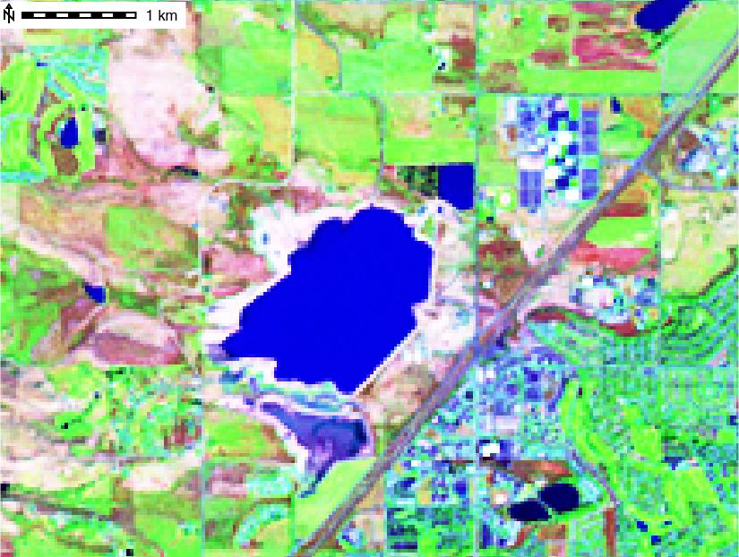
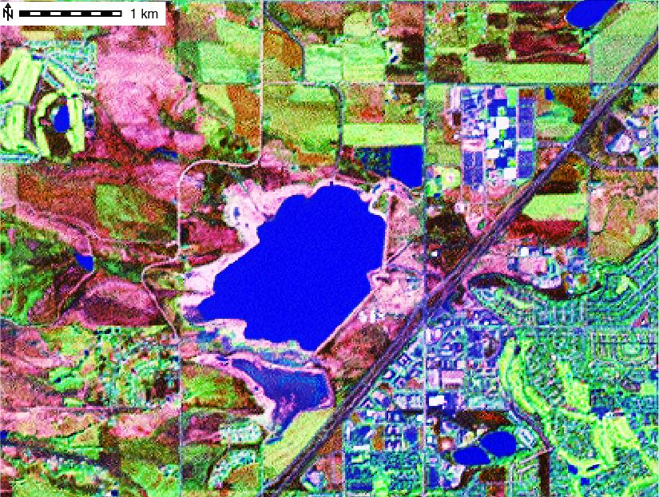
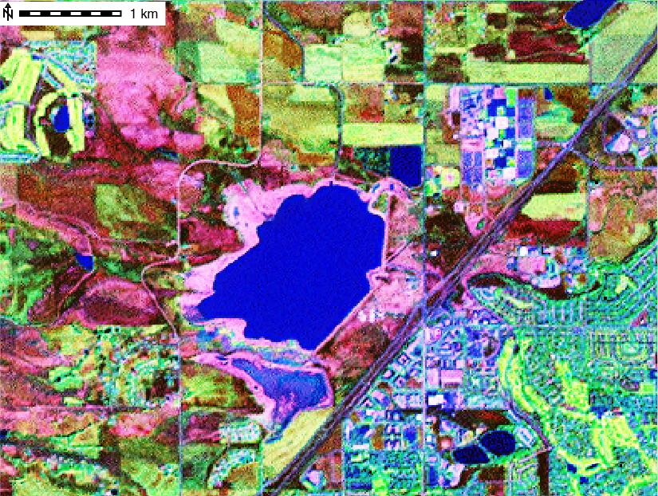
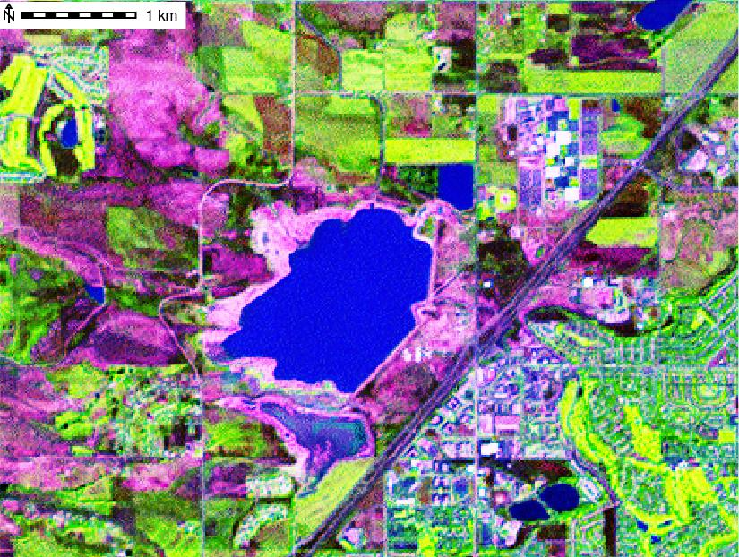

## DESCRIPTION

*i.pansharpen* uses a high resolution panchromatic band from a
multispectral image to sharpen 3 lower resolution bands. The 3 lower
resolution bands can then be combined into an RGB color image at a
higher (more detailed) resolution than is possible using the original 3
bands. For example, Landsat ETM has low resolution spectral bands 1
(blue), 2 (green), 3 (red), 4 (near IR), 5 (mid-IR), and 7 (mid-IR) at
30m resolution, and a high resolution panchromatic band 8 at 15m
resolution. Pan sharpening allows bands 3-2-1 (or other combinations of
30m resolution bands like 4-3-2 or 5-4-2) to be combined into a 15m
resolution color image.

*i.pansharpen* offers a choice of three different 'pan sharpening'
algorithms: IHS, Brovey, and PCA.

For *IHS pan sharpening*, the original 3 lower resolution bands,
selected as red, green and blue channels for creating an RGB composite
image, are transformed into IHS (intensity, hue, and saturation) color
space. The panchromatic band is then substituted for the intensity
channel (I), combined with the original hue (H) and saturation (S)
channels, and transformed back to RGB color space at the higher
resolution of the panchromatic band. The algorithm for this can be
represented as: RGB -\> IHS -\> \[pan\]HS -\> RGB.

With a *Brovey pan sharpening*, each of the 3 lower resolution bands and
panchromatic band are combined using the following algorithm to
calculate 3 new bands at the higher resolution (example for band 1):

```sh
                         band1
    new band1 = ----------------------- * panband
                 band1 + band2 + band3
```

In *PCA pan sharpening*, a principal component analysis is performed on
the original 3 lower resolution bands to create 3 principal component
images (PC1, PC2, and PC3) and their associated eigenvectors (EV), such
that:

```sh
     band1  band2  band3
PC1: EV1-1  EV1-2  EV1-3
PC2: EV2-1  EV2-2  EV2-3
PC3: EV3-1  EV3-2  EV3-3
```

and

```sh
PC1 = EV1-1 * band1 + EV1-2 * band2 + EV1-3 * band3 - mean(bands 1,2,3)
```

An inverse PCA is then performed, substituting the panchromatic band for
PC1. To do this, the eigenvectors matrix is inverted (in this case
transposed), the PC images are multiplied by the eigenvectors with the
panchromatic band substituted for PC1, and mean of each band is added to
each transformed image band using the following algorithm (example for
band 1):

```sh
band1 = pan * EV1-1 + PC2 * EV1-2 + PC3 * EV1-3 + mean(band1)
```

The assignment of the channels depends on the satellite. Examples of
satellite imagery with high resolution panchromatic bands, and lower
resolution spectral bands include Landsat 7 ETM, QuickBird, and SPOT.

## NOTES

The module works for 2-bit to 30-bit images. All images are rescaled to
8-bit for processing. By default, the entire possible range for the
selected bit depth is rescaled to 8-bit. For example, the range of
0-65535 for a 16-bit image is rescaled to 0-255). The 'r' flag allows
the range of pixel values actually present in an image rescaled to a
full 8-bit range. For example, a 16 bit image might only have pixels
that range from 70 to 35000; this range of 70-35000 would be rescaled to
0-255. This can give better visual distinction to features, especially
when the range of actual values in an image only occupies a relatively
limited portion of the possible range.

i.pansharpen temporarily changes the computational region to the high
resolution of the panchromatic band during sharpening calculations, then
restores the previous region settings. The current region coordinates
(and null values) are respected. The high resolution panchromatic image
is histogram matched to the band it is replaces prior to substitution
(i.e., the intensity channel for IHS sharpening, the low res band
selected for each color channel with Brovey sharpening, and the PC1
image for PCA sharpening).

By default, the command will attempt to employ parallel processing,
using up to 3 cores simultaneously. The -s flag will disable parallel
processing, but does use an optimized r.mapcalc expression to reduce
disk I/O.

The three pan-sharpened output channels may be combined with *d.rgb* or
*r.composite*. Colors may be optionally optimized with
*i.colors.enhance*. While the resulting color image will be at the
higher resolution in all cases, the 3 pan sharpening algorithms differ
in terms of spectral response.

## EXAMPLES

### Pan sharpening of LANDSAT ETM+ (Landsat 7)

LANDSAT ETM+ (Landsat 7), North Carolina sample dataset, PCA method:

```sh
# original at 28m
g.region raster=lsat7_2002_10 -p

d.mon wx0
d.rgb b=lsat7_2002_10 g=lsat7_2002_20 r=lsat7_2002_30

# i.pansharpen with PCA algorithm
i.pansharpen red=lsat7_2002_30 \
  green=lsat7_2002_20 blue=lsat7_2002_10 \
  pan=lsat7_2002_80 method=pca \
  output=lsat7_2002_15m_pca -l

# color enhance
i.colors.enhance blue=lsat7_2002_15m_pca_blue \
  green=lsat7_2002_15m_pca_green red=lsat7_2002_15m_pca_red

# display at 14.25m, IHS pansharpened
g.region raster=lsat7_2002_15m_pca_red -p
d.erase
d.rgb b=lsat7_2002_15m_pca_blue g=lsat7_2002_15m_pca_green r=lsat7_2002_15m_pca_red
```

LANDSAT ETM+ (Landsat 7), North Carolina sample dataset, IHS method:

```sh
# original at 28m
g.region raster=lsat7_2002_10 -p

d.mon wx0
d.rgb b=lsat7_2002_10 g=lsat7_2002_20 r=lsat7_2002_30

# i.pansharpen with IHS algorithm
i.pansharpen red=lsat7_2002_30 \
  green=lsat7_2002_20 blue=lsat7_2002_10 \
  pan=lsat7_2002_80 method=ihs \
  output=lsat7_2002_15m_ihs -l

# color enhance
i.colors.enhance blue=lsat7_2002_15m_ihs_blue \
  green=lsat7_2002_15m_ihs_green red=lsat7_2002_15m_ihs_red

# display at 14.25m, IHS pansharpened
g.region raster=lsat7_2002_15m_ihs_red -p
d.erase
d.rgb b=lsat7_2002_15m_ihs_blue g=lsat7_2002_15m_ihs_green r=lsat7_2002_15m_ihs_red

# compare before/after (RGB support under "Advanced"):
g.gui.mapswipe
```

### Pan sharpening comparison example

Pan sharpening of a Landsat image from Boulder, Colorado, USA (LANDSAT
ETM+ \[Landsat 7\] spectral bands 5,4,2, and pan band 8):

```sh
# R, G, B composite at 30m
g.region raster=p034r032_7dt20010924_z13_20 -p
d.rgb b=p034r032_7dt20010924_z13_20 g=lp034r032_7dt20010924_z13_40
    r=p034r032_7dt20010924_z13_50

# i.pansharpen with IHS algorithm
i.pansharpen red=p034r032_7dt20010924_z13_50 green=p034r032_7dt20010924_z13_40
    blue=p034r032_7dt20010924_z13_20 pan=p034r032_7dp20010924_z13_80
    output=ihs321 method=ihs

# ... likewise with method=brovey and method=pca

# display at 15m
g.region raster=ihs542_blue -p
d.rgb b=ihs542_blue g=ihs542_green r=ihs542_red
```

***Results:***

  
*R, G, B composite of Landsat at 30m*  

  
*R, G, B composite of Brovey sharpened image at 15m*  

  
*R, G, B composite of IHS sharpened image at 15m*  

  
*R, G, B composite of PCA sharpened image at 15m*  

## REFERENCES

- Original Brovey formula reference unknown, probably...  
  Roller, N.E.G. and Cox, S., (1980). Comparison of Landsat MSS and
  merged MSS/RBV data for analysis of natural vegetation. Proc. of the
  14th International Symposium on Remote Sensing of Environment, San
  Jose, Costa Rica, 23-30 April, pp. 1001-1007
- Amarsaikhan, D., Douglas, T. (2004). Data fusion and multisource image
  classification. International Journal of Remote Sensing, 25(17),
  3529-3539.
- Behnia, P. (2005). Comparison between four methods for data fusion of
  ETM+ multispectral and pan images. Geo-spatial Information Science,
  8(2), 98-103.
- Du, Q., Younan, N. H., King, R., Shah, V. P. (2007). On the
  Performance Evaluation of Pan-Sharpening Techniques. Geoscience and
  Remote Sensing Letters, IEEE, 4(4), 518-522.
- Karathanassi, V., Kolokousis, P., Ioannidou, S. (2007). A comparison
  study on fusion methods using evaluation indicators. International
  Journal of Remote Sensing, 28(10), 2309-2341.
- Neteler, M, D. Grasso, I. Michelazzi, L. Miori, S. Merler, and C.
  Furlanello (2005). An integrated toolbox for image registration,
  fusion and classification. International Journal of Geoinformatics,
  1(1):51-61
  ([PDF](https://neteler.org/wp-content/uploads/neteler/papers/neteler2005_IJG_051-061_draft.pdf))
- Pohl, C, and J.L van Genderen (1998). Multisensor image fusion in
  remote sensing: concepts, methods and application. Int. J. of Rem.
  Sens., 19, 823-854.

## SEE ALSO

*[i.his.rgb](i.his.rgb.md), [i.rgb.his](i.rgb.his.md),
[i.pca](i.pca.md), [d.rgb](d.rgb.md), [r.composite](r.composite.md)*

## AUTHORS

Michael Barton (Arizona State University, USA)  
with contributions from Markus Neteler (ITC-irst, Italy); Glynn
Clements; Luca Delucchi (Fondazione E. Mach, Italy); Markus Metz; and
Hamish Bowman.
