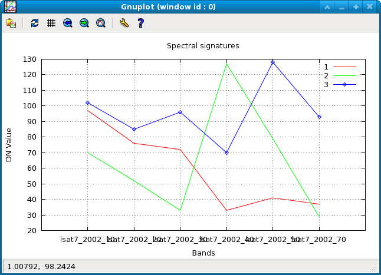

## DESCRIPTION

*i.spectral* displays spectral response at user specified locations in
images.

## NOTES

This script requires the launch of one of the supported monitors (cairo,
png, ps) or gnuplot to be installed.

## EXAMPLE

Analysis of LANDSAT TM7 channels (North Carolina dataset):

```sh
g.region raster=lsat7_2002_10 -p
i.spectral -g raster=lsat7_2002_10,lsat7_2002_20,lsat7_2002_30,lsat7_2002_40,lsat7_2002_50,lsat7_2002_70 \
           coordinates=636069,215440,637958,223393,633277,223605
```

  
*Spectral plot of 3 different land cover types: (1) water, (2) green
vegetation, and (3) highway*

North Carolina sample dataset:

```sh
g.region raster=lsat7_2002_10 -p
LIST=`g.list type=raster pattern="lsat7_2002_[1-5,7]0" separator=","`
d.mon start=cairo output=plot.png
i.spectral raster=$LIST coordinates=637502.25,221744.25
d.mon stop=cairo
```

This will search all LANDSAT map for 2002 but select only the B, G, R,
NIR, and MIR channels.

## SEE ALSO

*[d.where](d.where.md), [r.what](r.what.md), [Cairo
driver](cairodriver.md), [PNG driver](pngdriver.md), [PS driver
(Postscript)](psdriver.md)*

## AUTHORS

Markus Neteler  
Francesco Pirotti
