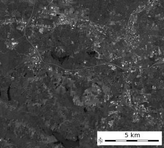
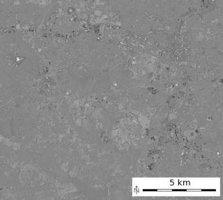

## DESCRIPTION

*i.tasscap* calculates Tasseled Cap (Kauth Thomas, TC) transformation
for Landsat TM data (TM4, TM5, ETM7), MODIS and Sentinel-2 data. The
tasseled cap transformation is effectively a compression method to
reduce multiple spectral data into a few bands. The method was
originally developed for understanding important phenomena of crop
development in spectral space (Kauth and Thomas, 1976).

Tasseled cap coefficients for Landsat 7 ETM+ are at-satellite
reflectance values (C. Huang et al., 2001), the conversion can be
achieved with *i.landsat.toar*.

The following tasseled cap components are generated:

- tasscap.1: corresponds to brightness,
- tasscap.2: corresponds to greenness,
- tasscap.3: corresponds to wetness,
- tasscap.4: corresponds to atmospheric haze (only selected sensors:
  Landsat 5,7,8).

## EXAMPLE

Calculation of TC maps from North Carolina Landsat 7 ETM scene:

```sh
# See manual page of i.landsat.toar for pre-processing

g.region raster=lsat7_2002_toar.1 -p

i.tasscap sensor=landsat7_etm \
  input=lsat7_2002_toar.1,lsat7_2002_toar.2,lsat7_2002_toar.3,lsat7_2002_toar.4,lsat7_2002_toar.5,lsat7_2002_toar.7 \
  output=lsat7_2002_tasscap
```

Results:

  
*'Brightness' Tasseled Cap component 1*  

  
*'Greenness' Tasseled Cap component 2*  

  
*'Wetness' Tasseled Cap component 3*  

  
*'Atmospheric haze' Tasseled Cap component 4*  

## REFERENCES

- LANDSAT-4/LANDSAT-5: TC-factor changed to CRIST et al. 1986, Proc.
  IGARSS 1986, p.1467
- Crist, E. P., 1985, A TM tasseled cap equivalent transformation for
  reflectance factor data, Remote Sensing of Environment, 17: 301-306.
- LANDSAT-7: TASSCAP factors cited from: DERIVATION OF A TASSELED CAP
  TRANSFORMATION BASED ON LANDSAT 7 AT-SATELLITE REFLECTANCE. Chengquan
  Huang, Bruce Wylie, Limin Yang, Collin Homer and Gregory Zylstra
  Raytheon ITSS, USGS EROS Data Center Sioux Falls, SD 57198, USA
  ([PDF](https://digitalcommons.unl.edu/usgsstaffpub/621/)). This is
  published as well in INT. J. OF RS, 2002, VOL 23, NO. 8, 1741-1748.
- MODIS Tasseled Cap coefficients - Ref: Lobser & Cohen (2007). MODIS
  tasseled cap: land cover characteristics expressed through transformed
  MODIS data. International Journal of Remote Sensing, Volume 28(22),
  Table 3
- Sentinel-2 Tasseled Cap coefficients - Ref: Nedkov, R. (2017).
  Orthogonal transformation of segmented images from the satellite
  Sentinel-2. Comptes rendus de l'Académie bulgare des sciences,
  70:687-692.
- Yarbrough, L., Navulur, R., 2014, Presentation of the Kauth-Thomas
  transform for WorldView-2 reflectance data. Remote Sensing Letters. 5.
  DOI: 10.1080/2150704X.2014.885148.

## SEE ALSO

*[i.albedo](i.albedo.md), [i.atcorr](i.atcorr.md),
[i.landsat.toar](i.landsat.toar.md), [i.vi](i.vi.md)*

## AUTHORS

Dr. Agustin Lobo, original script, 1997

Markus Neteler, ITC-irst, 2001

Converted to Python by Glynn Clements

Code improvements by Leonardo Perathoner

Sentinel-2 support by Veronica Andreo

Worldview-2 support by Markus Neteler
