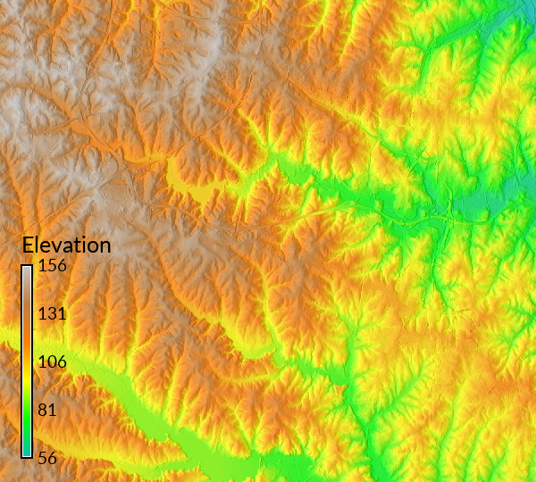

## DESCRIPTION

*r.blend* blends color components of 2 raster maps by a specified
percentage of the first map.

## EXAMPLE

Blending the aspect map with the elevation map for a shaded map (North
Carolina sample dataset):

```sh
g.region raster=elevation
r.relief input=elevation output=relief zscale=10
r.blend -c first=elevation second=relief output=blend percent=75
```

  
*Figure: Elevation blended with shaded relief*

## SEE ALSO

*[d.shade](d.shade.md), [g.region](g.region.md), [r.shade](r.shade.md),
[r.colors](r.colors.md), [r.his](r.his.md), [r.mapcalc](r.mapcalc.md),
[r.rgb](r.rgb.md), [r.support](r.support.md)*

## AUTHORS

Unknown: probably CERL  
Updated to GRASS 5.7 by Michael Barton, Arizona State University
