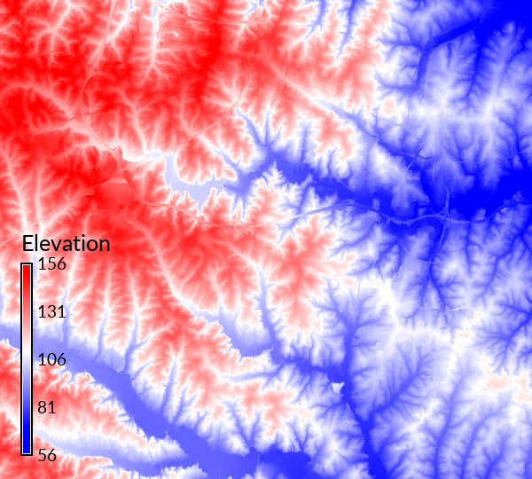

## DESCRIPTION

*r.colors.stddev* set raster map color rules based on standard
deviations from a map's mean value, either as a continuous color
gradient or in color bands per standard deviation (S.D.) from the mean.

With the color band option values less that 1 S.D. from the mean are
colored green, within 1-2 S.D. are colored yellow, within 2-3 S.D. are
colored red, and beyond 3 S.D. are colored black.

For a differences map there is an option to lock the center of the color
table at zero. Values more than two S.D. below the mean will be colored
blue; values below the mean but less than 2 S.D. away will transition to
white, and above the mean the colors will simularly transition to full
red at +2 S.D.

## EXAMPLE

North Carolina sample dataset:

```bash
g.region raster=elevation -p
r.colors.stddev elevation
```

<div align="center" style="margin: 10px">

[](r_colors_stddev.png)
*Figure: Standard deviations from mean elevation*

</div>

## SEE ALSO

*[r.colors](r.colors.md), [r.univar](r.univar.md),
[v.colors](v.colors.md)*

## AUTHOR

Hamish Bowman, *Dunedin, New Zealand*
