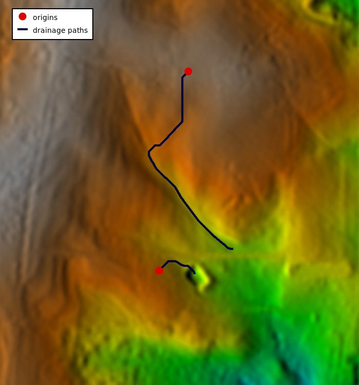
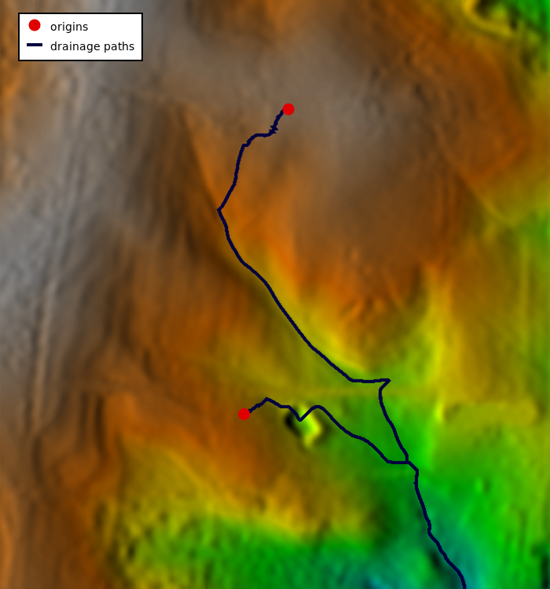

## DESCRIPTION

*r.drain* traces a flow through a least-cost path in an elevation model
or cost surface. For cost surfaces, a movement direction map must be
specified with the **direction** option and the **-d** flag to trace a
flow path following the given directions. Such a movement direction map
can be generated with *[r.walk](r.walk.md)*, *[r.cost](r.cost.md)*,
*[r.slope.aspect](r.slope.aspect.md)* or *[r.watershed](r.watershed.md)*
provided that the direction is in degrees, measured counterclockwise
from east.

The **output** raster map will show one or more least-cost paths between
each user-provided location(s) and the minima (low category values) in
the raster **input** map. If the **-d** flag is used the output
least-cost paths will be found using the direction raster map. By
default, the **output** will be an integer CELL map with category 1
along the least cost path, and null cells elsewhere.

With the **-c** (*copy*) flag, the input raster map cell values are
copied verbatim along the path. With the **-a** (*accumulate*) flag, the
accumulated cell value from the starting point up to the current cell is
written on output. With either the **-c** or the **-a** flags, the
**output** map is created with the same cell type as the **input**
raster map (integer, float or double). With the **-n** (*number*) flag,
the cells are numbered consecutively from the starting point to the
final point. The **-c**, **-a**, and **-n** flags are mutually
incompatible.

For an elevation surface, the path is calculated by choosing the steeper
"slope" between adjacent cells. The slope calculation accurately
accounts for the variable scale in lat-lon projections. For a cost
surface, the path is calculated by following the movement direction
surface back to the start point given in *[r.walk](r.walk.md)* or
*[r.cost](r.cost.md)*. The path search stops as soon as a region border
or a neighboring NULL cell is encountered, because in these cases the
direction can not be determined (the path could continue outside the
current region).

The **start_coordinates** parameter consists of map E and N grid
coordinates of a starting point. Each x,y pair is the easting and
northing (respectively) of a starting point from which a least-cost
corridor will be developed. The **start_points** parameter can take
multiple vector maps containing additional starting points. Up to 1024
starting points can be input from a combination of the
**start_coordinates** and **start_points** parameters.

### Explanation of output values

Consider the following example:

```sh
Input:                          Output:
  ELEVATION SURFACE               LEAST COST PATH
. . . . . . . . . . . . . . .    . . . . . . . . . . . . . . .
. 19. 20. 18. 19. 16. 15. 15.    .   .   .   .   .   .   .   .
. .  ---  . . . . . . . . . .    . . . . . . . . . . . . . . .
. 20| 19| 17. 16. 17. 16. 16.    .   . 1 . 1 . 1 .   .   .   .
. .  ---  . . . . . . . . . .    . . . . . . . . . . . . . . .
. 18. 18. 24. 18. 15. 12. 11.    .   .   .   .   . 1 .   .   .
. . . . . . . . . . . . . . .    . . . . . . . . . . . . . . .
. 22. 16. 16. 18. 10. 10. 10.    .   .   .   .   . 1 .   .   .
. . . . . . . . . . . . . . .    . . . . . . . . . . . . . . .
. 17. 15. 15. 15. 10. 8 . 8 .    .   .   .   .   .   . 1 .   .
. . . . . . . . . . . . . . .    . . . . . . . . . . . . . . .
. 24. 16. 8 . 7 . 8 . 0 . 12.    .   .   .   .   .   . 1 .   .
. . . . . . . . . . . . . . .    . . . . . . . . . . . . . . .
. 17. 9 . 8 . 7 . 8 . 6 . 12.    .   .   .   .   .   .   .   .
. . . . . . . . . . . . . . .    . . . . . . . . . . . . . . .
```

The user-provided starting location in the above example is the boxed
**19** in the left-hand map. The path in the output shows the least-cost
corridor for moving from the starting box to the lowest (smallest)
possible point. This is the path a raindrop would take in this
landscape.

With the **-c** *(copy)* flag, you get the following result:

```sh
Input:                          Output:
  ELEVATION SURFACE               LEAST COST PATH
. . . . . . . . . . . . . . .    . . . . . . . . . . . . . . .
. 19. 20. 18. 19. 16. 15. 15.    .   .   .   .   .   .   .   .
. .  ---  . . . . . . . . . .    . . . . . . . . . . . . . . .
. 20| 19| 17. 16. 17. 16. 16.    .   . 19. 17. 16.   .   .   .
. .  ---  . . . . . . . . . .    . . . . . . . . . . . . . . .
. 18. 18. 24. 18. 15. 12. 11.    .   .   .   .   . 15.   .   .
. . . . . . . . . . . . . . .    . . . . . . . . . . . . . . .
. 22. 16. 16. 18. 10. 10. 10.    .   .   .   .   . 10.   .   .
. . . . . . . . . . . . . . .    . . . . . . . . . . . . . . .
. 17. 15. 15. 15. 10. 8 . 8 .    .   .   .   .   .   . 8 .   .
. . . . . . . . . . . . . . .    . . . . . . . . . . . . . . .
. 24. 16. 8 . 7 . 8 . 0 .12 .    .   .   .   .   .   . 0 .   .
. . . . . . . . . . . . . . .    . . . . . . . . . . . . . . .
. 17. 9 . 8 . 7 . 8 . 6 .12 .    .   .   .   .   .   .   .   .
. . . . . . . . . . . . . . .    . . . . . . . . . . . . . . .

Note that the last 0 will not be put in the null values map.
```

With the **-a** *(accumulate)* flag, you get the following result:

```sh
Input:                          Output:
  ELEVATION SURFACE               LEAST COST PATH
. . . . . . . . . . . . . . .    . . . . . . . . . . . . . . .
. 19. 20. 18. 19. 16. 15. 15.    .   .   .   .   .   .   .   .
. .  ---  . . . . . . . . . .    . . . . . . . . . . . . . . .
. 20| 19| 17. 16. 17. 16. 16.    .   . 19. 36. 52.   .   .   .
. .  ---  . . . . . . . . . .    . . . . . . . . . . . . . . .
. 18. 18. 24. 18. 15. 12. 11.    .   .   .   .   . 67.   .   .
. . . . . . . . . . . . . . .    . . . . . . . . . . . . . . .
. 22. 16. 16. 18. 10. 10. 10.    .   .   .   .   . 77.   .   .
. . . . . . . . . . . . . . .    . . . . . . . . . . . . . . .
. 17. 15. 15. 15. 10. 8 . 8 .    .   .   .   .   .   . 85.   .
. . . . . . . . . . . . . . .    . . . . . . . . . . . . . . .
. 24. 16. 8 . 7 . 8 . 0 .12 .    .   .   .   .   .   . 85.   .
. . . . . . . . . . . . . . .    . . . . . . . . . . . . . . .
. 17. 9 . 8 . 7 . 8 . 6 .12 .    .   .   .   .   .   .   .   .
. . . . . . . . . . . . . . .    . . . . . . . . . . . . . . .
```

With the **-n** *(number)* flag, you get the following result:

```sh
Input:                          Output:
  ELEVATION SURFACE               LEAST COST PATH
. . . . . . . . . . . . . . .    . . . . . . . . . . . . . . .
. 19. 20. 18. 19. 16. 15. 15.    .   .   .   .   .   .   .   .
. .  ---  . . . . . . . . . .    . . . . . . . . . . . . . . .
. 20| 19| 17. 16. 17. 16. 16.    .   . 1 . 2 . 3 .   .   .   .
. .  ---  . . . . . . . . . .    . . . . . . . . . . . . . . .
. 18. 18. 24. 18. 15. 12. 11.    .   .   .   .   . 4 .   .   .
. . . . . . . . . . . . . . .    . . . . . . . . . . . . . . .
. 22. 16. 16. 18. 10. 10. 10.    .   .   .   .   . 5 .   .   .
. . . . . . . . . . . . . . .    . . . . . . . . . . . . . . .
. 17. 15. 15. 15. 10. 8 . 8 .    .   .   .   .   .   . 6 .   .
. . . . . . . . . . . . . . .    . . . . . . . . . . . . . . .
. 24. 16. 8 . 7 . 8 . 0 .12 .    .   .   .   .   .   . 7 .   .
. . . . . . . . . . . . . . .    . . . . . . . . . . . . . . .
. 17. 9 . 8 . 7 . 8 . 6 .12 .    .   .   .   .   .   .   .   .
. . . . . . . . . . . . . . .    . . . . . . . . . . . . . . .
```

With the **-d** *(direction)* flag, the direction raster is used for the
input, rather than the elevation surface. The output is then created
according to one of the **-can** flags.

```sh
The directions are recorded as degrees CCW from East:
       112.5     67.5         i.e. a cell with the value 135
157.5  135   90  45   22.5    means the next cell is to the North-West
       180   x   0
202.5  225  270  315  337.5
       247.5     292.5
```

## NOTES

If no direction input map is given, *r.drain* currently finds only the
lowest point (the cell having the smallest category value) in the input
file that can be reached through directly adjacent cells that are less
than or equal in value to the cell reached immediately prior to it;
therefore, it will not necessarily reach the lowest point in the input
file. It currently finds *pits* in the data, rather than the lowest
point in the entire input map. The *[r.fill.dir](r.fill.dir.md)*,
*[r.terraflow](r.terraflow.md)*, and *[r.basins.fill](r.basins.fill.md)*
modules can be used to fill in subbasins prior to processing with
*r.drain*.

*r.drain* will not give sane results at the region boundary. On outer
rows and columns bordering the edge of the region, the flow direction is
always directly out of the map. In this case, the user could try
adjusting the region extents slightly with *g.region* to allow
additional outlet paths for *r.drain*.

## EXAMPLES

### Path to the lowest point

In this example we compute drainage paths from two given points
following decreasing elevation values to the lowest point. We are using
the full North Carolina sample dataset. First we create the two points
from a text file using *[v.in.ascii](v.in.ascii.md)* module (here the
text file is CSV and we are using unix here-file syntax with EOF, in GUI
just enter the values directly for the parameter input):

```sh
v.in.ascii input=- output=start format=point separator=comma <<EOF
638667.15686275,220610.29411765
638610.78431373,220223.03921569
EOF
```

Now we compute the drainage path:

```sh
r.drain input=elev_lid792_1m output=drain_path drain=drain start_points=start
```

Before we visualize the result, we set a color table for the elevation
we are using and we create a shaded relief map:

```sh
r.colors map=elev_lid792_1m color=elevation
r.relief input=elev_lid792_1m output=relief
```

Finally we visualize all the input and output data:

```sh
d.shade shade=relief color=elev_lid792_1m
d.vect map=drain_path color=0:0:61 width=4 legend_label="drainage paths"
d.vect map=start color=none fill_color=224:0:0 icon=basic/circle size=15 legend_label=origins
d.legend.vect -b
```

  
*Figure: Drainage paths from two points flowing into the points with
lowest values*

### Path following directions

To continue flow even after it hits a depression, we need to supply a
direction raster map which will tell the *r.drain* module how to
continue from the depression. To get these directions, we use the
*[r.watershed](r.watershed.md)* module:

```sh
r.watershed elevation=elev_lid792_1m accumulation=accum drainage=drain_dir
```

The directions are categorical and we convert them to degrees using
raster algebra:

```sh
r.mapcalc "drain_deg = if(drain_dir != 0, 45. * abs(drain_dir), null())"
```

Together with directions, we need to provide the *r.drain* module with
cost values. We don't have any cost to assign to specific cells, so we
create a constant surface:

```sh
r.mapcalc "const1 = 1"
```

Now we are ready to compute the drainage paths. We are using the two
points from the previous example.

```sh
r.drain -d input=const1 direction=drain_deg output=drain_path_2 drain=drain_2 start_points=start
```

We visualize the result in the same way as in the previous example.

  
*Figure: Drainage paths from two points where directions from
r.watershed were used*

## KNOWN ISSUES

Sometimes, when the differences among integer cell category values in
the *[r.cost](r.cost.md)* cumulative cost surface output are small, this
cumulative cost output cannot accurately be used as input to *r.drain*
(*r.drain* will output bad results). This problem can be circumvented by
making the differences between cell category values in the cumulative
cost output bigger. It is recommended that if the output from *r.cost*
is to be used as input to *r.drain*, the user multiply the *r.cost*
input cost surface map by the value of the map's cell resolution, before
running *r.cost*. This can be done using *[r.mapcalc](r.mapcalc.md)*.
The map resolution can be found using *[g.region](g.region.md)*. This
problem doesn't arise with floating point maps.

## SEE ALSO

*[g.region](g.region.md), [r.cost](r.cost.md),
[r.fill.dir](r.fill.dir.md), [r.basins.fill](r.basins.fill.md),
[r.watershed](r.watershed.md), [r.terraflow](r.terraflow.md),
[r.mapcalc](r.mapcalc.md), [r.walk](r.walk.md)*

## AUTHORS

Completely rewritten by Roger S. Miller, 2001  
July 2004 at WebValley 2004, error checking and vector points added by
Matteo Franchi (Liceo Leonardo Da Vinci, Trento) and Roberto Flor
(ITC-irst, Trento, Italy)
