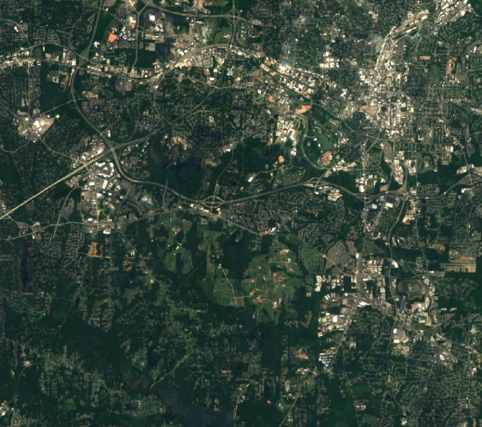

## DESCRIPTION

*r.in.wms* handles all of downloading and importing raster data from
[OGC WMS](https://www.ogc.org/publications/standard/wms/) and [OGC
WMTS](https://www.ogc.org/publications/standard/wmts/) web mapping
servers. It only needs be told the desired data to collect (bounds and
resolution) via a region, the server to get the data from, and the layer
or layers to get. It downloads the data in tiles, reprojects it, imports
it, and patches it back together.

## NOTES

To understand the data you are getting it is necessary to look at the
capabilities of the WMS server. This should be available via a
capabilities request (see examples)

If possible, the EPSG code of the current project should be used with
the **srs** option to avoid unnecessary reprojection.

When using GDAL WMS driver (**driver=WMS_GDAL**), the GDAL library needs
to be built with WMS support, see [GDAL
WMS](https://gdal.org/en/stable/drivers/raster/wms.html) manual page for
details.

### Tiled WMS

Into the parameter **layers** the name of the *TiledGroup* need to be
inserted from Tile Service file. Time variable can be specified in
**urlparams** parameter, e.g: `urlparams='time=2012-1-1'`.

## EXAMPLES

### General Get Capabilities Request

```sh
# Topographic WMS with OpenStreetMap by mundialis
r.in.wms -c url="https://ows.mundialis.de/services/service?"
r.in.wms -c url="https://ows.mundialis.de/services/service?" | grep Name

# Czech WMS
r.in.wms -c url="https://wms.cuzk.cz/wms.asp"
```

### Download raster data from WMS server (GetMap request)

#### Open Street Map

```sh
# OSM, using WMS_GRASS driver
g.region n=90 s=-90 w=-180 e=180 res=0:10:00 -p
r.in.wms url="http://watzmann-geog.urz.uni-heidelberg.de/cached/osm" layers=osm_auto:all output=osm format=png
r.info osm
```

```sh
# OSM Overlay WMS (can be used as an overlay for other maps)
r.in.wms url="http://ows.mundialis.de/services/service?" layer=OSM-Overlay-WMS output=osm_overlay format=png

# TOPO-OSM-WMS
r.in.wms url="http://ows.mundialis.de/services/service?" layer=TOPO-OSM-WMS output=topo_osm format=png
r.info topo_osm

# TOPO-WMS
r.in.wms url="http://ows.mundialis.de/services/service?" layer=TOPO-WMS output=topo format=png
r.info topo
```

More OSM WMS servers can be found online, e.g. on the OSM wiki in a [OSM
WMS Servers
list](https://wiki.openstreetmap.org/wiki/WMS#Public_WMS_Servers) and on
the [WORLD_OSM_WMS](https://wiki.openstreetmap.org/wiki/WORLD_OSM_WMS)
page.

#### Countries and coastlines

```sh
# using WMS_GRASS driver
r.in.wms url="http://www2.demis.nl/WMS/wms.asp" layers=Countries,Borders,Coastline output=countries srs=4326 format=png
r.info countries
```

#### Sentinel-2 satellite cloud free global coverage

```sh
# North Carolina sample data
g.region raster=elevation -p
# using WMS_GRASS driver
r.in.wms url="https://tiles.maps.eox.at/wms?" layers=s2cloudless output=sentinel2 format=png
r.info sentinel2
```

  
*Figure: Raleigh (NC, USA) seen by Sentinel-2 (10m resolution; image
courtesy: EOX)*

#### OGC WMTS Example

```sh
# using WMTS_GRASS driver
r.in.wms url="http://gpp3-wxs.ign.fr/yourAPIkey/geoportail/wmts" layers=ORTHOIMAGERY.ORTHOPHOTOS \
         output=orthophoto srs=3857 format=jpeg driver=WMTS_GRASS style=normal password="*" username="*"
r.info orthophoto
```

Note: username, password and API key can be obtained from [IGN
API](http://api.ign.fr/) website

#### Data covering the Czech Republic

```sh
# using WMS_GRASS driver
r.in.wms url="http://wms.cuzk.cz/wms.asp" layers=prehledka_kraju-linie srs=4326 output=kn format=png
```

```sh
# using WMTS_GRASS driver
r.in.wms url="http://geoportal.cuzk.cz/WMTS_ORTOFOTO/WMTService.aspx" layers=orto output=orthophoto \
         srs=3857 format=jpeg driver=WMTS_GRASS style=default
r.info orthophoto
```

Note: data are provided by [Czech office for surveying, mapping and
cadastre](https://cuzk.cz/en).

#### Satellite data covering Europe

Copernicus Core003 View Services - Optical VHR2 coverage over EU
2011-2013 (provided by JRC; usage is restricted to non-commercial
activities):

```sh
# get WMS layer list
r.in.wms -c url="http://cidportal.jrc.ec.europa.eu/copernicus/services/ows/wms/public/core003?"
r.in.wms -c url="http://cidportal.jrc.ec.europa.eu/copernicus/services/ows/wms/public/core003?" | grep Name

# spatial subset of Europe
# enlarging maxcols and maxrows in order to minimize impact of copyright notice in map
g.region n=56 s=47 w=5 e=16 res=0:00:10 -pa
# using WMS_GRASS driver
r.in.wms url="http://cidportal.jrc.ec.europa.eu/copernicus/services/ows/wms/public/core003?" \
         layer="OI.Mosaic.NaturalColor.Feathering" output="jrc_copernicus_core003_mosaik" \
         maxcols=3400 maxrows=3400
r.info jrc_copernicus_core003_mosaik

# Alternatively, using WMS_GDAL driver with BIGTIFF and compression enabled
r.in.wms url="http://cidportal.jrc.ec.europa.eu/copernicus/services/ows/wms/public/core003?" \
         layer="OI.Mosaic.NaturalColor.Feathering" output="jrc_copernicus_core003_mosaik2" \
         maxcols=3400 maxrows=3400 driver=WMS_GDAL gdal_createopt="BIGTIFF=YES,COMPRESS=DEFLATE"
r.info jrc_copernicus_core003_mosaik2

```

## REQUIREMENTS

*r.in.wms* requires the
[gdalwarp](https://gdal.org/en/stable/programs/gdalwarp.html) utility
from the GDAL/OGR library.

## REFERENCES

- [OGC WMS](https://www.ogc.org/publications/standard/wms/)
- [OGC WMTS](https://www.ogc.org/publications/standard/wmts/)

## SEE ALSO

*[r.in.gdal](r.in.gdal.md), [r.patch](r.patch.md),
[r.colors](r.colors.md), [r.composite](r.composite.md),
[v.in.wfs](v.in.wfs.md)*

See also [WMS support in
wxGUI](https://grasswiki.osgeo.org/wiki/WxGUI/Video_tutorials#Add_web_service_layer).

## AUTHOR

Stepan Turek, Czech Technical University in Prague, Czech Republic  
(bachelor's final project 2012, mentor: Martin Landa)
