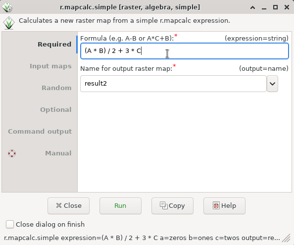

## DESCRIPTION

*r.mapcalc.simple* provides a wrapper to *r.mapcalc*. Up to 6 maps can
be combined using simple expressions.

The general syntax for the **expression** follows
*[r.mapcalc](r.mapcalc.md)* expression format, for example, `A + B` or
`exp(A + B)` are valid. The variables A, B, ..., F represent raster maps
which are provided as options **a**, **b**, ..., **f**.

The result name, i.e. the output raster map, is provided using the
option **output** and, unlike *r.mapcalc* it is not part of the
expression.

This module is meant for convenience (for users and programmers) while
the *r.mapcalc* module is a better choice for more complex expressions
and advanced usage.

## NOTES

Differences to *r.mapcalc* module:

- The input raster map names and the output map raster name are separate
  from the expression (formula) which uses generic variable names (A, B,
  C, ...).
- The output raster name is not included in the expression.
- The expression is expected to be a single short one liner without the
  function `eval()`.

Differences to *r.mapcalc.simple* module in GRASS GIS 5 and 6:

- The primary purpose is not being a GUI front end to *r.mapcalc*, but a
  wrapper which allows easy building of interfaces to *r.mapcalc*
  (including GUIs).
- Whitespace (most notably spaces) are allowed (in the same way as for
  *r.mapcalc*).
- The variable names are case-insensitive to allow the original
  uppercase as well as lowercase as in option names (unless the **-c**
  flag is used).
- Option names for each map are just one letter (not amap, etc.).
- Output option name is **output** as for other modules (not outfile).
- Raster map names can be optionally quoted (the **-q** flag).
- There is no expert mode (which was just running *r.mapcalc*).
- The **expression** option is first, so it is possible to omit its name
  in the command line (just like with *r.mapcalc*).
- Overwriting of outputs is done in the same way as with other modules,
  so there is no flag to not overwrite outputs.

## EXAMPLES

### Basic examples

```sh
r.mapcalc.simple expression="0" output=zeros
r.mapcalc.simple expression="1" output=ones
r.mapcalc.simple expression="2" output=twos
```

```sh
r.mapcalc.simple expression="A + B + C" a=zeros b=ones c=twos output=result1
```

```sh
r.mapcalc.simple expression="(A * B) / 2 + 3 * C" a=zeros b=ones c=twos output=result2
```

  
*Figure: r.mapcalc.simple graphical user interface*

### Example expressions

Addition:

```sh
A + B
```

No spaces around operators are not recommended for readability, but
allowed in the expression:

```sh
A+B
```

More complex expression with a function:

```sh
exp(A+C)+(B-2)*7
```

## SEE ALSO

*[r.mapcalc](r.mapcalc.md), [r3.mapcalc](r3.mapcalc.md),
[t.rast.mapcalc](t.rast.mapcalc.md), [g.region](g.region.md)*

## AUTHORS

Vaclav Petras, [NCSU GeoForAll
Lab](https://geospatial.ncsu.edu/geoforall/)  
Michael Barton, Arizona State University (updated to GRASS 5.7)  
R. Brunzema (original 5.0 Bash version)
