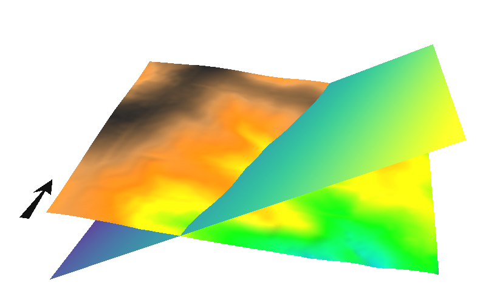

## DESCRIPTION

*r.plane* creates a tilted plane raster map given user-specified
parameters for inclination, azimuth, and the geographic location of a
point on the plane.  
The angle orientations of the *azimuth* parameter increase
counter-clockwise, i.e., 0 degree = N, 45 degree = NW, 90 degree = W
etc.

Increasing values of the *dip* parameter progressively lower (or dip)
the northern half of the plane, and incline the southern half, assuming
the *azimuth* parameter is held constant at 0 degrees.

## NOTES

`g.region -c` provides the easting and northing coordinates for the
center of the current region.

*CELL* (integer) maps take less disk space than *FCELL*s (floating
point), which in turn take up less space than *DCELL*s (double precision
floating point).

## EXAMPLE

A tilted plane in the North Carolina sample dataset region:

```sh
# set computational region
g.region raster=elev_lid792_1m -p

# get center coordinates as an example
g.region -c
# get terrain height at point
r.what map=elev_lid792_1m coordinates=638650.0,220375.0
# shows elevation: 116.7734

# generate tilted plane
r.plane myplane30 dip=30 az=75 east=638650.0 north=220375.0 \
        elev=116.7734 type=FCELL
```

  
*Figure: Tilted plane shown in NVIZ along with elevation map*

## AUTHORS

Stefan Jäger (1994), University of Heidelberg during a stay at USGS  
Updated to GRASS 5.7 by Michael Barton, Arizona State University  
Full rewrite for GRASS 7 by Glynn Clements
