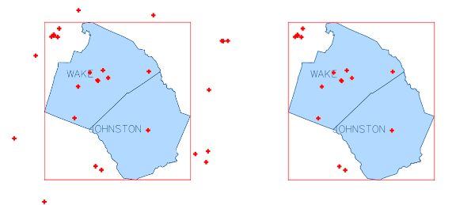

## DESCRIPTION

*v.clip* module enables extracting those features of input vector map,
which overlay features of clip map, as well as their storing in a new
vector map.

In default, boundaries of clip map are dissolved before clipping.
Alternatively, flag **-d** can be ticked to retain the boundaries of
clip map. Flag **-b** facilitates clipping by current computational
region.

It is possible to clip vector maps consisting of points, lines, areas or
combinations of these. However, the current version does not fully
support clipping of mixed geometry containing points. In such a case,
the output map will only store clipped lines and/or areas.

## NOTES

*v.clip* is a front-end to *[v.overlay](v.overlay.md)*, as well as
*[v.select](v.select.md)*. Clipping of areas and/or lines can be
achieved using *[v.overlay](v.overlay.md)*. Clipping of points can be
performed with *[v.select](v.select.md)*.

## EXAMPLES

### Basic use

Clip railroads by counties Wake and Johnston in North Carolina (North
Carolina data set).

```sh
v.extract input=boundary_county where="NAME='WAKE' OR NAME='JOHNSTON'" output=county_WAKE_JOHNSTON
v.clip input=railroads clip=county_WAKE_JOHNSTON output=railroads_WAKE_JOHNSTON
```

  
*Figure: v.clip example - basic use*

### Retain boundaries of clip map

```sh
v.clip -d input=railroads clip=county_WAKE_JOHNSTON output=railroads_WAKE_JOHNSTON
```

### Clip by current computational region

Clip hospitals by computational region adjusted to counties Wake and
Johnston in North Carolina (North Carolina data set). It is not
obligatory to enter name of clip map. In case it is stated, the clip map
will be omitted.

```sh
v.extract input=boundary_county where="NAME='WAKE' OR NAME='JOHNSTON'" output=county_WAKE_JOHNSTON
v.clip -r input=hospitals output=hospitals_clip
```

  
*Figure: v.clip example - clip by computational region*

## SEE ALSO

*[v.overlay](v.overlay.md), [v.select](v.select.md),
[v.dissolve](v.dissolve.md), [v.in.region](v.in.region.md)*

## AUTHOR

Zofie Cimburova, [GeoForAll
Lab](http://geomatics.fsv.cvut.cz/research/geoforall/), Czech Technical
University in Prague, Czech Republic
