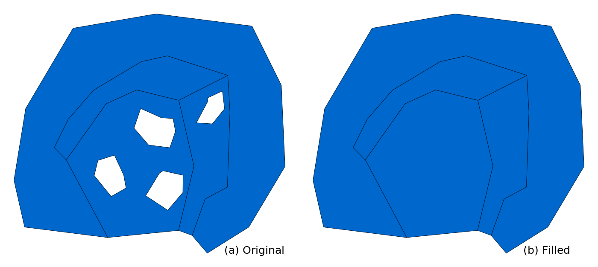
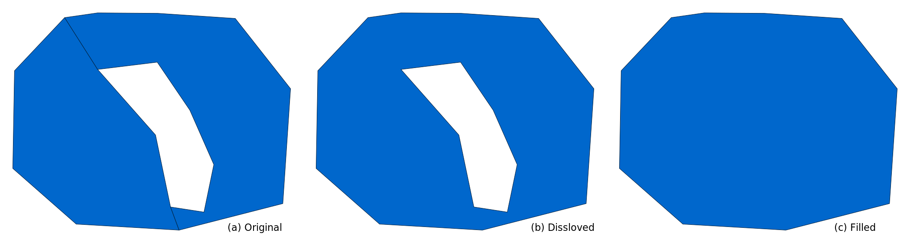
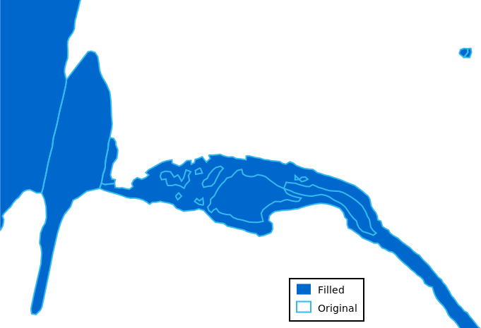

## DESCRIPTION

*v.fill.holes* fills empty spaces inside areas, specifically it
preserves areas with centroids while areas without centroids, which
typically represent holes, are removed. *v.fill.holes* goes over all
areas in a vector map and it preserves only outer boundaries of each
area while removing inner boundaries which are considered holes. The
holes become part of the area which contained them. No boundaries of
these holes are preserved.

  
*Figure: Holes inside areas are removed. (a) Original areas with holes
and (b) the same areas but with holes filled.*

In case areas have empty space in between them, i.e., there are holes in
the overall coverage, but not in the areas themselves, *v.fill.holes*
can't assign this empty space to either of these areas because it does
not know which area this empty space should belong to. If the space
needs to be filled, this can be resolved by merging the areas around the
empty space into one by dissolving their common boundaries. This turns
the empty space into a hole inside one single area which turns the
situation into a case of one area with a hole.

  
*Figure: Empty space in between two areas does not belong to either
area, so it is filled only after the boundaries between areas are
dissolved, i.e., areas merged into one. (a) Original areas with space in
between, (b) one area with a hole after dissolving the common boundary,
and (c) hole filled.*

### Topology

Strictly speaking, in the GRASS topological model, an area is a closed
boundary (or a series of connected closed boundaries) which may have a
centroid. If it has a centroid, it is rendered as a filled area in
displays and this is what is usually considered an area from the user
perspective. These are the areas where *v.fill.holes* preserves the
associated outer boundary (or boundaries). Other closed boundaries,
i.e., those without a centroid, are not carried over to the output. All
other features are removed including points and lines.

### Attributes

If a specific layer is selected, attributes for that layer are preserved
for the areas based on the category or categories associated with each
area. By default, layer number 1 is selected. In case there are
attribute tables associated with other layers or attributes associated
with categories of other features than areas with centroids, this
attribute data is not carried over to the output just like the
corresponding geometries.

## EXAMPLE

The *lakes* vector map in the North Carolina sample dataset represents
islands inside lakes as areas distinguished by attributes. To
demonstrate *v.fill.holes*, we will first extract only the lakes which
will create holes where the islands were located. Then, we will fill the
holes created in the lakes to get the whole perimeter of the lakes
including islands. Remove the islands by extracting everything else
(results in holes):

```sh
v.extract input=lakes where="FTYPE != 'ROCK/ISLAND'" output=lakes_only
```

Remove the holes:

```sh
v.fill.holes input=lakes_only output=lakes_filled
```

  
*Figure: The filled lake (blue) and borders of the original lakes with
islands removed (light blue). Figure shows a smaller area in the north
of the data extent.*

## SEE ALSO

- *[v.dissolve](v.dissolve.md)* for removing common boundaries based on
  attributes,
- *[v.clean](v.clean.md)* for removing topological issues,
- *[r.fillnulls](r.fillnulls.md)* for filling empty spaces in raster
  maps using interpolation,
- *[r.fill.stats](r.fill.stats.md)* for filling empty spaces in raster
  maps using statistics.

## AUTHOR

Vaclav Petras, [NCSU Center for Geospatial Analytics, GeoForAll
Lab](http://geospatial.ncsu.edu/)
