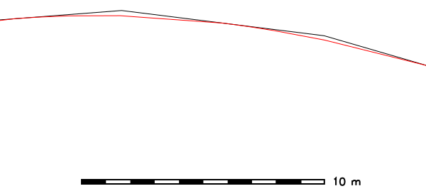

## DESCRIPTION

*v.generalize* is a module for the generalization of GRASS vector maps.
This module consists of algorithms for line simplification, line
smoothing, network generalization and displacement (new methods may be
added later).

The **cats** and **where** options are used only if a **layer** \> 0 is
specified, otherwise, those options are ignored. Be aware that the
default is *layer=-1*, meaning that all layers are processed, ignoring
the **cats** and **where** options.

If **type=area** is selected, boundaries of selected areas will be
generalized, and the options **cats**, **where**, and **layer** will be
used to select areas.

## NOTES

(Line) simplification is a process of reducing the complexity of vector
features. The module transforms a line into another line consisting of
fewer vertices, that still approximate the original line. Most of the
algorithms described below select a subset of points on the original
line.

(Line) smoothing is a "reverse" process which takes as input a line and
produces a smoother approximate of the original. In some cases, this is
achieved by inserting new vertices into the original line, and can total
up to 4000% of the number of vertices in the original. In such an
instance, it is always a good idea to simplify the line after smoothing.

Smoothing and simplification algorithms implemented in this module work
line by line, i.e. simplification/smoothing of one line does not affect
the other lines; they are treated separately. For isolated loops formed
by a single line/boundary, he first and the last point of each
line/boundary can be translated and/or deleted, unless the *-l* flag is
used to disable loop support.

Lines and boundaries are not translated if they would collapse to a
single point. Boundaries are not translated if they would intersect with
themselves or other boundaries. Such erroneous features are written to
an optional *error* vector map. Overlaying the *error* map over the
generalized map indicates the kind of error. Lines/boundaries collapsing
to a point are written out as points, boundaries violating topology are
written out as boundaries. The *error* map can be overlaid over the
generalized map to understand why some features were not generalized.

### SIMPLIFICATION

Simplification can fail for many boundaries if the simplification
parameters would result in a large reduction of vertices. If many
lines/boundaries could not be simplified, try different parameters that
would cause a lower degree of simplification.

*v.generalize* contains following line simplification algorithms:

- Douglas-Peucker Algorithm
- Douglas-Peucker Reduction Algorithm
- Lang Algorithm
- Vertex Reduction
- Reumann-Witkam Algorithm

Different algorithms require different parameters, but all the
algorithms have one parameter in common: the **threshold** parameter,
given in map units (for latitude-longitude projects: in decimal degree).
In general, the degree of simplification increases with the increasing
value of **threshold**.

#### ALGORITHM DESCRIPTIONS

- *Douglas-Peucker* - "Quicksort" of line simplification, the most
  widely used algorithm. Input parameters: **input**, **threshold**. For
  more information, see:  
  <http://geomalgorithms.com/a16-_decimate-1.html>.
- *Douglas-Peucker Reduction Algorithm* is essentially the same
  algorithm as the algorithm above, the difference being that it takes
  an additional **reduction** parameter which denotes the percentage of
  the number of points on the new line with respect to the number of
  points on the original line. Input parameters: **input**,
  **threshold**, **reduction**.
- *Lang* - Another standard algorithm. Input parameters: **input**,
  **threshold**, **look_ahead**. For an excellent description, see:  
  [http://www.sli.unimelb.edu.au/gisweb/LGmodule/LGLangVisualisation.htm](https://web.archive.org/web/20090823022009/http://www.sli.unimelb.edu.au/gisweb/LGmodule/LGLangVisualisation.htm).
- *Vertex Reduction* - Simplest among the algorithms. Input parameters:
  **input**, **threshold**. Given a line, this algorithm removes the
  points of this line which are closer to each other than **threshold**.
  More precisely, if p1 and p2 are two consecutive points, and the
  distance between p2 and p1 is less than **threshold**, it removes p2
  and repeats the same process on the remaining points.
- *Reumann-Witkam* - Input parameters: **input**, **threshold**. This
  algorithm quite reasonably preserves the global characteristics of the
  lines. For more information, see for example:  
  <http://psimpl.sourceforge.net/reumann-witkam.html>.

*Douglas-Peucker* and *Douglas-Peucker Reduction Algorithm* use the same
method to simplify the lines. Note that

```sh
v.generalize input=boundary_county output=boundary_county_dp20 method=douglas threshold=20
```

is equivalent to

```sh
v.generalize input=boundary_county output=boundary_county_dp_red20_100 \
             method=douglas_reduction threshold=20 reduction=100
```

However, in this case, the first method is faster. Also observe that
*douglas_reduction* never outputs more vertices than *douglas*, and
that, in general, *douglas* is more efficient than *douglas_reduction*.
More importantly, the effect of

```sh
v.generalize input=boundary_county output=boundary_county_dp_red0_30 \
             method=douglas_reduction threshold=0 reduction=30
```

is that 'out' contains approximately only 30% of points of 'in'.

### SMOOTHING

The following smoothing algorithms are implemented in *v.generalize*:

- *Boyle's Forward-Looking Algorithm* - The position of each point
  depends on the position of the previous points and the point
  **look_ahead** ahead. **look_ahead** consecutive points. Input
  parameters: **input**, **look_ahead**.
- *McMaster's Sliding Averaging Algorithm* - Input Parameters:
  **input**, **slide**, **look_ahead**. The new position of each point
  is the average of the **look_ahead** points around. Parameter
  **slide** is used for linear interpolation between old and new
  position (see below).
- *McMaster's Distance-Weighting Algorithm* - Takes the weighted average
  of **look_ahead** consecutive points where the weight is the
  reciprocal of the distance from the point to the currently smoothed
  point. The parameter **slide** is used for linear interpolation
  between the original position of the point and newly computed position
  where value 0 means the original position. Input parameters:
  **input**, **slide**, **look_ahead**.
- *Chaiken's Algorithm* - "Inscribes" a line touching the original line
  such that the points on this new line are at least *threshold* apart.
  Input parameters: **input**, **threshold**. This algorithm
  approximates the given line very well.
- *Hermite Interpolation* - This algorithm takes the points of the given
  line as the control points of hermite cubic spline and approximates
  this spline by the points approximately **threshold** apart. This
  method has excellent results for small values of **threshold**, but in
  this case it produces a huge number of new points and some
  simplification is usually needed. Input parameters: **input**,
  **threshold**, **angle_thresh**. **Angle_thresh** is used for reducing
  the number of the points. It denotes the minimal angle (in degrees)
  between two consecutive segments of a line.
- *Snakes* is the method of minimisation of the "energy" of a line. This
  method preserves the general characteristics of the lines but smooths
  the "sharp corners" of a line. Input parameters **input**, **alpha**,
  **beta**. This algorithm works very well for small values of **alpha**
  and **beta** (between 0 and 5). These parameters affect the
  "sharpness" and the curvature of the computed line.

One of the key advantages of *Hermite Interpolation* is the fact that
the computed line always passes through the points of the original line,
whereas the lines produced by the remaining algorithms never pass
through these points. In some sense, this algorithm outputs a line which
"circumscribes" the input line.

On the other hand, *Chaiken's Algorithm* outputs a line which
"inscribes" a given line. The output line always touches/intersects the
centre of the input line segment between two consecutive points. For
more iterations, the property above does not hold, but the computed
lines are very similar to the Bezier Splines. The disadvantage of the
two algorithms given above is that they increase the number of points.
However, *Hermite Interpolation* can be used as another simplification
algorithm. To achieve this, it is necessary to set *angle_thresh* to
higher values (15 or so).

One restriction on both McMasters' Algorithms is that *look_ahead*
parameter must be odd. Also note that these algorithms have no effect if
*look_ahead = 1*.

Note that *Boyle's*, *McMasters'* and *Snakes* algorithm are sometimes
used in the signal processing to smooth the signals. More importantly,
these algorithms never change the number of points on the lines; they
only translate the points, and do not insert any new points.

*Snakes* Algorithm is (asymptotically) the slowest among the algorithms
presented above. Also, it requires quite a lot of memory. This means
that it is not very efficient for maps with the lines consisting of many
segments.

### DISPLACEMENT

The displacement is used when the lines overlap and/or are close to each
other at the current level of detail. In general, displacement methods
move the conflicting features apart so that they do not interact and can
be distinguished.

This module implements an algorithm for displacement of linear features
based on the *Snakes* approach. This method generally yields very good
results; however, it requires a lot of memory and is not very efficient.

Displacement is selected by **method=displacement**. It uses the
following parameters:

- **threshold** - specifies critical distance. Two features interact if
  they are closer than **threshold** apart.
- **alpha**, **beta** - These parameters define the rigidity of lines.
  For larger values of **alpha**, **beta** (\>=1), the algorithm does a
  better job at retaining the original shape of the lines, possibly at
  the expense of displacement distance. If the values of **alpha**,
  **beta** are too small (\<=0.001), then the lines are moved
  sufficiently, but the geometry and topology of lines can be destroyed.
  Most likely the best way to find the good values of **alpha**,
  **beta** is by trial and error.
- **iterations** - denotes the number of iterations the interactions
  between the lines are resolved. Good starting points for values of
  **iterations** are between 10 and 100.

The lines affected by the algorithm can be specified by the **layer**,
**cats** and **where** parameters.

### NETWORK GENERALIZATION

Used for selecting "the most important" part of the network. This is
based on the graph algorithms. Network generalization is applied if
method=network. The algorithm calculates three centrality measures for
each line in the network and only the lines with the values greater than
thresholds are selected. The behaviour of algorithm can be altered by
the following parameters:

- **degree_thresh** - algorithm selects only the lines which share a
  point with at least **degree_thresh** different lines.
- **closeness_thresh** - is always in the range (0, 1\]. Only the lines
  with the closeness centrality value at least **closeness_thresh**
  apart are selected. The lines in the centre of a network have greater
  values of this measure than the lines near the border of a network.
  This means that this parameter can be used for selecting the centre(s)
  of a network. Note that if closeness_thresh=0 then everything is
  selected.
- **betweeness_thresh** - Again, only the lines with a betweeness
  centrality measure at least **betweeness_thresh** are selected. This
  value is always positive and is larger for large networks. It denotes
  to what extent a line is in between the other lines in the network.
  This value is large for the lines which lie between other lines and
  lie on the paths between two parts of a network. In the terminology of
  road networks, these are highways, bypasses, main roads/streets, etc.

All three parameters above can be presented at the same time. In that
case, the algorithm selects only the lines which meet each criterion.

Also, the outputted network may not be connected if the value of
**betweeness_thresh** is too large.

## EXAMPLES

### SIMPLIFICATION EXAMPLE

Simplification of county boundaries with DP method (North Carolina
sample dataset), threshold given in mapset units (here: meters):

```sh
v.generalize input=boundary_county output=boundary_county_dp20 \
  method=douglas threshold=20 error=boundary_county_dp20_leftover
```

  
*Figure: Vector simplification example (spatial subset: original map
shown in black, simplified map with 26% remaining vertices shown in
red)*

### SMOOTHING EXAMPLE

Smoothing of road network with Chaiken method (North Carolina sample
dataset), threshold given in mapset units (here: meters):

```sh
v.generalize input=roads output=roads_chaiken method=chaiken \
  threshold=1 error=roads_chaiken_leftover
```

  
*Figure: Vector smoothing example (spatial subset: original map shown in
black, smoothed map with 500% increased number of vertices shown in
red)*

## SEE ALSO

*[v.clean](v.clean.md), [v.dissolve](v.dissolve.md)*

[v.generalize
Tutorial](https://grasswiki.osgeo.org/wiki/V.generalize_tutorial)
(GRASS-Wiki)

## AUTHORS

Daniel Bundala, Google Summer of Code 2007, Student  
Wolf Bergenheim, Mentor  
Partial rewrite: Markus Metz
