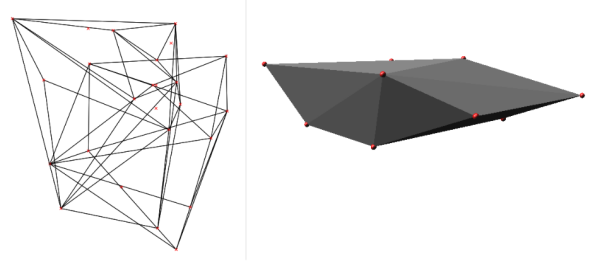

## DESCRIPTION

*v.hull* computes the convex hull of a vector map and outputs the convex
hull polygon as a vector area map. The convex hull, or convex envelope,
for an object or a set of objects is the minimal convex set containing
the given objects. This module creates a vector polygon containing all
vector points or lines of the input map.

In the case of 3D input points, the hull will be a 3D hull as well,
unless the user specifies the **-f** flag. The 3D hull will be composed
of triangular faces.

  
*Fig: Convex hull polygon created with v.hull*

## NOTES

In order to use the **where** option the **layer** option must be set to
a positive number (the default is '-1' for 'all layers'), otherwise all
points from all layers will be used and the **cats** and **where**
options will be ignored.

## EXAMPLE

Example of *v.hull* 3D output (using two random 3D point clouds, North
Carolina sample data set):

```sh
g.region rural_1m -p
r.mapcalc "zero = 0"
v.random -z output=random3d_a n=10 zmin=0 zmax=200
v.random -z output=random3d_b n=15 zmin=400 zmax=600
v.hull input=random3d_a output=random3d_a_hull
v.hull input=random3d_b output=random3d_b_hull

d.mon wx0
d.vect random3d_a_hull
d.vect random3d_a color=red

d.vect random3d_b_hull
d.vect random3d_b color=red

# 3D view in wxGUI (g.gui)
```

  
*Fig: Convex hull in 3D from 3D points created with v.hull*

## REFERENCES

- M. de Berg, M. van Kreveld, M. Overmars, O. Schwarzkopf, (2000).
  Computational geometry, chapter 1.1, 2-8.
- J. O'Rourke, (1998). Computational Geometry in C (Second Edition),
  chapter 4.

## SEE ALSO

*[v.delaunay](v.delaunay.md)*

## AUTHORS

Andrea Aime, Modena, Italy  
Markus Neteler, ITC-irst (update to 5.7)  
Benjamin Ducke, CAU Kiel (3D hull support)  
Martin Landa, CTU in Prague, Czech Republic (vector lines support)
