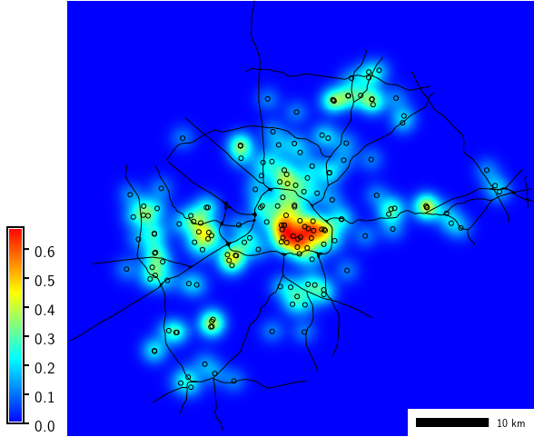

## DESCRIPTION

*v.kernel* generates a raster density map from vector points data using
a moving kernel. Available [kernel density
functions](https://en.wikipedia.org/wiki/Kernel_(statistics)#Kernel_functions_in_common_use)
are *uniform, triangular, epanechnikov, quartic, triweight, gaussian,
cosine*. The default function is *gaussian*.

The module can also generate a vector density map on a vector network.
Conventional kernel functions produce biased estimates by overestimating
the densities around network nodes, whereas the equal split method of
Okabe et al. (2009) produces unbiased density estimates. The equal split
method uses the kernel function selected with the **kernel** option and
can be enabled with **node=split**.

## NOTES

The **multiplier** option is needed to overcome the limitation that the
resulting density in case of a vector map output is stored as category
(integer). The density result stored as category may be multiplied by
this number.

For the *gaussian* kernel, standard deviation for the [gaussian
function](https://en.wikipedia.org/wiki/Kernel_(statistics)#Kernel_functions_in_common_use)
is set to 1/4 of the radius.

With the **-o** flag (experimental) the command tries to calculate an
optimal radius. The value of *radius* is taken as maximum value. The
radius is calculated based on the gaussian function, using ALL points,
not just those in the current region.

## EXAMPLES

Compute density of points (using vector map of schools from North
Carolina sample dataset):

```sh
g.region region=wake_30m
v.kernel input=schools_wake output=schools_density radius=5000 multiplier=1000000
r.colors map=schools_density color=bcyr
```

  
*School density*

## KNOWN ISSUES

The module only considers the presence of points, but not (yet) any
attribute values.

## REFERENCES

- Okabe, A., Satoh, T., Sugihara, K. (2009). *A kernel density
  estimation method for networks, its computational method and a
  GIS-based tool*. **International Journal of Geographical Information
  Science**, Vol 23(1), pp. 7-32.  
  DOI:
  [10.1080/13658810802475491](https://doi.org/10.1080/13658810802475491)

## SEE ALSO

*[v.surf.rst](v.surf.rst.md)*

Overview: [Interpolation and
Resampling](https://grasswiki.osgeo.org/wiki/Interpolation) in GRASS GIS

## AUTHORS

Stefano Menegon, [ITC-irst](http://mpa.itc.it/), Trento, Italy  
Radim Blazek (additional kernel density functions and network part)
