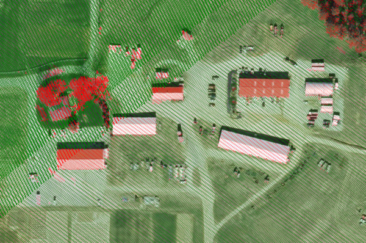
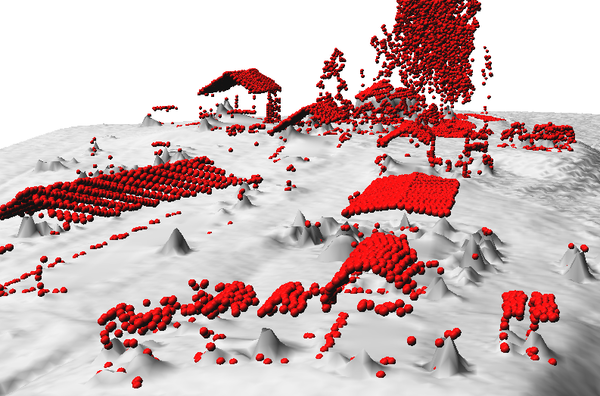

## DESCRIPTION

*v.lidar.edgedetection* is the first of three steps to filter LiDAR
data. The filter aims to recognize and extract attached and detached
object (such as buildings, bridges, power lines, trees, etc.) in order
to create a Digital Terrain Model.

In particular, this module detects the edge of each single feature over
the terrain surface of a LIDAR point surface. First of all, a bilinear
spline interpolation with a Tychonov regularization parameter is
performed. The gradient is minimized and the low Tychonov regularization
parameter brings the interpolated functions as close as possible to the
observations. Bicubic spline interpolation with Tychonov regularization
is then performed. However, now the curvature is minimized and the
regularization parameter is set to a high value. For each point, an
interpolated value is computed from the bicubic surface and an
interpolated gradient is computed from the bilinear surface. At each
point the gradient magnitude and the direction of the edge vector are
calculated, and the residual between interpolated and observed values is
computed. Two thresholds are defined on the gradient, a high threshold
**tgh** and a low one **tgl**. For each point, if the gradient magnitude
is greater than or equal to the high threshold and its residual is
greater than or equal to zero, it is labeled as an EDGE point. Similarly
a point is labeled as being an EDGE point if the gradient magnitude is
greater than or equal to the low threshold, its residual is greater than
or equal to zero, and the gradient to two of eight neighboring points is
greater than the high threshold. Other points are classified as TERRAIN.

The length (in mapping units) of each spline step is defined by
**ew_step** for the east-west direction and **ns_step** for the
north-south direction.

The output will be a vector map in which points has been classified as
TERRAIN, EDGE or UNKNOWN. This vector map should be the input of
*[v.lidar.growing](v.lidar.growing.md)* module.

## NOTES

In this module, an external table will be created which will be useful
for the next module of the procedure of LiDAR data filtering. In this
table the interpolated height values of each point will be recorded.
Also points in the output vector map will be classified as:

```sh
TERRAIN (cat = 1, layer = 1)
EDGE (cat = 2, layer = 1)
UNKNOWN (cat = 3, layer = 1)
```

The final result of the whole procedure (*v.lidar.edgedetection*,
*[v.lidar.growing](v.lidar.growing.md)*,
*[v.lidar.correction](v.lidar.correction.md)*) will be a point
classification in four categories:

```sh
TERRAIN SINGLE PULSE (cat = 1, layer = 2)
TERRAIN DOUBLE PULSE (cat = 2, layer = 2)
OBJECT SINGLE PULSE (cat = 3, layer = 2)
OBJECT DOUBLE PULSE (cat = 4, layer = 2)
```

## EXAMPLES

### Basic edge detection

```sh
# last return points
v.lidar.edgedetection input=vector_last output=edge ew_step=8 ns_step=8 lambda_g=0.5
```

### Complete workflow

```sh
# region settings (using an existing raster)
g.region raster=elev_lid792_1m

# import
v.in.pdal -r input=points.las output=points
v.in.pdal -r input=points.las output=points_first return_filter=first

# detection
v.lidar.edgedetection input=points output=edge ew_step=8 ns_step=8 lambda_g=0.5
v.lidar.growing input=edge output=growing first=points_first
v.lidar.correction input=growing output=correction terrain=only_terrain

# visualization of selected points
# zoom somewhere first, to make it faster
d.rast map=orthophoto
d.vect map=correction layer=2 cats=2,3,4 color=red size=0.25
d.vect map=correction layer=2 cats=1 color=0:128:0 size=0.5

# interpolation (this may take some time)
v.surf.rst input=only_terrain elevation=terrain

# get object points for 3D visualization
v.extract input=correction layer=2 cats=2,3,4 output=objects
```

  
*Figure 1: Example output from complete workflow (red: objects, green:
terrain)*

  
*Figure 2: 3D visualization of filtered object points (red) and terrain
created from terrain points (gray)*

## REFERENCES

- Antolin, R. et al., 2006. Digital terrain models determination by
  LiDAR technology: Po basin experimentation. Bolletino di Geodesia e
  Scienze Affini, anno LXV, n. 2, pp. 69-89.
- Brovelli M. A., Cannata M., Longoni U.M., 2004. LIDAR Data Filtering
  and DTM Interpolation Within GRASS, Transactions in GIS, April 2004,
  vol. 8, iss. 2, pp. 155-174(20), Blackwell Publishing Ltd.
- Brovelli M. A., Cannata M., 2004. Digital Terrain model reconstruction
  in urban areas from airborne laser scanning data: the method and an
  example for Pavia (Northern Italy). Computers and Geosciences
  30 (2004) pp.325-331
- Brovelli M. A. and Longoni U.M., 2003. Software per il filtraggio di
  dati LIDAR, Rivista dell'Agenzia del Territorio, n. 3-2003, pp. 11-22
  (ISSN 1593-2192).
- Brovelli M. A., Cannata M. and Longoni U.M., 2002. DTM LIDAR in area
  urbana, Bollettino SIFET N.2, pp. 7-26.
- Performances of the filter can be seen in the [ISPRS WG III/3
  Comparison of Filters](https://www.itc.nl/isprs/wgIII-3/filtertest/)
  report by Sithole, G. and Vosselman, G., 2003.

## SEE ALSO

*[v.lidar.growing](v.lidar.growing.md),
[v.lidar.correction](v.lidar.correction.md),
[v.surf.bspline](v.surf.bspline.md), [v.surf.rst](v.surf.rst.md),
[v.in.pdal](v.in.pdal.md), [v.in.ascii](v.in.ascii.md)*

## AUTHORS

Original version of program in GRASS 5.4:  
Maria Antonia Brovelli, Massimiliano Cannata, Ulisse Longoni and Mirko
Reguzzoni  
  
Update for GRASS 6.X:  
Roberto Antolin and Gonzalo Moreno
