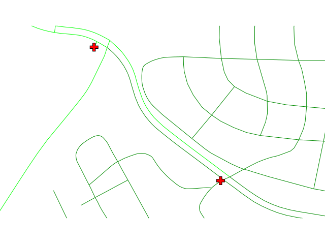

## DESCRIPTION

*v.net.alloc* allocates subnets for nearest centers. Center nodes must
be opened (costs \>= 0). Costs of center nodes are used in the
calculation.

Costs may be either line lengths, or attributes saved in a database
table. These attribute values are taken as costs of whole segments, not
as costs to traverse a length unit (e.g. meter) of the segment. For
example, if the speed limit is 100 km / h, the cost to traverse a 10 km
long road segment must be calculated as  
length / speed = 10 km / (100 km/h) = 0.1 h.  
Supported are cost assignments for both arcs and nodes, and also
different costs for both directions of a vector line. For areas, costs
will be calculated along boundary lines.

The input vector needs to be prepared with *v.net operation=connect* in
order to connect points representing center nodes to the network.

The nearest center can be determined using either costs from the nearest
center or costs to the nearest center with option **method**. See
example below.

By default, the category value of the nearest center is used as category
value for output lines. With the **-u** flag, output lines become unique
categories and an attribute table is created with the fields *cat, ocat,
center*. The *ocat* field holds the original line category in
**arc_layer** and the *center* field holds the center category in
**node_layer**. Additionally, original line categories are copied from
the input **arc_layer** to layer 2 in the output, together with any
attribute table.

Application of flag **-t** enables a turntable support. This flag
requires additional parameters **turn_layer** and **turn_cat_layer**
that are otherwise ignored. The turntable allows to model e.g. traffic
code, where some turns may be prohibited. This means that the input
layer is expanded by turntable with costs of every possible turn on any
possible node (intersection) in both directions. Turntable can be
created by the *[v.net](v.net.md)* module. For more information about
turns in the vector network analyses see [wiki
page](https://grasswiki.osgeo.org/wiki/Turns_in_the_vector_network_analysis).

## NOTES

Nodes and arcs can be closed using cost = -1.

Center nodes can also be assigned to vector nodes using *[wxGUI vector
digitizer](wxGUI.vdigit.md)*.

## EXAMPLES

1\. Subnetwork allocation using distance:

  

2\. Subnetwork allocation using traveling time:

  

Example 1: *Calculating subnets for 3 center nodes using distances*

```sh
# Spearfish

# center nodes:
echo "591235.5|4926306.62|1
596591.8|4917042.5|2
602722.9|4923544.2|3" | v.in.ascii in=- out=centernodes

g.copy vect=roads,myroads

# connect points to network
v.net myroads points=centernodes out=myroads_net op=connect thresh=200

# allocate, specifying range of center cats (easier to catch all):
v.net.alloc myroads_net out=myroads_net_alloc center_cats=1-100000 node_layer=2

# report categories
v.category myroads_net_alloc option=report
```

To display the result, run for example:

```sh
# show result
g.region vector=myroads_net
d.mon x0
d.vect myroads_net layer=1

# the result has to be selected by category number of the relevant node:
d.vect myroads_net_alloc cat=1 col=red layer=1
d.vect myroads_net_alloc cat=2 col=green layer=1
d.vect myroads_net_alloc cat=3 col=yellow layer=1

# center nodes
d.vect myroads_net col=red icon=basic/triangle fcol=green size=12 layer=2
```

Example 2: *Calculating subnets for 3 center nodes using traveling
time*  

```sh
# Spearfish

# center nodes:
echo "591235.5|4926306.62|1
596591.8|4917042.5|2
602722.9|4923544.2|3" | v.in.ascii in=- out=centernodes

g.copy vect=roads,myroads

# create lines map connecting points to network
v.net myroads points=centernodes out=myroads_net op=connect thresh=500 arc_layer=1 node_layer=2

# set up costs

# create unique categories for each road in layer 3
v.category in=myroads_net out=myroads_net_time opt=add cat=1 layer=3 type=line

# add new table for layer 3
v.db.addtable myroads_net_time layer=3 col="cat integer,label varchar(43),length double precision,speed double precision,cost double precision,bcost double precision"

# copy road type to layer 3
v.to.db myroads_net_time layer=3 qlayer=1 opt=query qcolumn=label columns=label

# upload road length in miles
v.to.db myroads_net_time layer=3 type=line option=length col=length unit=miles

# set speed limits in miles / hour
v.db.update myroads_net_time layer=3 col=speed val="5.0"
v.db.update myroads_net_time layer=3 col=speed val="75.0" where="label='interstate'"
v.db.update myroads_net_time layer=3 col=speed val="75.0" where="label='primary highway, hard surface'"
v.db.update myroads_net_time layer=3 col=speed val="50.0" where="label='secondary highway, hard surface'"
v.db.update myroads_net_time layer=3 col=speed val="25.0" where="label='light-duty road, improved surface'"
v.db.update myroads_net_time layer=3 col=speed val="5.0" where="label='unimproved road'"

# define traveling costs as traveling time in minutes:

# set forward costs
v.db.update myroads_net_time layer=3 col=cost val="length / speed * 60"
# set backward costs
v.db.update myroads_net_time layer=3 col=bcost val="length / speed * 60"

# subnetwork allocation with fastest paths
v.net.alloc in=myroads_net_time arc_layer=3 node_layer=2 arc_column=cost arc_backward_column=bcost out=myroads_net_alloc_time center_cats=1-3
```

To display the result, run for example:

```sh
# show result
g.region vector=myroads_net
d.mon x0
d.vect myroads_net type=line layer=1

# the result has to be selected by category number of the relevant node:
d.vect myroads_net_alloc_time cat=1 col=red layer=1
d.vect myroads_net_alloc_time cat=2 col=green layer=1
d.vect myroads_net_alloc_time cat=3 col=yellow layer=1

# center nodes
d.vect myroads_net_time col=red icon=basic/triangle fcol=green size=12 type=point layer=2
```

Example 3: *Differences between costs from centers and costs to
centers*  
Each lane of the two-lane road is a one-way road.

1\. Subnetwork allocation from centers:

  
*A center reaches any point following the one-way lanes.*

2\. Subnetwork allocation to centers:

  
*Any node reaches reaches the nearest center following the one-way lanes.*

In case of an accident, the ambulance should come from the nearest
'from' hospital and go to the nearest 'to' hospital.

```sh
# North Carolina

# center nodes are hospitals:
# connect hospitals to streets as layer 2
v.net input=streets_wake points=hospitals output=streets_hospitals operation=connect thresh=400 arc_layer=1 node_layer=2
v.to.db map=streets_hospitals layer=1 type=line option=cat columns=cat

# close oneway roads
v.db.update map=streets_hospitals column=TF_COST value=-1 where="ONE_WAY = 'FT'"
v.db.update map=streets_hospitals column=FT_COST value=-1 where="ONE_WAY = 'TF'"

# add costs to newly created lines
v.db.update map=streets_hospitals column=TF_COST value=0 where="cat > 49746"
v.db.update map=streets_hospitals column=FT_COST value=0 where="cat > 49746"

# from centers
v.net.alloc in=streets_hospitals out=streets_hospitals_alloc_from center_cats=1-10000 arc_column=FT_COST arc_backward_column=TF_COST

# to centers
v.net.alloc in=streets_hospitals out=streets_hospitals_alloc_to method=to center_cats=1-10000 arc_column=FT_COST arc_backward_column=TF_COST
```

## SEE ALSO

*[d.path](d.path.md), [v.net](v.net.md), [v.net.iso](v.net.iso.md),
[v.net.path](v.net.path.md), [v.net.steiner](v.net.steiner.md),
[v.net.salesman](v.net.salesman.md)*

## AUTHORS

Radim Blazek, ITC-Irst, Trento, Italy  
Documentation: Markus Neteler, Markus Metz

### TURNS SUPPORT

The turns support was implemnented as part of GRASS GIS turns cost
project at Czech Technical University in Prague, Czech Republic. Eliska
Kyzlikova, Stepan Turek, Lukas Bocan and Viera Bejdova participated at
the project. Implementation: Stepan Turek Documentation: Lukas Bocan
Mentor: Martin Landa
