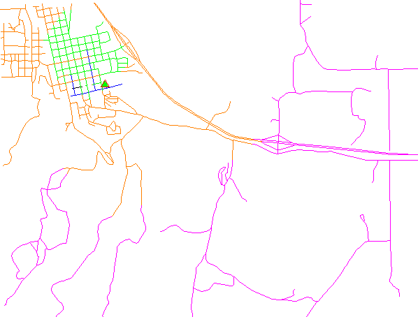
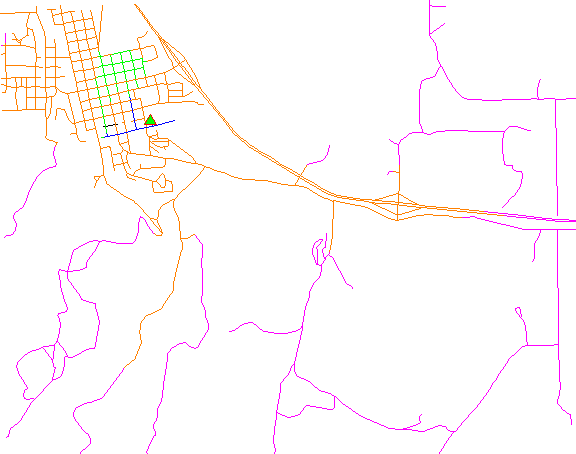

## DESCRIPTION

*v.net.iso* splits a network into bands between cost isolines (distance
from center). Center nodes must be opened (costs \>= 0). The costs of
center nodes are used in the calculation.

Costs may be either line lengths, or attributes saved in a database
table. These attribute values are taken as costs of whole segments, not
as costs to traverse a length unit (e.g. meter) of the segment. For
example, if the speed limit is 100 km / h, the cost to traverse a 10 km
long road segment must be calculated as  
length / speed = 10 km / (100 km/h) = 0.1 h.  
Supported are cost assignments for both arcs and nodes, and also
different costs for both directions of a vector line. For areas, costs
will be calculated along boundary lines.

The input vector needs to be prepared with *v.net operation=connect* in
order to connect points representing center nodes to the network.

The nearest center can be determined using either costs from the nearest
center or costs to the nearest center with option **method**.

By default, the iso band number is used as category value for output
lines. With the **-u** flag, output lines become unique categories and
an attribute table is created with the fields *cat, ocat, center, isonr,
isolbl*. The *ocat* field holds the original line category in
**arc_layer**, the *center* field holds the center category in
**node_layer**, the *isonr* field holds the iso band number and the
*isolbl* field holds a label for the isoband. Additionally, original
line categories are copied from the input **arc_layer** to layer 2 in
the output, together with any attribute table.

Application of flag **-t** enables a turntable support. This flag
requires additional parameters **turn_layer** and **turn_cat_layer**
that are otherwise ignored. The turntable allows to model e.g. traffic
code, where some turns may be prohibited. This means that the input
layer is expanded by turntable with costs of every possible turn on any
possible node (intersection) in both directions. Turntable can be
created by the *[v.net](v.net.md)* module. For more information about
turns in the vector network analyses see [wiki
page](https://grasswiki.osgeo.org/wiki/Turns_in_the_vector_network_analysis).

## NOTES

Nodes and arcs can be closed using cost = -1.

Nodes must be on the isolines.

## EXAMPLES

The map must contain at least one center (point) on the vector network
which can be patched into with [v.net](v.net.md).

Isonetwork using distance:



Isonetwork using time:



### Subdivision of a network using distance

```sh
# Spearfish

# start node:
echo "591280.5|4926396.0|1" | v.in.ascii in=- out=startnode
g.copy vect=roads,myroads

# connect point to network
v.net myroads points=startnode out=myroads_net op=connect thresh=200

# define iso networks using distance:
v.net.iso input=myroads_net output=myroads_net_iso center_cats=1-100000 costs=1000,2000,5000
```

The network is divided into 4 categories:

```sh
v.category myroads_net_iso option=report
# ... reports 4 categories:
#cat | distance from point in meters
#1          0 - < 1000
#2       1000 - < 2000
#3       2000 - < 5000
#4             >= 5000
```

To display the result, run for example:

```sh
g.region n=4928200 s=4922300 w=589200 e=596500
d.mon x0
d.vect myroads_net_iso col=blue   cats=1
d.vect myroads_net_iso col=green  cats=2
d.vect myroads_net_iso col=orange cats=3
d.vect myroads_net_iso col=magenta  cats=4
d.vect myroads_net col=red icon=basic/triangle fcol=green size=12 layer=2
```

### Subdivision of a network using traveling time

Prepare the network as above:

```sh
# Spearfish

# start node:
echo "591280.5|4926396.0|1" | v.in.ascii in=- out=startnode
g.copy vect=roads,myroads

# connect point to network
v.net myroads points=startnode out=myroads_net op=connect thresh=200
```

Define costs as traveling time dependent on speed limits:

```sh
# set up costs

# create unique categories for each road in layer 3
v.category in=myroads_net out=myroads_net_time opt=add cat=1 layer=3 type=line

# add new table for layer 3
v.db.addtable myroads_net_time layer=3 col="cat integer,label varchar(43),length double precision,speed double precision,cost double precision,bcost double precision"

# copy road type to layer 3
v.to.db myroads_net_time layer=3 qlayer=1 opt=query qcolumn=label columns=label

# upload road length in miles
v.to.db myroads_net_time layer=3 type=line option=length col=length unit=miles

# set speed limits in miles / hour
v.db.update myroads_net_time layer=3 col=speed val="5.0"
v.db.update myroads_net_time layer=3 col=speed val="75.0" where="label='interstate'"
v.db.update myroads_net_time layer=3 col=speed val="75.0" where="label='primary highway, hard surface'"
v.db.update myroads_net_time layer=3 col=speed val="50.0" where="label='secondary highway, hard surface'"
v.db.update myroads_net_time layer=3 col=speed val="25.0" where="label='light-duty road, improved surface'"
v.db.update myroads_net_time layer=3 col=speed val="5.0" where="label='unimproved road'"

# define traveling costs as traveling time in minutes:

# set forward costs
v.db.update myroads_net_time layer=3 col=cost val="length / speed * 60"
# set backward costs
v.db.update myroads_net_time layer=3 col=bcost val="length / speed * 60"

# define iso networks using traveling time:
v.net.iso input=myroads_net_time output=myroads_net_iso_time arc_layer=3 node_layer=2 arc_column=cost arc_backward_column=bcost center_cats=1-100000 costs=1,2,5
```

To display the result, run for example:

```sh
# add table with labels and coloring
v.db.addtable myroads_net_iso_time columns="cat integer,trav_time varchar(20),GRASSRGB varchar(11)"
# labels
v.db.update map=myroads_net_iso_time layer=1 column=trav_time value="0 - 1" where="cat = 1"
v.db.update map=myroads_net_iso_time layer=1 column=trav_time value="1 - 2" where="cat = 2"
v.db.update map=myroads_net_iso_time layer=1 column=trav_time value="2 - 5" where="cat = 3"
v.db.update map=myroads_net_iso_time layer=1 column=trav_time value="> 5" where="cat = 4"
# colors
# cats=1: blue
v.db.update map=myroads_net_iso_time layer=1 column=GRASSRGB value="000:000:255" where="cat = 1"
# cats=2: green
v.db.update map=myroads_net_iso_time layer=1 column=GRASSRGB value="000:255:000" where="cat = 2"
# cats=3: orange
v.db.update map=myroads_net_iso_time layer=1 column=GRASSRGB value="255:128:000" where="cat = 3"
# cats=4: magenta
v.db.update map=myroads_net_iso_time layer=1 column=GRASSRGB value="255:000:255" where="cat = 4"

# show results
g.region n=4928200 s=4922300 w=589200 e=596500
d.mon x0
d.vect myroads_net_iso_time layer=1 -a rgb_col=GRASSRGB
d.vect myroads_net col=red icon=basic/triangle fcol=green size=12 layer=2
```

## SEE ALSO

*[d.path](d.path.md), [v.net](v.net.md), [v.net.alloc](v.net.alloc.md),
[v.net.path](v.net.path.md), [v.net.salesman](v.net.salesman.md),
[v.net.steiner](v.net.steiner.md), [v.patch](v.patch.md)*

## AUTHORS

Radim Blazek, ITC-Irst, Trento, Italy  
Documentation: Markus Neteler, Markus Metz

### TURNS SUPPORT

The turns support was implemnented as part of GRASS GIS turns cost
project at Czech Technical University in Prague, Czech Republic. Eliska
Kyzlikova, Stepan Turek, Lukas Bocan and Viera Bejdova participated at
the project. Implementation: Stepan Turek Documentation: Lukas Bocan
Mentor: Martin Landa
