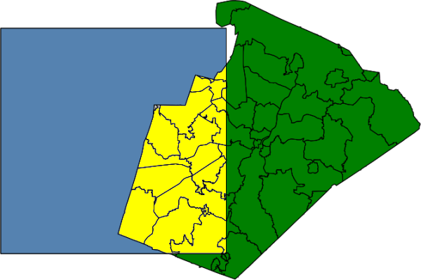
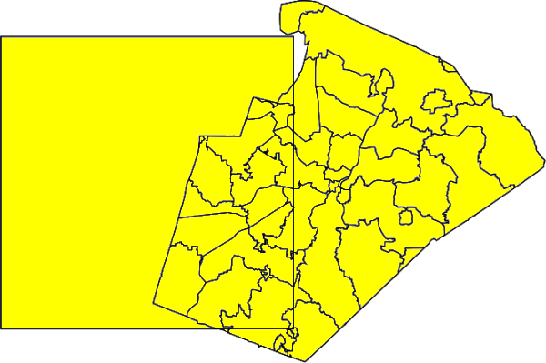
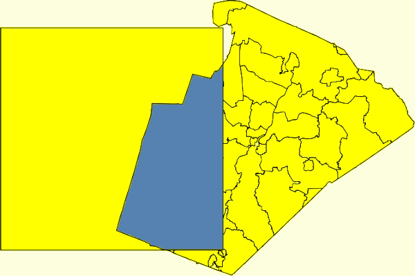
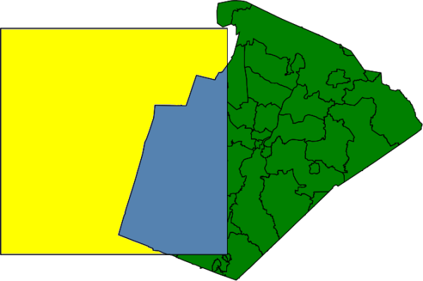
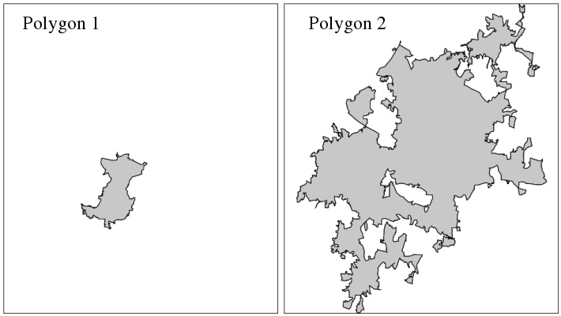

## DESCRIPTION

*v.overlay* allows the user to overlay two vector maps. Features in
**ainput** can be lines or areas and are cut with areas in **binput**.
Simple *clipping* can be performed with the **and** operator.

If areas in **ainput** are overlaid with areas in **binput**, it is
sometimes necessary to snap areas of **binput** to those of **ainput**,
otherwise areas can go missing or many sliver areas can be created.
Snapping is enabled by default and can be disabled by setting the
**snap** option to a negative value. Recommended values are between
0.00000001 and 0.0001. Using larger values for snapping can have
undesired side-effects, but may sometimes be necessary to get a clean
output (see example below). In general, it is recommended to start with
a small snapping threshold, gradually increasing the threshold until the
result is reasonably clean. Snapping modifies only boundaries in binput,
which are snapped to boundaries in ainput. Boundaries in **ainput** are
not modified.

## NOTES

Currently only areas in **ainput** are supported for the operators *or*
and *xor*! See also *[v.select](v.select.md)*. The operator defines what
kind of operation will be done. Features are written to output, if the
result of an operation **ainput** operator **binput** is true.

If the *first* number of the **olayer** option is greater than 0, then
the resulting output map has a merged attribute table in the given layer
number. The original column names have a prefix (*a\_* and *b\_*)
corresponding to **ainput** and **binput** map.

If the *second* number of the **olayer** option is greater than 0, then
the categories of **ainput** in layer **alayer** are transferred to the
output layer with the second number.

If the *third* number of the **olayer** option is greater than 0, then
the categories of **binput** in layer *blayer* are transferred to the
output layer with the third number.

If **atype**=auto is given than *v.overlay* determines feature type for
**ainput** from the first found feature.

## EXAMPLES

Preparation of example data (North Carolina sample dataset):

```sh
# Create an empty box for overlaying to ZIP code vector map
v.mkgrid map=box grid=1,1 position=coor coordinates=584037,201970 box=50000,50000

# set region to ZIP codes and box vector maps
g.region vector=zipcodes_wake,box -p res=100 -a
# enlarge region a bit for "white border" around map in monitor
g.region n=n+1000 s=s-1000 w=w-1000 e=e+1000 -p
d.mon wx0
```

### AND operator

Clipping example (no attribute table is generated here):

```sh
d.vect map=zipcodes_wake fill_color=0:128:0
d.vect map=box fill_color=85:130:176
v.overlay -t ainput=box binput=zipcodes_wake operator=and output=v_overlay_AND
d.vect map=v_overlay_AND
```

  
*Figure: v.overlay with AND operator (selected polygons in yellow
color)*

### OR operator

Union example of areas:

```sh
d.vect map=zipcodes_wake fill_color=0:128:0
d.vect map=box fill_color=85:130:176
v.overlay -t ainput=box binput=zipcodes_wake operator=or output=v_overlay_OR
d.vect map=v_overlay_OR
```

  
*Figure: v.overlay with OR operator (selected polygons in yellow color)*

### XOR operator

Symmetrical difference example:

```sh
d.vect map=zipcodes_wake fill_color=0:128:0
d.vect map=box fill_color=85:130:176
v.overlay -t ainput=box binput=zipcodes_wake operator=xor output=v_overlay_XOR
d.vect map=v_overlay_XOR
```

  
*Figure: v.overlay with XOR operator (selected polygons in yellow
color)*

### NOT operator

Difference example:

```sh
d.vect map=zipcodes_wake fill_color=0:128:0
d.vect map=box fill_color=85:130:176
v.overlay -t ainput=box binput=zipcodes_wake operator=not output=v_overlay_NOT
d.vect map=v_overlay_NOT
```

  
*Figure: v.overlay with NOT operator (selected polygon in yellow color)*

### Overlay operations: AND, OR, NOT, XOR

ZIP code examples, based on North Carolina sample dataset:

```sh
# creation of simple dataset
v.extract input=zipcodes_wake output=poly1 where="cat = 42"
v.extract input=urbanarea output=poly2 where="cat = 55"

v.overlay ainput=poly1 binput=poly2 operator=and output=poly_1_2_and
v.overlay ainput=poly1 binput=poly2 operator=or  output=poly_1_2_or
v.overlay ainput=poly1 binput=poly2 operator=not output=poly_1_2_not
v.overlay ainput=poly1 binput=poly2 operator=xor output=poly_1_2_xor
```

  
*Figure: v.overlay operations: original input polygons*

  
*Figure: v.overlay results of AND, OR, NOT, XOR operations*

### Polygons overlaid with polygons

```sh
v.overlay ainput=lake binput=province output=lakeXprovince operator=or
```

Polygon union of urban area and Census 2000 areas (North Carolina
dataset):

```sh
# input maps
d.vect urbanarea
d.vect census_wake2000

# union
v.overlay ain=census_wake2000 bin=urbanarea out=urban_census2000 operator=or

# show result, graphically zooming a subset
g.region n=230400 s=223800 w=655800 e=662400
d.erase
d.vect urban_census2000

# show merged attribute table
v.db.select urban_census2000 where="cat=108" -v
cat|108
a_cat|98
a_AREA|231001264
a_PERIMETE|67804.305
a_TRACT_|98
a_TRACT_ID|98
a_RINGS_OK|1
a_RINGS_NO|0
a_ID|98
a_FIPSSTCO|37183
a_TRT2000|054108
a_STFID|37183054108
a_TRACTID|541.08
a_TRACT|541.08
b_cat|55
b_OBJECTID|55
b_UA|73261
b_NAME|Raleigh
b_UA_TYPE|UA
```


  
*Figure: v.overlay: Polygon union (right) of urban area (left) and
Census 2000 (middle) areas (North Carolina dataset)*

As can be seen by the resulting large number of centroids on boundaries,
the urban areas do not match exactly the Census 2000 areas. In this case
a clean result can be obtained by snapping with a threshold of 0.1 m.

### Lines overlaid with polygons

Using the North Carolina sample dataset, we clip the roads map to the
area of city of Raleigh, preserving road attributes in layer 1:

```sh
g.region vector=zipcodes_wake

# extract Raleigh city:
v.extract in=zipcodes_wake out=raleigh where="ZIPNAME = 'RALEIGH'"

# clip road network to city polygon:
v.overlay ainput=roadsmajor atype=line binput=raleigh out=roadsmajor_raleigh operator=and olayer=0,1,0
```

  
*Figure: v.overlay: Line to polygon clipping*

## SEE ALSO

*[v.clip](v.clip.md), [v.db.connect](v.db.connect.md),
[v.select](v.select.md), [g.copy](g.copy.md)*

## AUTHORS

Radim Blazek, ITC-Irst, Trento, Italy  
Markus Metz  
Speedup for large, complex input areas sponsored by
[mundialis](https://www.mundialis.de)
