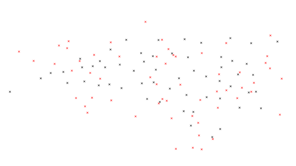
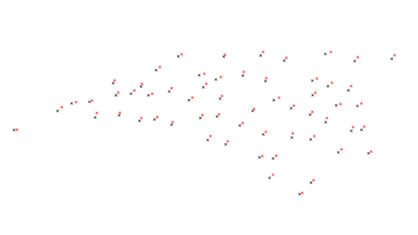

## DESCRIPTION

*v.perturb* reads a vector map of points and writes the same points but
*perturbs* the eastings and northings by adding either a uniform or
normal delta value. Perturbation means that a variating spatial
deviation is added to the coordinates.

## NOTES

The uniform distribution is always centered about zero. The associated
*parameter* is constrained to be positive and specifies the maximum of
the distribution; the minimum is the negation of that parameter. Do
perturb into a ring around the center, the *minimum* parameter can be
used.

Usually, the mean (first parameter) of the normal distribution is zero
(i.e., the distribution is centered at zero). The standard deviation
(second parameter) is naturally constrained to be positive.

Output vector points are not guaranteed to be contained within the
current geographic region.

## EXAMPLES

### Random, uniformly distributed selection

To create a random, uniformly distributed selection of possible new
points with a radius of 100,000 map units, use the following command:

```sh
v.perturb input=comm_colleges output=uniform_perturb parameters=100000
```

Your map should look similar to this figure:

  
*Figure: Map showing the actual community college points and uniformly
random chosen points.*

### Normal distributed selection

For a normal distribution with a mean of 5000 and standard deviation of
2000, use the following command:

```sh
v.perturb input=comm_colleges output=normal_perturb distribution=normal parameters=5000,2000
```

  
*Figure: Map showing the actual community college points and normally
random chosen and colored points. Notice that each point is closer to
the original point.*

### Normal distributed selection with a minimum value

In order to include a minimum value of 500, use the following command:

```sh
v.perturb input=comm_colleges output=min_perturb distribution=normal parameters=100000,1000 minimum=500
```

## SEE ALSO

*[v.random](v.random.md), [v.univar](v.univar.md)*

## AUTHORS

[James Darrell McCauley](http://mccauley-usa.com/)  
when he was at: [Agricultural
Engineering](http://ABE.www.ecn.purdue.edu/ABE/) [Purdue
University](http://www.purdue.edu/)

Random number generators originally written in FORTRAN by Wes Peterson
and translated to C using *f2c*.
