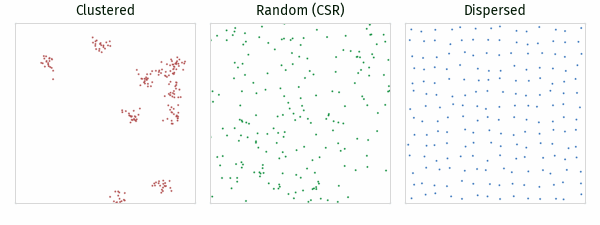
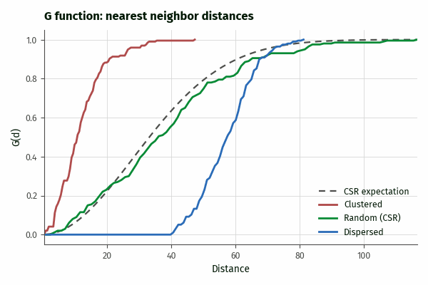
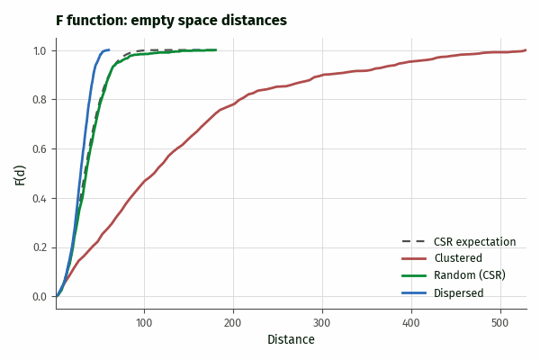
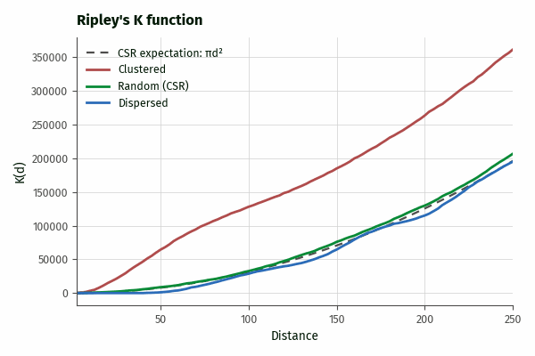
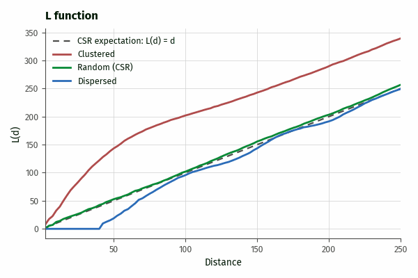

## DESCRIPTION

*v.ppa* performs point pattern analysis on the points of a vector map
using one of four summary functions: the nearest neighbor distance
distribution function G, the empty space function F, Ripley's K
function, and the variance stabilized L function. The functions
describe whether and at which spatial scales a point pattern is
clustered, random, or dispersed.

The **method** option selects the summary function:

- **g**: the fraction of points whose nearest neighbor lies within
  distance *d*, estimated for a range of distances.
- **f**: the fraction of uniformly random locations whose nearest
  pattern point lies within distance *d*. The number of sampled
  locations is set by **random_points**.
- **k**: the average number of further points within distance *d* of a
  typical point, scaled by the intensity. Under complete spatial
  randomness (CSR), K(d) equals pi \* d^2.
- **l**: the transformation L(d) = sqrt(K(d) / pi), which equals *d*
  under CSR and stabilizes the variance of K.

Each estimate is evaluated at **num_distances** equally spaced
distances and reported together with the theoretical value of the
function under CSR, so the output can be plotted and interpreted
directly. Values above the CSR reference indicate clustering, values
below it indicate dispersion (for F, the interpretation is reversed).

  
*Figure: Clustered, random (CSR), and dispersed point patterns of
about 200 points in a 1000x1000 window, used in the figures below.*

  
*Figure: G function. Clustered patterns rise left of the CSR
expectation because nearest neighbors are close; dispersed patterns
stay at zero up to their minimum spacing and then rise right of it.*

  
*Figure: F function. The interpretation is reversed compared to G:
dispersed patterns rise faster than the CSR expectation, clustered
patterns slower because of their large empty spaces.*

  
*Figure: Ripley's K function with isotropic edge correction. Clustered
patterns lie above the CSR expectation, dispersed patterns below it up
to the pattern spacing.*

  
*Figure: L function. The square root transformation makes departures
from CSR easier to see than in K.*

The **computational region is the observation window** of the
analysis: it defines the area used to estimate the intensity (points
per unit area), the sampling window of the F function, the edge
correction geometry, and the default distance range. Points of the
input map that fall outside the current region are ignored with a
warning. Use *g.region* to set the study area before running the tool.

Results are printed to standard output by default, or written to the
file given by **output**. The **format** option selects human readable
text (**plain**), comma separated values (**csv**), or JSON
(**json**). The JSON output includes the number of points, the
estimated intensity, the observation window, and, for K and L, the
edge correction, followed by the per-distance results.

## NOTES

The K and L functions apply Ripley's isotropic edge correction by
default: each point pair is weighted by the reciprocal of the fraction
of the circle through the neighbor, centered at the point, that lies
inside the window. Without a correction (**correction=none**), K and L
are biased downward at larger distances because part of each circle
falls outside the observed window. The G and F estimates are currently
uncorrected empirical distribution functions; interpret them against
the reported CSR reference rather than in absolute terms.

The K and L functions are evaluated up to **max_distance**, which
defaults to one quarter of the shorter side of the computational
region, a common rule of thumb beyond which K estimates become
unreliable. The G and F functions are evaluated up to the largest
observed nearest neighbor or empty space distance, so their last value
is always 1.

The intensity is estimated as the number of points inside the region
divided by the region area. Duplicate point locations are retained and
count as nearest neighbors at distance zero. Only point geometry is
used; for 3D maps the z coordinate is ignored.

The **seed** option only affects the F function, which samples random
locations; G, K, and L are deterministic. The computation of all
functions is parallelized with OpenMP; the number of threads is set
with **nprocs**.

## EXAMPLES

Generate a random point pattern in a 1000 by 1000 window and compare
its K function against CSR (the two columns should be similar):

```sh
g.region n=1000 s=0 w=0 e=1000 res=1
v.random output=random_points npoints=500 seed=42
v.ppa input=random_points method=k format=csv
```

Estimate the G function of a point map within the current region and
save it to a file:

```sh
v.ppa input=points_of_interest method=g format=csv output=g_function.csv
```

Compute the L function without edge correction at 200 distances up to
500 map units:

```sh
v.ppa input=points_of_interest method=l correction=none \
    num_distances=200 max_distance=500
```

Read the K function results into Python:

```python
from grass.tools import Tools

tools = Tools()
data = tools.v_ppa(input="random_points", method="k", format="json").json
print(data["intensity"], data["results"][0])
```

## TODO

- Monte Carlo simulation envelopes for testing deviations from CSR.
- Bivariate (cross-type) K function.
- Border corrections for the G and F functions.

## REFERENCES

- Ripley, B.D. (1977). Modelling spatial patterns. *Journal of the
  Royal Statistical Society, Series B* 39, 172-212.
- Baddeley, A., Rubak, E., Turner, R. (2015). *Spatial Point Patterns:
  Methodology and Applications with R*. Chapman and Hall/CRC.

## SEE ALSO

*[g.region](g.region.md), [v.cluster](v.cluster.md),
[v.kernel](v.kernel.md), [v.qcount](v.qcount.md),
[v.random](v.random.md)*

## AUTHORS

Corey T. White, OpenPlains Inc. and Center for Geospatial Analytics,
NC State University
