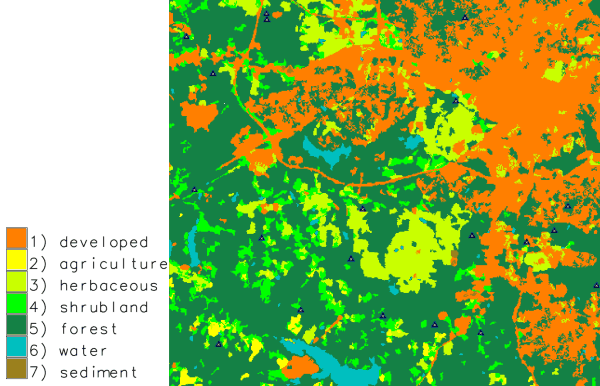

## DESCRIPTION

*v.random* randomly generates vector points within the current region
using the selected random number generator.

*v.random* can generate also 3D vector points or write random value to
the attribute table. Point height range or attribute value range is
controlled by specifying **zmin** and **zmax** options. Both z values
are included in range (*zmin \<= z \<= zmax*). Generated random
attribute value type can be controlled by **column_type**. Use *integer*
column type for integers and *double precision* for floating point
numbers. Integer values are calculated by rounding random floating point
number.

To produce repeatable results a random seed can be set using the option
**seed**.

### Restriction to vector areas

If an **restrict** vector map with areas is specified, the location of
random points is restricted to the selected areas. By default, the
requested number of points are distributed across all areas.

If the **-a** flag is given, the requested number of points is generated
for each individual area. For example, if 20 points should be generated
and the input map has 100 individual areas, 2000 points will be
generated in total.

Attributes attached to **restrict** vector map are also transferred if
the **layer** parameter is defined \> 0, see
*[example](#stratified-random-sampling-random-sampling-from-vector-map-by-attribute)*
below.

## NOTES

Importantly, attributes will only be transferred if **layer** \> 0
(e.g., `layer=1`).

## EXAMPLES

All examples are based on the North Carolina sample dataset.

### Generating random points in 2D

Generate 20 random points with binary attributes (only 0 or 1):

```sh
v.random output=binary_random npoints=20 zmin=0 zmax=1 column='binary'
v.db.select binary_random
cat|binary
1|0.63495
2|0.233421
3|0.489302
4|0.748264
5|0.505556
6|0.32975
[...]

v.univar -d binary_random
Calculating geometric distances between 20 primitives...
[...]
minimum: 148.515
maximum: 16572.8
[...]
```

### Generating random points in 2D with binary attributes

Generate 20 random points with binary attributes (only 0 or 1):

```sh
v.random output=binary_random npoints=20 zmin=0 zmax=1 column='binary' column_type=integer
v.db.select binary_random
cat|binary
1|0
2|0
3|0
4|0
5|1
6|0
[...]
```

### Generating random points in 3D

Generate 20 random 3D points using a specific random seed:

```sh
v.random seed=52 output=height_random npoints=40 zmin=110 zmax=170 -z
v.univar -d height_random
Calculating geometric distances between 40 primitives...
[...]
minimum: 334.889
maximum: 18351.9
range: 18017
sum: 5.38425e+06
mean: 7266.2
mean of absolute values: 7266.2
population standard deviation: 3563.95
[...]
skewness: 0.34703
```

  
*Random points with different X, Y, and Z coordinates*

### Generating random points in selected areas

Generate 3 random points only in selected areas ("RALEIGH" related ZIP
code areas):

```sh
v.random restrict=zipcodes_wake output=zipcodes_local_random_n3 npoints=3 where="ZIPNAME = 'RALEIGH'" -a

# visualization
d.mon wx0
d.vect zipcodes_wake
d.vect zipcodes_wake fcolor=yellow where="ZIPNAME = 'RALEIGH'"
d.vect zipcodes_local_random_n3 color=red icon=basic/circle
```

  
*Fixed number of random points generated in selected areas*

### Generating random adjacent areas

To generate random adjacent areas, first the centroids are generated as
points, then a triangulation is run (North Carolina sample dataset:

```sh
g.region vector=nc_state
v.random output=randpoints6k npoints=6000
v.voronoi input=randpoints6k output=randareas6k
v.info -t randareas6k
v.category randareas6k option=print

# plot vector areas
d.mon wx0
d.vect randareas6k -c
```

  
*Random adjacent areas from random points (here: used as centroids)*

To eventually obtain isolated areas, selected areas can be extracted
with *[v.extract](v.extract.md)*.

These vector areas can also be rasterized:

```sh
# rasterize areas
# note: rastermaps must result in at least 6k pixel in this example
g.region vector=nc_state res=500 -p -a
v.to.rast randareas6k out=randareas6k use=cat
r.colors randareas6k color=random
d.rast randareas6k
```

### Random sampling from raster map

Generate 20 random samples from a raster map:

```sh
g.region -p raster=elevation
v.random output=random_samples npoints=20
v.db.addtable map=random_samples columns='cat INTEGER, sample DOUBLE PRECISION'
v.what.rast map=random_samples raster=elevation column=sample
v.db.select random_samples
cat|sample
1|103.9935
2|129.1266
3|96.01388
[...]
```

### Random sampling from vector map

Generate 20 random points and sample attribute data from geology
(vector) map:

```sh
g.region -p vector=geology
v.random output=random_samples npoints=20
v.db.addtable map=random_samples columns='cat integer, geology varchar(100)'
v.what.vect map=random_samples column=geology query_map=geology query_layer=1 query_column=GEO_NAME
v.db.select random_samples
cat|geology
1|PzZm
2|
3|Zatm
[...]
```

### Stratified random sampling: Random sampling from vector map by attribute

Generate 20 random points restricted to forested areas:

```sh
g.region -p raster=landclass96
r.to.vect -v input=landclass96 output=landclass96 type=area
v.random restrict=landclass96 output=random_samples npoints=20 where="label = 'forest'" layer=1
v.db.select map=random_samples
cat|landclass96_cat|landclass96_label
1|5|forest
2|5|forest
3|5|forest
...
```

  
*Random points only sampled in forested areas (stratified random sampling)*

### Stratified random sampling: Random sampling from vector map with spatial constraints

Generating n points for each individual area: in this example two random
points in each water body:

```sh
g.region -p raster=landclass96
r.to.vect -v input=landclass96 output=landclass96 type=area
v.random restrict=landclass96 output=random_samples npoints=2 where="label = 'water'" layer=1 -a
```

  
*Two random points sampled in each individual water body (stratified
random sampling)*

## SEE ALSO

*[g.region](g.region.md), [r.random](r.random.md),
[v.db.addtable](v.db.addtable.md), [v.perturb](v.perturb.md),
[v.sample](v.sample.md), [v.univar](v.univar.md),
[v.what.rast](v.what.rast.md), [v.what.vect](v.what.vect.md)*

[SQL support in GRASS GIS](sql.md)

## AUTHOR

[James Darrell McCauley](http://mccauley-usa.com/)
[\<darrell@mccauley-usa.com\>](mailto:darrell@mccauley-usa.com),  
when he was at: [Agricultural
Engineering](http://ABE.www.ecn.purdue.edu/ABE/) [Purdue
University](http://www.purdue.edu/)
