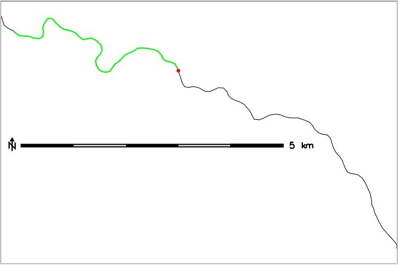
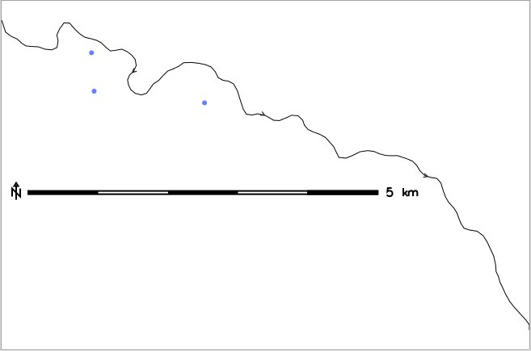

## DESCRIPTION

*v.segment* generates segments or points from input lines and from
positions read from a text file or '`stdin`'. It includes the creation
of parallel lines or points in given destination from the line.

The format is:

```sh
P <point id>   <line cat> <offset> [<side offset>]
L <segment id> <line cat> <start offset> <end offset> [<side offset>]
```

The offsets can be percent values of the line length. If the offsets are
negative, they start from the end node of the line. -0 means the end of
the line.

The user could send to `stdin` something like:

```sh
P 1 356 24.56
P 2 495 12.31
P 3 500 -12.31
P 4 510 -20%
...
```

(pipe or redirect from file into the command).  

## NOTES

A segment is only created for the first line found of the specified
category.

Points are generated along the lines at the given distance(s) or
percent(s) of the line length from the beginning or end, if offsets are
negative, of the vector line.

The side offset is the orthogonal distance from the line. Positive side
offsets are to the right side of the line going forward, negative
offsets are to the left (*d.vect* with *display=shape,dir* shows the
direction of vector lines). As the segment distance is measured along
the original line, side-offset lines will be longer than the start-end
segment distance for outside corners of curving lines, and shorter for
inside corners.

All offsets are measured in map units (see "*g.proj -p*") or percents of
the line length, if followed by a % character.

To place a point in the middle of a line, 50% offset can be used or the
*v.to.db* module may be used to find the line's length. Then half of
that distance can be used as the along-line offset.

## EXAMPLES

The examples are based on the North Carolina sample dataset.

### Extraction of a line segment

Extract line segment from 400m to 5000m from beginning of line 1:

```sh
# extract lines from railroad map:
v.extract input=railroads output=myrr cats=1

# join segments into polyline and reassign category numbers
v.build.polylines myrr out=myrr_pol
v.category input=myrr_pol output=myrailroads option=add

# zoom to an area of interest
g.region vector=myrailroads -p

# show line, category, direction (to find the beginning)
d.mon wx0
d.vect map=myrailroads display=shape,cat,dir lsize=12

# extract line segment from 400m to 5000m from beginning of line 1
echo "L 1 1 400 5000" | v.segment input=myrailroads output=myrailroads_segl
d.erase
d.vect map=myrailroads
d.vect map=myrailroads_segl col=green width=2

# set node at 5000m from beginning of line 1
echo "P 1 1 5000" | v.segment input=myrailroads output=myrailroads_segp
d.vect map=myrailroads_segp icon=basic/circle color=red fcolor=red size=5
```

  
*Extract line segment from 400m to 5000m from beginning of line 1*

### Parallel line segments

Creation of parallel, 1km long line segments along the first 8km of
track, offset 500m to the left of the tracks:

```sh
v.segment input=myrailroads output=myrailroads_segl_side << EOF
L 1 1 1000 2000 -500
L 2 1 3000 4000 -500
L 3 1 5000 6000 -500
L 4 1 7000 8000 -500
EOF
d.erase
d.vect map=myrailroads display=shape,dir
d.vect -c map=myrailroads_segl_side width=2
```

### Points equidistant along the tracks

Creation of a series of points, spaced every 2km along the tracks:

```sh
v.segment input=myrailroads output=myrailroads_pt2km << EOF
P 1 1 1000
P 2 1 3000
P 3 1 5000
P 4 1 7000
EOF
d.erase
d.vect map=myrailroads display=shape,dir
d.vect map=myrailroads_pt2km icon=basic/circle color=blue fcolor=blue size=5
```

  
*A series of points, spaced every 2km along the tracks*

### Points equidistant along and offset the tracks

Creation of a series of points, spaced every 2km along the tracks,
offset 500m to the right:

```sh
v.segment input=myrailroads output=myrailroads_pt2kmO500m << EOF
P 1 1 1000 500
P 2 1 3000 500
P 3 1 5000 500
P 4 1 7000 500
EOF
d.erase
d.vect map=myrailroads display=shape,dir
d.vect map=myrailroads_pt2kmO500m icon=basic/circle color=aqua fcolor=aqua size=5
```

  
*A series of points, spaced every 2km along the tracks, offset 500m to the right*

### Points equidistant in percent along and offset the tracks

Creation of a series of points, spaced every 10% of the line's length
along the tracks from the end of the line up to the middle point, offset
500m to the right:

```sh
v.segment input=myrailroads output=myrailroads_pt10pctO500m << EOF
P 1 1  -0% 500
P 2 1 -10% 500
P 3 1 -20% 500
P 4 1 -30% 500
P 5 1 -40% 500
P 6 1 -50% 500
EOF
d.erase
d.vect map=myrailroads display=shape,dir
d.vect map=myrailroads_pt10pctO500m icon=basic/circle color=red fcolor=black size=5
```

  
*A series of points, spaced every 10% of the line's length along the tracks
from the end of the line up to the middle point, offset 500m to the right*

## KNOWN ISSUES

There is a problem with side-offset parallel line generation for inside
corners.

## SEE ALSO

*[LRS tutorial](lrs.md) (Linear Referencing System),  
[d.vect](d.vect.md), [v.build.polylines](v.build.polylines.md),
[v.lrs.segment](v.lrs.segment.md), [v.parallel](v.parallel.md),
[v.split](v.split.md), [v.to.db](v.to.db.md),
[v.to.points](v.to.points.md)*

## AUTHOR

Radim Blazek, ITC-Irst, Trento, Italy
