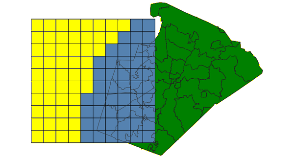
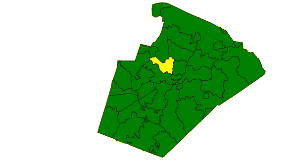
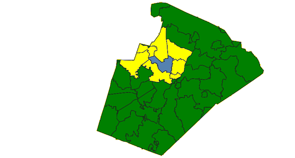
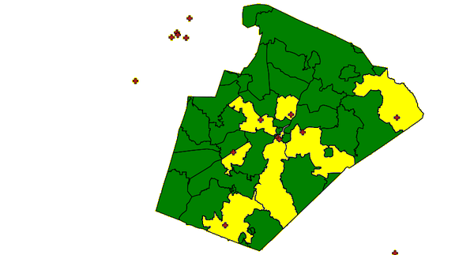

## DESCRIPTION

*v.select* allows the user to select features from a vector map by
features from another one.

Supported operators (without GEOS; using GRASS' own algorithm):

- **overlap** - features partially or completely overlap (GEOS
  equivalent: intersects)

Supported operators (internally using
[GEOS](https://trac.osgeo.org/geos/) - Geometry Engine, Open Source):

- **equals** - features are spatially equals
- **disjoint** - features do not spatially intersect
- **intersects** - features spatially intersect (equivalent to native
  'overlap')
- **touches** - features spatially touches
- **crosses** - features spatially crosses
- **within** - feature A is completely inside feature B
- **contains** - feature B is completely inside feature A
- **overlaps** - features spatially overlap
- **relate** - feature A is spatially related to feature B

## NOTES

Only features with category numbers will be considered. If required the
*[v.category](v.category.md)* module can be used to add them. Typically
boundaries do not need to be given a category number, as an area's
attributes are inherited from the centroid. Typically points, lines, and
centroids will always want to have a cat number. E.g. take a road which
separates two farms. It is ambiguous as to which farm an attribute that
is attached to the road belongs to. The boundary only needs a cat number
if it will hold its own attributes, such as road name or pavement form.
A centroid in each paddock holds the information with respect to
ownership, area, etc.

## EXAMPLES

Preparation of example data (North Carolina sample dataset):

```sh
# Create an grid for overlaying to ZIP code vector map
v.mkgrid map=boxgrid grid=10,10 position=coor \
         coordinates=583600,201500 box=5000,5000

# set region to ZIP codes and boxgrid vector maps
g.region vector=zipcodes_wake,boxgrid -p res=100 -a
# enlarge region a bit for "white border" around map in monitor
g.region n=n+1000 s=s-1000 w=w-1000 e=e+1000 -p
d.mon wx0
```

### OVERLAP: features partially or completely overlap (using GRASS)

Select grid boxes (North Carolina sample dataset):

```sh
d.vect map=zipcodes_wake fill_color=0:128:0
d.vect map=boxgrid fill_color=85:130:176
v.select ainput=boxgrid binput=zipcodes_wake output=v_select_OVERLAP operator=overlap
d.vect map=v_select_OVERLAP
d.vect map=zipcodes_wake type=boundary color=255:255:50
```

  
v.select with OVERLAP operator: selected grid boxes shown in yellow
(using GRASS method)

### OVERLAPS features spatially overlap (using GEOS)

Select grid boxes (North Carolina sample dataset):

```sh
d.vect map=zipcodes_wake fill_color=0:128:0
d.vect map=boxgrid fill_color=85:130:176
v.select ainput=boxgrid binput=zipcodes_wake output=v_select_OVERLAPS operator=overlaps
d.vect map=v_select_OVERLAPS
d.vect map=zipcodes_wake type=boundary color=255:255:50
```

  
v.select with OVERLAPS operator: selected grid boxes shown in yellow
(using GEOS method)

### DISJOINT: features do not spatially intersect (using GEOS)

Select grid boxes (North Carolina sample dataset):

```sh
d.vect map=zipcodes_wake fill_color=0:128:0
d.vect map=boxgrid fill_color=85:130:176
v.select ainput=boxgrid binput=zipcodes_wake output=v_select_DISJOINT operator=disjoint
d.vect map=v_select_DISJOINT
d.vect map=zipcodes_wake type=boundary color=255:255:50
```

  
v.select with DISJOINT operator: selected grid boxes shown in yellow

### EQUALS: features are spatially equals (using GEOS)

Select zipcode polygon (North Carolina sample dataset):

```sh
d.vect map=zipcodes_wake fill_color=0:128:0
v.extract input=zipcodes_wake where=ZIPCODE_ID=35 output=zipcodeID35
v.select ainput=zipcodes_wake binput=zipcodeID35 output=v_select_EQUALS operator=equals
d.vect map=v_select_EQUALS
d.vect map=zipcodes_wake type=boundary color=255:255:50
```

  
v.select with EQUALS operator: selected grid boxes shown in yellow

### INTERSECTS: features spatially intersect (using GEOS)

Select zipcode polygons (North Carolina sample dataset):

```sh
d.vect map=zipcodes_wake fill_color=0:128:0
d.vect map=boxgrid fill_color=85:130:176
v.select ainput=zipcodes_wake binput=boxgrid output=v_select_INTERSECTS operator=intersects
d.vect map=v_select_INTERSECTS
d.vect map=boxgrid type=boundary color=255:255:50
```

  
v.select with INTERSECTS operator: selected grid boxes shown in yellow

### TOUCHES: features spatially touches (using GEOS)

Select polygons (North Carolina sample dataset):

```sh
d.vect map=zipcodes_wake fill_color=0:128:0
d.vect map=zipcodeID35 fill_color=85:130:176
v.select ainput=zipcodes_wake binput=zipcodeID35 output=v_select_TOUCHES operator=touches
d.vect map=v_select_TOUCHES
d.vect map=zipcodes_wake type=boundary color=255:255:50
```

  
v.select with TOUCHES operator: selected polygons shown in yellow (blue:
input polygon)

### CROSSES: features spatially crosses (using GEOS)

Select zipcode polygons by lines (North Carolina sample dataset):

```sh
d.vect map=zipcodes_wake fill_color=0:128:0
d.vect map=busroute1 color=200:27:27 width=3
v.select ainput=zipcodes_wake binput=busroute1 output=v_select_CROSSES operator=crosses
d.vect map=v_select_CROSSES
d.vect map=zipcodes_wake type=boundary color=255:255:50
d.vect map=busroute1 color=200:27:27 width=3
```

  
v.select with CROSSES operator: selected polygons shown in yellow (red:
input lines)

### WITHIN feature A is completely inside feature B (using GEOS)

Select zipcode polygons (North Carolina sample dataset):

```sh
d.vect map=zipcodes_wake fill_color=0:128:0
d.vect map=boundary_county fill_color=85:130:176
v.select ainput=zipcodes_wake binput=boundary_county output=v_select_WITHIN operator=within
d.vect map=v_select_WITHIN
```

  
v.select with WITHIN operator: selected polygons shown in yellow (blue:
input polygons)

### CONTAINS feature B is completely inside feature A (using GEOS)

Select zipcode polygon (North Carolina sample dataset):

#### CONTAINS with polygons

```sh
d.vect map=zipcodes_wake fill_color=0:128:0
d.vect map=zipcodeID35 fill_color=85:130:176
v.select ainput=zipcodes_wake binput=zipcodeID35 \
         output=v_select_CONTAINS_pol operator=contains
d.vect map=v_select_CONTAINS
```

  
v.select with CONTAINS operator: selected polygon shown in yellow (blue:
input polygon, not visible)

#### CONTAINS with points

```sh
d.vect map=zipcodes_wake fill_color=0:128:0
d.vect map=hospitals fill_color=195:31:31 icon=basic/cross3 size=10
v.select ainput=zipcodes_wake binput=hospitals \
         output=v_select_CONTAINS_pnts operator=contains
d.vect map=v_select_CONTAINS_pnts
d.vect map=hospitals fill_color=195:31:31 icon=basic/cross3 size=10
```

  
v.select with CONTAINS operator: selected polygons shown in yellow (red:
input points)

### RELATE feature A is spatially related to feature B (using GEOS)

This operator additionally requires the **relate** parameter (in other
GIS called 'ST_Relate'). This operator allows calculating the
[Dimensionally Extended nine-Intersection Model
(DE-9IM)](https://en.wikipedia.org/wiki/DE-9IM). In the following one
example: Select polygon with 'TOUCHES' operator (North Carolina sample
dataset):

```sh
d.vect map=zipcodes_wake fill_color=0:128:0
d.vect map=zipcodeID35 fill_color=85:130:176
v.select ainput=zipcodeID35 binput=zipcodes_wake \
         output=v_select_TOUCHES_relate operator=relate relate='T********'
d.vect map=v_select_TOUCHES
```

The result of `relate='T********'` is the same as seen above in the
example 'TOUCHES'. See the
[DE-9IM](https://en.wikipedia.org/wiki/DE-9IM) page for related
operators and their definition.

### Extraction of points falling into a polygon

Extract fire stations (points) falling into urban area (polygon) - North
Carolina data set (point in polygon test):

```sh
v.select ainput=firestations binput=urbanarea output=urban_firestations \
         operator=overlap
```

### Extraction of lines overlapping with a polygon

Extract railroad lines from zip code map overlapping with the urban area
(line in polygon test):

```sh
v.select ainput=railroads binput=urbanarea \
         output=railroads_in_urbanarea operator=overlap
```

### Extraction of areas overlapping with a line

Extract those areas from zip code map which overlap with railroads
(polygon on line test):

```sh
# first add a tiny buffer around railroad lines:
v.buffer input=railroads output=railroads_buf20m \
  distance=20

v.select ainput=zipcodes_wake binput=railroads_buf20m \
  output=zipcodes_wake_railroads operator=overlap
```

## SEE ALSO

*[v.category](v.category.md), [v.clip](v.clip.md),
[v.overlay](v.overlay.md), [v.extract](v.extract.md)*

[GRASS SQL interface](sql.md)  
[GEOS](https://trac.osgeo.org/geos/) - Geometry Engine, Open Source

## AUTHORS

Radim Blazek  
GEOS support by Martin Landa, Czech Technical University in Prague,
Czech Republic  
ZIP code examples by Carol X. Garzon-Lopez, Trento, Italy
