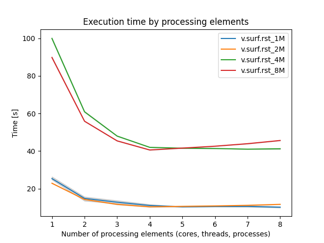
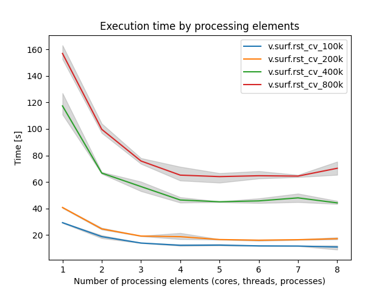

## DESCRIPTION

*v.surf.rst* program performs spatial approximation based on *z-values*
(input vector map is 3D and **zcolumn** parameter is not given),
*categories* (input vector map is 2D and **zcolumn** parameter is not
given), or *attributes* (**zcolumn** parameter is given) of point or
isoline data given in a vector map named **input** to grid cells in the
output raster map **elevation** representing a surface.

As an option, simultaneously with approximation, topographic parameters
slope, aspect, profile curvature (measured in the direction of the
steepest slope), tangential curvature (measured in the direction of a
tangent to contour line) or mean curvature are computed and saved as
raster maps specified by the options **slope, aspect, pcurv, tcurv,
mcurv** respectively. If **-d** flag is set, *v.surf.rst* outputs
partial derivatives *f_x*, *f_y*, *f_xx*,
*f_yy*, *f_xy* instead of slope, aspect, profile,
tangential and mean curvatures respectively. If the input vector map
have time stamp, the program creates time stamp for all output maps.

User can either use *[r.mask](r.mask.md)* to set a mask or specify a
raster map in **mask** option, which will be used as a mask. The
approximation is skipped for cells which have zero or NULL value in
mask. NULL values will be assigned to these cells in all output raster
maps. Data points are checked for identical points and points that are
closer to each other than the given **dmin** are removed. If sparsely
digitized contours or isolines are used as input, additional points are
computed between each 2 points on a line if the distance between them is
greater than specified **dmax**. Parameter **zmult** allows user to
rescale the values used for approximation (useful e.g. for
transformation of elevations given in feet to meters, so that the proper
values of slopes and curvatures can be computed).

Regularized spline with tension is used for the approximation. The
**tension** parameter tunes the character of the resulting surface from
thin plate to membrane. Smoothing parameter **smooth** controls the
deviation between the given points and the resulting surface and it can
be very effective in smoothing noisy data while preserving the
geometrical properties of the surface. With the smoothing parameter set
to zero (**smooth=0**) the resulting surface passes exactly through the
data points (spatial interpolation is performed). When smoothing
parameter is used, it is also possible to output a vector point map
**deviations** containing deviations of the resulting surface from the
given data.

If the number of given points is greater than **segmax**, segmented
processing is used. The region is split into quadtree-based rectangular
segments, each having less than **segmax** points and approximation is
performed on each segment of the region. To ensure smooth connection of
segments the approximation function for each segment is computed using
the points in the given segment and the points in its neighborhood which
are in the rectangular window surrounding the given segment. The number
of points taken for approximation is controlled by **npmin**, the value
of which must be larger than **segmax**. User can choose to output
vector maps **treeseg** and **overwin** which represent the quad tree
used for segmentation and overlapping neighborhoods from which
additional points for approximation on each segment were taken.

Predictive error of surface approximation for given parameters can be
computed using the **-c** flag. A crossvalidation procedure is then
performed using the data given in the vector map **input** and the
estimated predictive errors are stored in the vector point map
**cvdev**. When using this flag, no raster output maps are computed.
Anisotropic surfaces can be interpolated by setting anisotropy angle
**theta** and scaling factor **scalex**. The program writes values of
selected input and internally computed parameters to the history file of
raster map **elevation**.

The user must run *[g.region](g.region.md)* before the program to set
the region and resolution for approximation.

## NOTES

*v.surf.rst* uses regularized spline with tension for approximation from
vector data. The module does not require input data with topology,
therefore both level1 (no topology) and level2 (with topology) vector
point data are supported. Additional points are used for approximation
between each 2 points on a line if the distance between them is greater
than specified **dmax**. If **dmax** is small (less than cell size) the
number of added data points can be vary large and slow down
approximation significantly. The implementation has a segmentation
procedure based on quadtrees which enhances the efficiency for large
data sets. Special color tables are created by the program for output
raster maps.

Topographic parameters are computed directly from the approximation
function so that the important relationships between these parameters
are preserved. The equations for computation of these parameters and
their interpretation is described in [Mitasova and Hofierka,
1993](http://fatra.cnr.ncsu.edu/~hmitaso/gmslab/papers/hmg.rev1.ps) or
Neteler and Mitasova, 2004). Slopes and aspect are computed in degrees
(0-90 and 1-360 respectively). The aspect raster map has value 0
assigned to flat areas (with slope less than 0.1%) and to singular
points with undefined aspect. Aspect points downslope and is 90 to the
North, 180 to the West, 270 to the South and 360 to the East, the values
increase counterclockwise. Curvatures are positive for convex and
negative for concave areas. Singular points with undefined curvatures
have assigned zero values.

Tension and smoothing allow user to tune the surface character. For most
landscape scale applications the default values should provide adequate
results. The program gives warning when significant overshoots appear in
the resulting surface and higher tension or smoothing should be used.

To select parameters that will produce a surface with desired
properties, it is useful to know that the method is scale dependent and
the tension works as a rescaling parameter (high tension "increases the
distances between the points" and reduces the range of impact of each
point, low tension "decreases the distance" and the points influence
each other over longer range). Surface with tension set too high behaves
like a membrane (rubber sheet stretched over the data points) with peak
or pit ("crater") in each given point and everywhere else the surface
goes rapidly to trend. If digitized contours are used as input data,
high tension can cause artificial waves along contours. Lower tension
and higher smoothing is suggested for such a case.

Surface with **tension** set too low behaves like a stiff steel plate
and overshoots can appear in areas with rapid change of gradient and
segmentation can be visible. Increase in tension should solve the
problems.

There are two options how **tension** can be applied in relation to
**dnorm** (dnorm rescales the coordinates depending on the average data
density so that the size of segments with **segmax=**40 points is around
1 - this ensures the numerical stability of the computation):

1. Default: the given **tension** is applied to normalized data
    (*x/dnorm*), that means that the distances are multiplied (rescaled)
    by *tension/dnorm*. If density of points is changed, e.g., by using
    higher **dmin**, the **dnorm** changes and **tension** needs to be
    changed too to get the same result. Because the **tension** is
    applied to normalized data its suitable value is usually within the
    10-100 range and does not depend on the actual scale (distances) of
    the original data (which can be km for regional applications or cm
    for field experiments).
2. Flag**-t**: The given **tension** is applied to un-normalized data
    (rescaled *tension = tension\*dnorm/1000* is applied to normalized
    data (*x/dnorm*) and therefore **dnorm** cancels out) so here
    **tension** truly works as a rescaling parameter. For regional
    applications with distances between points in km the suitable
    tension can be 500 or higher, for detailed field scale analysis it
    can be 0.1. To help select how much the data need to be rescaled the
    program writes **dnorm** and rescaled tension
    *fi=tension\*dnorm/1000* at the beginning of the program run. This
    rescaled **tension** should be around 20-30. If it is lower or
    higher, the given **tension** parameter should be changed
    accordingly.

The default is a recommended choice, however for the applications where
the user needs to change density of data and preserve the approximation
character the **-t** flag can be helpful.

Anisotropic data (e.g. geologic phenomena) can be interpolated using
**theta** and **scalex** defining orientation and ratio of the
perpendicular axes put on the longest/shortest side of the feature,
respectively. **Theta** is measured in degrees from East,
counterclockwise. **Scalex** is a ratio of axes sizes. Setting
**scalex** in the range 0-1, results in a pattern prolonged in the
direction defined by **theta**. **Scalex** value 0.5 means that modeled
feature is approximately 2 times longer in the direction of **theta**
than in the perpendicular direction. **Scalex** value 2 means that axes
ratio is reverse resulting in a pattern perpendicular to the previous
example. Please note that anisotropy option has not been extensively
tested and may include bugs (for example, topographic parameters may not
be computed correctly) - if there are problems, please report to GRASS
bugtracker (accessible from <https://grass.osgeo.org/>).  

For data with values changing over several magnitudes (sometimes the
concentration or density data) it is suggested to interpolate the log of
the values rather than the original ones.

*v.surf.rst* checks the numerical stability of the algorithm by
computing the values in given points, and prints the root mean square
deviation (rms) found into the history file of raster map **elevation**.
For computation with smoothing set to 0, rms should be 0. Significant
increase in **tension** is suggested if the rms is unexpectedly high for
this case. With smoothing parameter greater than zero the surface will
not pass exactly through the data points and the higher the parameter
the closer the surface will be to the trend. The rms then represents a
measure of smoothing effect on data. More detailed analysis of smoothing
effects can be performed using the output deviations option.

*v.surf.rst* also writes the values of parameters used in computation
into the comment part of history file **elevation** as well as the
following values which help to evaluate the results and choose the
suitable parameters: minimum and maximum z values in the data file
(zmin_data, zmax_data) and in the interpolated raster map (zmin_int,
zmax_int), rescaling parameter used for normalization (dnorm), which
influences the tension.

If visible connection of segments appears, the program should be rerun
with higher **npmin** to get more points from the neighborhood of given
segment and/or with higher tension.

When the number of points in a vector map is not too large (less than
800), the user can skip segmentation by setting **segmax** to the number
of data points or **segmax=700**.

*v.surf.rst* gives warning when user wants to interpolate outside the
rectangle given by minimum and maximum coordinates in the vector map,
zoom into the area where the given data are is suggested in this case.

When a **mask** is used, the program takes all points in the given
region for approximation, including those in the area which is masked
out, to ensure proper approximation along the border of the mask. It
therefore does not mask out the data points, if this is desirable, it
must be done outside *v.surf.rst*.

### Cross validation procedure

The "optimal" approximation parameters for given data can be found using
a cross-validation (CV) procedure (**-c** flag). The CV procedure is
based on removing one input data point at a time, performing the
approximation for the location of the removed point using the remaining
data points and calculating the difference between the actual and
approximated value for the removed data point. The procedure is repeated
until every data point has been, in turn, removed. This form of CV is
also known as the "leave-one-out" or "jack-knife" method (Hofierka et
al., 2002; Hofierka, 2005). The differences (residuals) are then stored
in the **cvdev** output vector map. Please note that during the CV
procedure no other output maps can be set, the approximation is
performed only for locations defined by input data. To find "optimal
parameters", the CV procedure must be iteratively performed for all
reasonable combinations of the approximation parameters with small
incremental steps (e.g. tension, smoothing) in order to find a
combination with minimal statistical error (also called predictive
error) defined by root mean squared error (RMSE), mean absolute error
(MAE) or other error characteristics. A script with loops for tested RST
parameters can do the job, necessary statistics can be calculated using
e.g. *[v.univar](v.univar.md)*. It should be noted that crossvalidation
is a time-consuming procedure, usually reasonable for up to several
thousands of points. For larger data sets, CV should be applied to a
representative subset of the data. The cross-validation procedure works
well only for well-sampled phenomena and when minimizing the predictive
error is the goal. The parameters found by minimizing the predictive
(CV) error may not not be the best for for poorly sampled phenomena
(result could be strongly smoothed with lost details and fluctuations)
or when significant noise is present that needs to be smoothed out.

### Performance

To enable parallel processing, the user can specify the number of
threads to be used with the **nprocs** parameter (default 1). Figures 1
and 2 show benchmark results running on Intel® Core™ i5-10210U CPU @
1.60GHz × 8. See benchmark scripts in the source code for more details.

  
*Figure 1: Benchmark shows execution time for different number of cells
(1M, 2M, 4M, and 8M).*

  
*Figure 2: Benchmark shows execution time for running cross-validation
on different number of cells (100k, 200k, 400k, and 800k).*

## EXAMPLE

### Setting for lidar point cloud

Lidar point clouds as well as UAS SfM-based (phodar) point clouds tend
to be dense in relation to the desired raster resolution and thus a
different set of parameters is more advantageous, e.g. in comparison to
a typical temperature data interpolation.

```sh
v.surf.rst input=points elevation=elevation npmin=100
```

### Usage of the where parameter

Using the **where** parameter, the interpolation can be limited to use
only a subset of the input vectors.

North Carolina example (we simulate randomly distributed elevation
measures which we interpolate to a gap-free elevation surface):

```sh
g.region raster=elevation -p
# random elevation extraction of 500 samplings
r.random -s elevation vector=elevrand n=500
v.info -c elevrand
v.db.select elevrand

# interpolation based on all points
v.surf.rst elevrand zcol=value elevation=elev_full
# apply the color table of the original raster map
r.colors elev_full raster=elevation
d.rast elev_full
d.vect elevrand

# compute univariate statistics with 1st/3rd quartiles
v.db.univar -e elevrand column=value

# interpolation based on subset of points (only those over 1st quartile)
v.surf.rst input=elevrand zcolumn=value elevation=elev_partial npmin=100 where="value > 94.9"
r.colors map=elev_partial raster=elevation
d.rast elev_partial
d.vect elevrand where="value > 94.9"
```

## REFERENCES

- [Mitasova, H., Mitas, L. and Harmon, R.S.,
  2005,](http://fatra.cnr.ncsu.edu/~hmitaso/gmslab/papers/IEEEGRSL2005.pdf)
  Simultaneous spline approximation and topographic analysis for lidar
  elevation data in open source GIS, IEEE GRSL 2 (4), 375- 379.
- Hofierka, J., 2005, Interpolation of Radioactivity Data Using
  Regularized Spline with Tension. Applied GIS, Vol. 1, No. 2, pp. 16-01
  to 16-13. DOI: 10.2104/ag050016
- [Hofierka J., Parajka J., Mitasova H., Mitas L.,
  2002,](http://fatra.cnr.ncsu.edu/~hmitaso/gmslab/papers/TGIS2002_Hofierka_et_al.pdf)
  Multivariate Interpolation of Precipitation Using Regularized Spline
  with Tension. Transactions in GIS 6(2), pp. 135-150.
- H. Mitasova, L. Mitas, B.M. Brown, D.P. Gerdes, I. Kosinovsky, 1995,
  Modeling spatially and temporally distributed phenomena: New methods
  and tools for GRASS GIS. International Journal of GIS, 9 (4), special
  issue on Integrating GIS and Environmental modeling, 433-446.
- [Mitasova, H. and Mitas, L.,
  1993](http://fatra.cnr.ncsu.edu/~hmitaso/gmslab/papers/MG-I-93.pdf):
  Interpolation by Regularized Spline with Tension: I. Theory and
  Implementation, Mathematical Geology ,25, 641-655.
- [Mitasova, H. and Hofierka, J.,
  1993](http://fatra.cnr.ncsu.edu/~hmitaso/gmslab/papers/MG-II-93.pdf):
  Interpolation by Regularized Spline with Tension: II. Application to
  Terrain Modeling and Surface Geometry Analysis, Mathematical Geology
  25, 657-667.
- [Mitas, L., and Mitasova H.,
  1988,](http://fatra.cnr.ncsu.edu/~hmitaso/gmslab/papers/CMA1988.pdf)
  General variational approach to the approximation problem, Computers
  and Mathematics with Applications, v.16, p. 983-992.
- [Neteler, M. and Mitasova, H., 2008, Open Source GIS: A GRASS GIS
  Approach, 3rd Edition,](https://grassbook.org) Springer, New York, 406
  pages.
- Talmi, A. and Gilat, G., 1977 : Method for Smooth Approximation of
  Data, Journal of Computational Physics, 23, p.93-123.
- Wahba, G., 1990, : Spline Models for Observational Data, CNMS-NSF
  Regional Conference series in applied mathematics, 59, SIAM,
  Philadelphia, Pennsylvania.

## SEE ALSO

*[v.vol.rst](v.vol.rst.md), [v.surf.idw](v.surf.idw.md),
[v.surf.bspline](v.surf.bspline.md), [r.fillnulls](r.fillnulls.md),
[g.region](g.region.md)*

Overview: [Interpolation and
Resampling](https://grasswiki.osgeo.org/wiki/Interpolation) in GRASS GIS

For examples of applications see [GRASS4
implementation](http://fatra.cnr.ncsu.edu/~hmitaso/gmslab/) and [GRASS5
and GRASS6 implementation](http://fatra.cnr.ncsu.edu/~hmitaso/).

## AUTHORS

*Original version of program (in FORTRAN) and GRASS enhancements*:  
Lubos Mitas, NCSA, University of Illinois at Urbana Champaign, Illinois,
USA (1990-2000); Department of Physics, North Carolina State University,
Raleigh  
Helena Mitasova, USA CERL, Department of Geography, University of
Illinois at Urbana-Champaign, USA (1990-2001); MEAS, North Carolina
State University, Raleigh

*Modified program (translated to C, adapted for GRASS, new segmentation
procedure):*  
Irina Kosinovsky, US Army CERL, Dave Gerdes, US Army CERL

*Modifications for new sites format and timestamping:*  
Darrel McCauley, Purdue University, Bill Brown, US Army CERL

*Update for GRASS5.7, GRASS6 and addition of crossvalidation:*  
Jaroslav Hofierka, University of Presov; Radim Blazek, ITC-irst

*Parallelization using OpenMP:*  
Stanislav Zubal, Czech Technical University in Prague  
Michal Lacko, Pavol Jozef Safarik University in Kosice

*Parallelization of cross-validation using OpenMP:*  
Chung-Yuan Liang, Purdue University, West Lafayette, Indiana, USA
